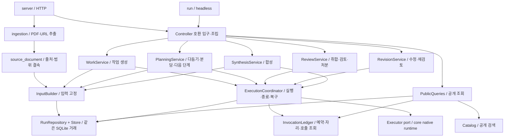

# 현재 애플리케이션 구조

이 문서는 **실제로 사용하는 코드의 책임 지도**다. 목표 기능 전체와 대안은 [개편 준비서](../docs/architecture/redesign-2026-10-04/README.md), 사용자 기능·가치·후속 우선순위는 [FEATURES](../docs/FEATURES.md), 실행 방법은 [app 안내](README.md)가 관리한다. [문서 지도](../docs/DOCUMENT-MAP.md)에서 함께 찾는다.

## 실행되는 뼈대

`Controller`는 HTTP·headless·기존 호출자가 쓰는 호환 API와 서비스 조립을 맡는다. 각 서비스가 controller를 다시 import하거나 controller 객체를 넘겨받아 만능 의존성으로 쓰지 않는다. `Runtime`에는 같은 원장의 소유권·설정·잠금·진행 중인 스레드 핸들만 있다. DB 상태가 정본이며 핸들 존재/부재는 자손 종료의 증거가 아니다.

## 코드 위치와 변경 책임

| 위치 | 하는 일 | 여기서 하지 않는 일 |
|---|---|---|
| [controller.py](controller.py), [wiring.py](wiring.py) | 서비스 조립, 기존 메서드/설정 접근 호환, 두 실행 입구 연결 | 새 업무 로직이나 화면 projection 추가 |
| [domain.py](domain.py), [state.py](state.py) | 참여자 값, 오류, Unicode·입력 표식·수용·정족수 정책 | HTTP·저장·모델 실행 |
| [context/inputs.py](context/inputs.py) | 역할/자료/승인 확인, manifest·확인 hash, 입력 사본, 이전 기억 고정 | thread 시작, 실행 결과의 진실 판정 |
| [ingestion/extract.py](ingestion/extract.py), [ingestion/url_fetch.py](ingestion/url_fetch.py), [source_document.py](source_document.py) | 제한된 PDF/공개 URL 추출, 출처·원본/변환/선택 hash와 누락을 텍스트에 결속 | 자동 첨부·모델 호출·OCR·페이지 렌더·로그인 |
| [memory.py](memory.py) | 공개 완료 이력 선택·발췌·크기 상한·선택 이유 | 과거 pack 재계산, 전역 기억·의미 검색 |
| [application/work.py](application/work.py) | 작업/실행/배정/승인 사용을 같은 거래로 생성 | 전송 방식·worker 내부 turn |
| [application/templates.py](application/templates.py), [static/templates.js](static/templates.js) | 재사용 설정·자료 사본 저장/복원, 현재 모델 재검사, 파일 이동 | 실행·승인·예산·과거 기억 pack 복사 |
| [application/planning.py](application/planning.py) | 질문 다듬기, 다음 단계·분담 제안 명령 | 모델에게 실행 시작 권한 부여 |
| [application/reviews.py](application/reviews.py) | 취합·교차검토 라운드·지적 처분·사람의 판단 | 인용 일치를 사실 검증으로 승격 |
| [application/revisions.py](application/revisions.py), [revisions.py](revisions.py), [static/revisions.js](static/revisions.js) | 고정 근거로 별도 수정 판·재검토, 원본 비교와 이력 | 초안 덮어쓰기, 자동 반복·독립 정족수 추가 |
| [application/synthesis.py](application/synthesis.py) | 공개 후 모의/모델 합성의 입력·조건·예약 | 직접 thread 생성·executor 실행 |
| [execution/coordinator.py](execution/coordinator.py) | 초안/상위 역할/합성 worker, 수용·공개·취소·복구·종료 | UI 렌더, 검색, HTTP 경로 |
| [execution/invocations.py](execution/invocations.py) | 모든 실제 호출의 예약 쓰기, 공통 budget/자리/unknown 조회, 역할별 저장의 Invocation 읽기 adapter | 과거 시도 생성·환불, 새 schema인 것처럼 표 변경 |
| [execution/seats.py](execution/seats.py) | 역할별 table/key/event/답 형식 검사 연결 | 각 역할만의 별도 예산·스레드 수명 |
| [execution/executor.py](execution/executor.py), [cli_executor.py](cli_executor.py), [core](../core/README.md) | 최종 계획과 실제 실행 port, 명시적 mock/native backend | 자동 유료 fallback, 답변의 최종 수용·공개 |
| [execution/runtime.py](execution/runtime.py) | 하나의 owner가 공유하는 lock·설정·worker 핸들 | 영속 상태·미확정 호출을 메모리로 대체 |
| [repository.py](repository.py), [store.py](store.py) | 행 기반 gate·조건부 transition·결과 판, SQLite 거래·schema·잠금 | 모델 호출·HTTP |
| [queries/public.py](queries/public.py) | 봉인 allowlist, 작업/실행/역할 결과, 계정 관측, 호출·고정 기억 조회 | 상태 변경·재검색 주입·모델 호출 |
| [queries/catalog.py](queries/catalog.py) | 공개 snapshot만 받아 종류/작업/문구 검색·건수·발췌 | DB 직접 읽기, 봉인 본문 검색 |
| [static/api.js](static/api.js) | 인증·JSON 전송, 외부 전송/redirect 거절, 취소·응답 세대 | 렌더·업무 판단 |
| [static/catalog.js](static/catalog.js) | 검색·호출 기록 대화상자, 원래 실행 이동 | 자동 실행·별도 원장 |
| [static/role-board.js](static/role-board.js), [static/index.html](static/index.html) | 역할 편집, 입력 미리보기, 작업/실행 화면, 기존 poll·선택 상태 | 봉인 판단을 CSS로 대신하기 |
| [refine.py](refine.py), [split.py](split.py), [next_step.py](next_step.py), [collate.py](collate.py), [cross_review.py](cross_review.py), [synthesis.py](synthesis.py), [report.py](report.py) | 각 역할의 prompt/응답 형식·원문 결속·보고서 | 각자 모델 실행기·별도 회계 갖기 |

## 명령과 조회의 흐름

**명령:** 기존 facade → 담당 application service → 입력·gate 확인 → 같은 SQLite 거래의 상태/예약/시작 사건 → coordinator thread → native 관측 → 조건부 결과 저장·공개 → 후속 검토 배정. 실행이 끝나도 저장에 실패하면 그 사실을 남기고 재호출로 덮지 않는다.

**조회:** facade → PublicQueries의 동일 lock 안 snapshot → 허용 필드 → 화면/보고서/검색. 검색 건수와 미리보기도 공개 snapshot에서 계산한다. 검색을 위해 원장을 쓰거나 모델을 부르지 않는다. 검색은 현재 로컬 원장의 문구 일치 방식이며 전체 공개 snapshot을 읽는다. 응답은 제한하지만 큰 원장의 처리량 최적화나 FTS 효과를 입증한 것은 아니다.

**검토 배정:** 실행 coordinator는 조립 때 받은 `advance_reviews` callback으로 다음 준비된 검토자를 알린다. callback은 같은 lock과 호출 관문을 이용한다. 서비스 import의 순환이나 새 daemon은 없다. 사용자 확인·한 라운드·종료 미확정 중단 조건은 유지된다.

## API와 호환

기존 `/api/state`, 실행/다듬기/검토/합성 명령, 보고서, `python -m app.run`은 계속 같은 facade를 사용한다. 추가한 읽기는 다음과 같다. 모두 기존 Host/Origin/token 검사를 통과해야 한다.

| API | 반환·용도 |
|---|---|
| `GET /api/search?q=…&task=…&kind=…&limit=…` | 질문·답·검토·판단·합성·자료 이름/해시 검색. task/kind 선택, 최대 응답 한도, 잘린 결과 표시 |
| `GET /api/runs/{id}/activity` | 실제 attempt가 있는 역할들의 공통 호출 기록. 입력·답·시간·usage·digest 없이 ID/종류/상태/원본 key만 |
| `GET /api/runs/{id}/memory` | 그 실행에서 고정한 pack·선택 근거·출처 가용성. 지금 다시 선택하지 않음 |
| `GET/POST /api/templates`, `GET /api/templates/{id}` | 설정 목록/저장/복원. 목록은 자료 본문을 읽지 않고 복원은 현재 카드·모델을 재검사 |
| `POST /api/templates/{id}/delete`, `GET /api/templates/{id}/export`, `POST /api/templates/import` | 확인한 템플릿 삭제, 해시 결속 파일 내보내기/가져오기. 실행·관측·예산은 옮기지 않음 |
| `POST /api/runs/{id}/revisions/preview`, `POST /api/runs/{id}/revisions` | 수정 근거·작성자·입력 미리보기와 hash 확인 후 호출 |
| `POST /api/revisions/{id}/recheck` | 해당 판을 원래 다른 CLI 팀원에게 재검토 요청 |
| `POST /api/{revisions,rechecks}/{id}/acknowledge` | 자손 종료를 직접 확인한 사용자가 unknown 자리 해제. 재호출·환불 없음 |
| `GET /api/runs/{id}/revision-report` | 원본·수정·재검토 hash를 확인한 `decision-revision-history/1` 내보내기 |
| `POST /api/sources/extract` | PDF 파일 또는 공개 URL의 선택 범위를 추출. 원장 쓰기·실행 없음 |
| `GET /api/runs/{id}/sources/{name}` | 해시 확인 후 저장한 자료 사본과 추출 출처 조회. 입력 자료이며 모델 답은 반환하지 않음 |

schema 16은 `work_templates`와 별도의 `answer_revisions`·`revision_checks`를 둔다. 기존 실행 행/event 의미는 유지한다. 역할별 저장 adapter가 공통 Invocation을 만들며 manual·미시작 review·모델 없는 합성을 호출로 발명하지 않는다. 전역 event revision이나 command receipt table은 아직 없다.

수정은 원래 CLI 작성자·원본 hash·앞 판·지적과 당시 처분을 고정한다. 미리보기 이후 근거가 바뀌면 시작을 거절한다. 작성자는 원래 자료 사본을 읽고 재검토자는 고정 지적과 수정 답을 받는다. 팀원/실행당 수정, 판당 재검토는 각각 최대 2회이며 실패도 포함한다. 다음 판은 앞 판의 재검토 이후 가능하다. 모든 호출은 SEATS를 통해 공통 예약·수용·종료·복구를 쓰고 원래 초안/정족수를 바꾸지 않는다. 검색·호출·사용량·기억·판단 완료에 연결하며 기존 draft/decision report와 합성은 원래 초안을 유지한다.

새 기억에는 일치 표현·순위·최근 기록 대체 여부를 hash 안에 저장한다. 이것도 전달문 크기 상한에 포함된다. 옛 pack은 그대로 읽으며 기록하지 않은 과거 선택 이유를 추측해서 채우지 않는다. 선택 점수는 사실의 신뢰도가 아니다.

추출은 InputBuilder 앞의 명시적인 준비 단계다. `DECISION-SOURCE/1` 텍스트에 출처·시각·원본/변환/선택 hash·쪽/줄 범위·누락·글을 묶어 기존 자료 사본과 템플릿으로 전달한다. 새 DB table은 없으며 일반 자료의 기존 형식은 그대로다. 목록 조회는 추출 자료의 제한된 header만 읽고 사본 조회 때 전체 hash를 맞춘다. 추출 자료가 있는 draft report만 `/6`으로 출처 정보를 추가하고, 일반 자료의 `/5`와 기존 기억은 유지한다. 합성은 두 보고 형식 모두 받는다.

PDF는 로컬 Poppler를 shell 없이 호출하며 원본 1 MiB, 한 번에 20쪽·글 190 KiB로 제한한다. URL은 stdlib 자식 프로세스의 시간·출력 상한 안에서 읽는다. 각 redirect의 공개 IP를 검사한 뒤 그 IP에 연결하고 TLS는 원래 hostname을 검증한다. 환경 프록시도 검증한 IP로 CONNECT하며 거절 시 우회하지 않는다. 인증·쿠키·외부 리소스·JavaScript를 사용하지 않는다. 원본 바이너리/HTTP 응답은 임시 처리 후 지우며 출처 정보는 진위 보장이 아니다. 변환기 자체의 격리 안전성을 입증한 것은 아니다.

## 유지할 계약과 되돌리기

- 구독 경로·기기 관측·최종 plan 고정, 전체 tree/input/native outcome 수용 의미를 유지한다.
- 격리 초안과 자동 기억의 역할 범위, 같은 원장의 호출 상한·unknown 슬롯, 한 writer를 유지한다.
- 취소·시작 실패·결과 저장 실패·재시작·늦은 결과를 분리하고 소비 기록을 지우지 않는다.
- schema 16 이행 전에 자동 backup을 만든다. 이전 버전 코드는 새 원장을 거절한다. 실제 호출 뒤 코드·DB를 되돌릴 때 원장을 과거 backup으로 덮어 소비 기록을 지우지 않는다.

새 기능을 넣을 때는 담당 service와 순수 형식 모듈에 넣고, 실제 실행은 coordinator와 InvocationLedger를 통과시킨다. 공개 경로는 PublicQueries를 재사용한다. 기존 회귀와 [새 경계 검사](../tests/test_foundation.py), [전송 검사](../tests/test_api_client.py)가 기준이며, 실제 기기 계약을 바꾸면 PC 관측을 별도로 갖춘다.

템플릿은 편집 가능한 설정을 복원하며 새 입력 확인 뒤에만 시작한다. 다른 원장에는 파일로 복사하며 다듬기 승인 차례는 옮기지 않는다. 후속 자료 추출·workflow·고급 검색·지속 실행의 원리는 [통합 후보 지도](../docs/architecture/redesign-2026-10-04/CAPABILITY-MAP.md), 순서는 [현재 기능 지도](../docs/FEATURES.md#후속-우선순위)를 본다.
