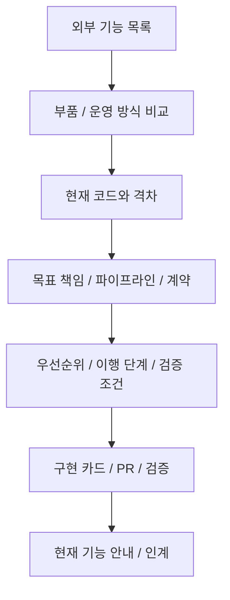

# Decision AI 문서 지도

현재 동작, 개편 제안, 외부 근거, 과거 기록을 구별해 찾는 입구다. **현재 상태와 사용자 확정 조건은 [NEXT-SESSION](../NEXT-SESSION.md)**이 기준이다. 개편 문서는 구현 완료나 새 운영 버전 선언이 아니다.

## 목적에 따라 시작하기

| 하고 싶은 일 | 먼저 볼 곳 | 이어서 볼 곳 |
|---|---|---|
| 지금 할 일과 환경·확정 방침 확인 | [현재 인계](../NEXT-SESSION.md) | [협업 규칙](COLLABORATION.md), [설치](SETUP.md) |
| 지금 되는 기능·가치와 코드 찾기 | [기능·용도·효용](FEATURES.md) | [실제 서비스 구조](../app/ARCHITECTURE.md), [앱 실행](../app/README.md), [실행 기반](../core/README.md) |
| 크게 고치기 전 전체 구조 판단 | [통합 개편 준비서](architecture/redesign-2026-10-04/README.md) | [현재와 격차](architecture/redesign-2026-10-04/CURRENT.md), [목표 구조·대안](architecture/redesign-2026-10-04/TARGET.md) |
| 어떤 기능을 먼저 넣을지 선택 | [구현 후 우선순위](FEATURES.md#후속-우선순위) | [개편 전 전체 효용 비교](architecture/redesign-2026-10-04/PRIORITIES.md), [후보 배치 지도](architecture/redesign-2026-10-04/CAPABILITY-MAP.md), [누락·충돌 검토](architecture/redesign-2026-10-04/REVIEW.md) |
| 구현 카드로 쪼개기 | [이행 단계·완료 기준](architecture/redesign-2026-10-04/MIGRATION.md) | [파이프라인](architecture/redesign-2026-10-04/PIPELINES.md), [데이터·상태 계약](architecture/redesign-2026-10-04/DATA-CONTRACTS.md) |
| 다른 프로젝트 기능을 다시 찾아보기 | [외부 참고 지도](REFERENCE-MAP.md) | 아래 원본 조사 지도, 각 기록의 고정 출처 |
| 화면·개념·계약 확인 | [작업 개념도](concept/README.md), [디자인](../design/README.md) | [계약](../contracts/README.md), [아키텍처 버전 지도](architecture/README.md) |
| 검증과 과거 결정 추적 | [검토 목록](reviews/README.md), [실험](experiments/) | [보관 인계](handoff/README.md), [CI](https://github.com/inlight37-design/decision-model_lab/actions/workflows/checks.yml), 관련 PR |

## 조사에서 설계·구현으로 이어지는 길

| 원본 조사 | 찾는 내용 | 통합 설계와의 연결 |
|---|---|---|
| [외부 기능 후보 목록](research/feature-catalog-2026-10-04/README.md) | Hermes와 다른 도구의 편의·검색·스킬·자동화·연동 후보 | H/O 후보 → 작업 묶음·기대 효용 |
| [AnchorMind 등 부품 분석](research/component-comparison-2026-10-04/README.md) | 저장·검색·기억 수명·검토·인계의 코드와 대안 비교 | D 후보 → 문맥·기억·근거·원장 책임 |
| [tmux 등 운영 분석](research/operations-comparison-2026-10-04/README.md) | 실행/연결 분리, 작업 배정·복구·adapter·workflow | OP 후보 → 작업·실행·조회·자동화 책임 |
| [이전 조사와 적용 현황](REFERENCE-MAP.md) | Hermes·tmux 초기 분석, Peek·WorkTrail·다중 AI·Jev 등 | 이미 반영한 원리와 아직 남은 제안을 구별 |
| [v0.4](architecture/v0.4/README.md), [v0.3](architecture/v0.3/README.md), [v0.2](architecture/v0.2/README.md) | 협업·회계·native CLI·독립성·합성 계약의 기반 | 개편 시 유지할 계약과 평가 조건 |

기능 후보의 D 번호는 부품 분석의 지역 번호다. v0.3/v0.4 설계 결정 번호와 합쳐 읽지 않는다. 코드 전체 목록, 실제 읽은 코드, 실행 probe는 서로 다른 검토 범위이며 각 조사 근거 파일에서 확인한다.

## 같은 사실을 여러 곳에서 관리하지 않기

| 사실 | 관리하는 곳 | 다른 문서의 역할 |
|---|---|---|
| 현 환경·확정 조건·열린 작업 | NEXT-SESSION | 요약을 복사하지 않고 연결 |
| 실제 사용자 기능·기억 적용 범위 | FEATURES, app/README | 제안과 실제 동작을 대조 |
| 현재 코드 책임·명령/조회 경계 | app/ARCHITECTURE | 개편 전 코드 지도와 구별 |
| 외부 원문·버전·읽은 범위·제한 | 해당 연구의 SOURCES/EVIDENCE/source-map | 고정 출처를 인용 |
| 후보의 목표 배치 | 개편 준비서 CAPABILITY-MAP와 JSON | 같은 후보의 중복 백로그를 만들지 않음 |
| 현재 후속 우선순위·기대 효과 | FEATURES의 후속 우선순위 | 개편 전 PRIORITIES/MIGRATION의 판단·의존성에 연결 |
| 특정 시점 검증 결과 | CI·실험·날짜별 검토 기록 | 현재 성능이나 PC 관측으로 확대 해석하지 않음 |

## 정리·보존 기준

현재 안내에서 끝난 작업·중복 설명·낡은 제약은 고친다. 날짜별 조사·검토·실험은 근거이므로 보존하며, 현재와 다른 판단은 입구에 단서를 붙인다. 파일을 옮기거나 지우기 전 코드·문서·외부 고정 링크의 사용처를 확인한다. “지금 도입하지 않음”은 후보와 출처를 삭제한다는 뜻이 아니다.

개편 작업을 시작할 때는 인계 → 우선순위 → 해당 단계의 계약·현재 코드만 먼저 읽고 필요한 원본으로 내려간다. 모든 조사를 매번 모델 입력에 넣지 않는다.
