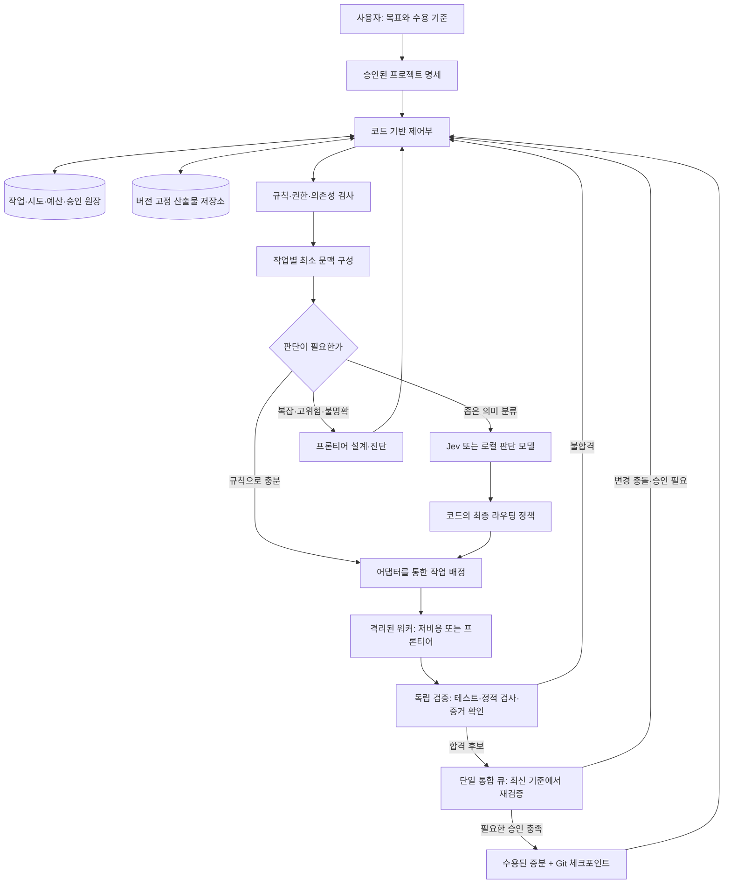

# 02. 제안 아키텍처: 선택적 판단 계층을 가진 검증 중심 협업 시스템

> **상태: 설계 제안 v0.1 / 2026-09-21.** 실행 중인 제품이나 성능이 검증된 구현이 아니다.
>
> 목표: 프론티어 모델의 능력을 없애지 않고, 반복적인 조율·문맥 전달·단순 판단을 줄여 **수용된 결과 하나를 얻는 총비용**을 낮춘다. 규모 확장은 그다음이다.
>
> 공개 근거는 [01 조사 지도](01-evidence-and-landscape.md), 재사용 후보는 [05 도구·도입 결정](05-tooling-and-roadmap.md), 검증 방법은 [04 평가·비용](04-evaluation-and-economics.md)에 분리한다. 이 문서의 구성·정책은 별도 표시가 없는 한 본 저장소의 제안이다.

## 1. 한 문장 구조

**코드가 프로젝트의 상태·권한·예산을 통제하고, Jev류는 제한된 판단을 제안하며, 생성 모델은 범위가 정해진 일을 수행하고, 독립 검증을 통과한 산출물만 통합한다.**

전체 프로젝트를 이해하는 프론티어 모델은 남긴다. 다만 매 로그를 읽고 매 도구 호출을 승인하며 모든 워커의 수다를 전달받는 상시 관리자로 쓰지 않는다.

## 2. 왜 ‘가벼운 제어부 + 필요한 AI’인가

운영 규칙과 지능이 필요한 판단은 다른 문제다. 작업의 선행 조건 충족 여부, 예산 부족, 동일 파일 수정 충돌, 명령 종료 코드, 승인 유효기간은 코드로 판정할 수 있다. 이런 일에 Jev를 추가하면 더 저렴한 LLM을 썼더라도 불필요한 모델 호출이 남는다.

반대로 시스템 구조 설계, 요구사항의 모순 해소, 여러 모듈에 걸친 원인 추론, 검증 전략의 적절성은 단순 분류로 충분하지 않을 수 있다. 여기에 소형 판단 모델을 강제로 끼워 넣지 않는다.

공식 Jev 문서의 작은 질문 원칙, 공개 Jev 제어 데모의 제한된 후보 선택, 다중 에이전트 연구의 조율·종료 실패를 참고한다. [조사 지도 S02, S16–S20]

## 3. 전체 구성



여기서 프론티어/저비용은 모델 이름이 아니라 **역할 등급**이다. 모델 ID, 가격, 지원 도구·문맥 길이·정책은 실행 설정에 둔다. 새로운 모델이 나와도 문서 전체나 작업 계약을 바꾸지 않아야 한다.

## 4. 여섯 가지 책임 경계

| 계층 | 맡길 일 | 맡기지 않을 일 |
|---|---|---|
| 규칙 엔진 | DAG 준비 상태, 예산, 경로·명령 허용, 종료 코드, 재시도 횟수 | 요구사항의 의미를 임의로 추론 |
| 선택적 판단 모델 | 작업군·역량 수요 분류, 정보 부족 신호, 검토 우선순위 제안 | 코드 생성, 권한 부여, 배포 승인, 최종 정답 선언 |
| 저비용 생성 워커 | 정해진 인터페이스 안의 구현·테스트·문서·탐색 | 임의로 프로젝트 범위 확대, 상위 설계 변경 |
| 프론티어 모델 | 명세/아키텍처, 어려운 실패 진단, 교차 모듈 변경, 중요한 검토 | 기계적으로 판정 가능한 모든 운영 업무 |
| 독립 검증기 | 신뢰된 수용 기준에 대한 실제 실행과 증거 기록 | 워커의 ‘완료’ 문구를 통과로 변환 |
| 사용자 | 목표·우선순위·위험 허용, 비가역/외부 영향 승인 | 매 정상 실행 단계의 수동 버튼 클릭 |

‘저비용 워커가 못하면 다음 등급’이라는 무조건적인 계단도 피한다. 어려움이 명백한 작업은 처음부터 프론티어에 보내는 편이 총비용이 낮을 수 있다. 반복 실패의 비용은 평가에 포함한다.

## 5. 두 종류의 라우팅을 분리한다

### 5.1 작업 경계 라우팅 — 초기 기본값

작업 하나를 받는 시점에 모델·하네스·문맥·예산을 고정한다. 작업 중에는 같은 실행 세션을 유지하고, 완료·실패·명세 변경 시에만 다시 판단한다.

장점은 상태 이동과 캐시 손실을 줄이고 어느 선택이 성과를 냈는지 추적하기 쉽다는 것이다. Jev를 호출할 때도 전체 대화 대신 현재 작업 카드와 필요한 특징을 보낸다.

### 5.2 하네스 내부의 매 턴 라우팅 — 후속 실험

탐색/구현/검증 단계마다 모델을 바꾸는 접근도 공개 구현이 있다. LiteLLM의 2026-09-07 단계별 라우팅 실험이 그 예다. [05의 T06]

하지만 이것은 요청을 관찰·변환할 수 있는 API 경로와 하네스 호환성을 전제로 한다. 모델별 상태·도구 형식·암호화된 항목·캐시 정책이 달라질 수 있다. **Antigravity Teamwork의 내부 관리자 판단을 Jev로 교체하는 공개 계약을 이번 조사에서 확인하지 못했다.** 따라서 처음부터 내부 루프를 바꾼다고 설계하지 않는다.

하나의 요청에 외부 작업 router, gateway auto-router, 하네스 내 router를 동시에 켜지 않는다. 여러 router의 충돌과 비용 귀속 문제를 피하기 위해 **활성 모델 선택 책임자는 하나**로 지정한다.

## 6. 제어부의 최소 모듈

### 6.1 Project Registry / Spec Store

프로젝트 목표, 금지 사항, 수용 기준, API 계약, 위험 분류, 승인 이력을 저장한다. 자연어 요구는 프론티어가 구조화 제안할 수 있으나, 제어부가 순환 의존성·누락 필드·모순된 파일 범위를 검사한 뒤 승인된 버전으로 등록한다.

명세 변경은 새 버전이다. 이전 계획을 몰래 바꾸고 과거 결과를 새 명세에 합격한 것처럼 표시하지 않는다.

### 6.2 Task Ledger / Scheduler

작업 그래프와 각 시도의 상태를 보존한다. 실행 가능한 작업만 큐에 올리고, 자원/예산/파일 소유권을 확보한 뒤 워커에게 전달한다. 스케줄링 자체에 LLM은 필요하지 않다.

초기에는 **단일 제어 프로세스 + SQLite + 로컬 산출물 디렉터리**로 제한한다. 다른 컴퓨터의 여러 제어 프로세스가 동시에 같은 SQLite 파일을 네트워크 공유로 수정하는 구조는 범위 밖이다. 분산 실행이 필요해지면 서버형 저장소·큐로 이전한다.

LangGraph 등을 쓰더라도 별도의 경쟁 원장을 만들지 않는다. 프레임워크 체크포인트와 프로젝트 원장 중 각 상태의 소유자를 명시한다. [조사 지도 S29]

### 6.3 Context Builder

현재 작업에 필요한 코드와 증거를 가져온다. 저장소 지도, 심볼 검색, Git diff, 테스트 실패 요약, 관련 명세를 우선 사용한다. 초기에는 파일/심볼 검색과 구조화 인덱스로 시작하고 벡터 DB는 필요성이 확인된 뒤 추가한다.

문맥에는 파일의 기준 commit, 내용 hash, 수용 기준 버전이 붙는다. 오래된 요약을 최신 사실로 재사용하지 않는다. 자세한 정책은 [03](03-protocol-and-context.md).

### 6.4 Decision Adapter

입력은 제한된 작업 특징과 후보 집합, 출력은 후보 분포와 원래 모델 메타데이터다. 인터페이스는 Jev, 로컬 모델, 학습된 router, 규칙-only/no-op 구현으로 교체할 수 있게 한다.

분류 오류·타임아웃·잘못된 schema·새로운 도메인에서는 `abstain`을 반환한다. 예외가 났다고 조용히 가장 싼 워커에 보내지 않는다. 판단 결과는 **추천**이며 코드의 권한 정책보다 우선하지 않는다.

### 6.5 Worker Adapter

하네스별 CLI/SDK를 감싸 공통 작업 이벤트로 정규화한다. 시작, 사용량, 산출물, 오류, 취소, 재개를 기능별로 선언한다. 지원하지 않는 기능을 지원한다고 꾸미지 않는다.

각 어댑터는 `capabilities`를 공개한다. 예: 구조화 최종 출력, 스트림 이벤트, 실제 토큰 측정, 세션 ID 재개, 자식 프로세스 취소, 샌드박스, 도구 허용 목록. 검증되지 않은 기능은 `unknown` 또는 비활성으로 둔다.

### 6.6 Verifier / Integrator

워커가 제출한 patch를 별도의 검증 작업 공간에 적용한다. 형식/타입/빌드/수용 테스트/보안 정책/변경 범위를 확인한다. 합격 후보는 단일 merge queue를 거치고, 최신 통합 head에서 다시 필요한 검증을 받는다.

‘Git 충돌이 없었다’는 ‘의미적 충돌이 없다’와 다르다. 백엔드와 프런트엔드가 각각 테스트를 통과했더라도 API 의미가 맞지 않으면 통합 실패다.

## 7. 작업 생명주기와 복구

```text
DRAFT -> READY -> LEASED -> RUNNING -> VERIFYING -> MERGE_READY -> ACCEPTED
                         |              |              |
                         +-> REWORK <---+              +-> REWORK
                         +-> BLOCKED / ESCALATED / PAUSED / FAILED
```

`ACCEPTED`는 워커가 반환하는 상태가 아니다. 검증·통합·필요한 승인까지 만족한 뒤 제어부가 기록한다. 워커 성공 종료는 최대한 `candidate_ready`다.

### 반드시 분리할 식별자

- `project_id`: 프로젝트.
- `task_id`: 요구 단위. 재시도해도 같다.
- `attempt_id`: 한 번의 실행 시도. 재시도마다 새 값.
- `run_id`: 공급자/하네스 실행 세션.
- `state_version`: 동시 수정 검출용 버전.
- `lease_epoch`: 만료된 워커의 늦은 응답을 거부할 fencing 값.
- `base_commit` / `acceptance_hash`: 무엇을 기준으로 작업·검증했는지.

### 원자적 처리 원칙

작업 claim, 예산 예약, 파일 소유권 획득, 시작 이벤트 기록은 하나의 트랜잭션으로 처리한다. 실행 시작은 커밋된 outbox 항목을 통해 전달한다. 중복 전달에 대비해 adapter가 `attempt_id`를 확인한다.

외부 모델·도구 호출 전체의 exactly-once를 보장한다고 말하지 않는다. 프로세스가 호출 직후 죽으면 결과와 청구가 불명확할 수 있다. `unknown_outcome`을 기록하고 공급자 run ID·산출물·결제 상태를 조회하여 조정한다. 조회할 수 없으면 승인 또는 제한된 복구 경로로 멈춘다.

### 복구 시나리오

| 장애 | 안전한 동작 |
|---|---|
| 제어부가 모델 호출 직전에 종료 | outbox와 attempt 기록으로 미전달/전달 상태 확인; idempotency 지원 범위에서 재전달 |
| 응답 전에 연결이 끊김 | unknown outcome 기록; 무조건 같은 유료/외부 동작 재실행 금지 |
| lease가 끝났는데 이전 워커가 결과 제출 | 이전 epoch 결과는 자동 통합 금지; 산출물만 격리 보존 |
| 검증 중 종료 | 동일 후보 hash로 검증 재개/재실행; 이전 PASS 텍스트를 신뢰하지 않음 |
| 다른 작업이 먼저 merge | 새 head 기준 영향 분석·재검증; 예전 검증 결과 자동 재사용 금지 |
| 예산·구독 quota 부족 | 새 실행 중단, 진행 체크포인트 저장, 명시된 fallback 또는 PAUSED |
| schema/CLI 버전 변경 | capability smoke test 실패 시 해당 어댑터 비활성 |
| 사용자가 중지 | 새 배정 중단 → 실행 취소 요청 → 자식 프로세스 확인 → 미확인 실행은 별도 표시 |

## 8. 큰 프로젝트를 실제로 나누는 단위

‘백엔드 담당, 프런트 담당, 테스트 담당’이라는 역할 이름만으로는 충분하지 않다. 워커에게 넘기는 단위는 **인터페이스가 고정된 수직 기능 또는 명확한 변경 묶음**이어야 한다.

각 작업에 다음이 필요하다.

- 구체적인 목표와 하지 않을 일.
- 읽을 수 있는 영역, 수정할 수 있는 파일/모듈, 필요한 인터페이스.
- 선행 산출물과 그 버전.
- 실행 가능한 수용 기준과 검증 책임자.
- 예산·시간·재시도·에스컬레이션 한도.

한 작업이 몇 파일이어야 한다는 고정 숫자는 두지 않는다. 현재 문맥에서 설명·구현·검증할 수 있고, 실패했을 때 되돌릴 수 있는 크기로 쪼갠다.

### 예시: 여러 모듈을 가진 도구 개발

```text
M0  사용자 목표 및 금지 사항 확정
 |
M1  프론티어가 인터페이스·데이터 모델·수용 테스트 전략 제안
 |
 +-- T1 저장 모듈 구현 -----------+
 +-- T2 어댑터 구현 -------------+--> I1 통합/회귀 검증
 +-- T3 UI mock/문서 작성 -------+
                                  |
M2  실제 사용자 시나리오 종단간 검증
 |
M3  남은 실패만 프론티어 진단 후 재배정
```

T1/T2가 동시에 같은 중앙 설정 파일을 수정해야 한다면 병렬로 맡기지 않거나 중앙 설정 변경을 별도 통합 작업으로 분리한다. 설계가 바뀌면 영향을 받는 하위 작업을 `stale`로 표시하여 재계획한다.

### 계획의 전체와 세부를 분리

프로젝트 전체에는 목표·모듈 계약·마일스톤만 유지한다. 세부 작업은 현재 마일스톤 주변만 구체화한다. 처음부터 수천 개의 세부 task를 생성하지 않는다. 매 마일스톤마다 실제 구현·실패를 반영해 다음 작업을 갱신한다.

## 9. 협업 패턴 선택

| 패턴 | 기본 조건 | 구성 | 중단 조건 |
|---|---|---|---|
| 단일 워커 | 작은 변경 또는 밀접한 단일 문제 | 워커 1 + 코드 검증 | 정상 기본값 |
| 반복 개선 | 독립 분해는 어렵지만 검증 피드백이 유효 | 워커 1, 필요할 때 독립 리뷰 | 동일 실패 반복/개선 없음/예산 소진 |
| 제한 병렬 | 인터페이스·수정 범위가 분리됨 | 초기 최대 2개의 실행 트랙 | 충돌 증가/검증 병목/비용 악화 |
| 후보 경쟁 | 큰 설계 선택의 불확실성이 높고 비교 기준이 있음 | 제한 수의 독립 후보 + 검증 | 후보 수·예산 사전 고정 |
| 원격 전문 에이전트 | 별도 도구·데이터·격리 환경이 필요 | task/artifact 계약 | 인증·취소·증거 경계 미충족 시 금지 |

‘최대 2’는 초기 실험을 단순하게 하기 위한 설정 제안이지 성능상의 최적값이 아니다. 이후 실측으로 조정한다.

외부 워커가 자체 Teamwork를 실행할 경우에는 **하나의 위임된 팀**으로 취급한다. 외부 제어부와 내부 팀이 서로 하위 팀을 계속 만드는 재귀적 증식은 금지한다. 내부 동시성을 측정/제한할 수 없으면 저비용 자동 경로의 기본 후보에서 제외한다.

## 10. 무엇을 Jev에 물어볼 것인가

좋은 초기 질문 후보:

| 질문 | 후보/출력 | 정답 또는 사후 평가 |
|---|---|---|
| 이 작업의 주된 유형은? | 탐색/국소 구현/설계/리뷰/정보 부족 | 라벨된 실제 작업 카드 |
| 현재 입력만으로 작업을 시작할 수 있는가? | 예/아니오 확률 | 누락 정보 때문에 실패했는지 |
| 승인된 작은 워커가 처리할 수 있는 범위인가? | 제한된 후보 분포 | 동일 verifier 아래 수용 여부·재시도 비용 |
| 테스트 오류가 어떤 유형에 가까운가? | 환경/테스트 기대/구현/정보 부족 | 실제 해결 원인 및 명령 증거 |

나쁜 초기 질문:

- ‘이 PR은 안전하게 배포해도 되는가?’를 유일한 승인으로 쓰기.
- 저장소 전체를 넣고 완벽한 작업 그래프를 한 번에 선택하게 하기.
- 모델이 임의로 새 tool/command/permission을 출력하게 하기.
- 종속된 질문 A→B를 한 번의 병렬 독립 질문 묶음에 넣고 B가 A의 답을 알고 있다고 가정하기.
- exit code나 JSON 파싱처럼 코드가 정확하게 할 일을 모델에게 다시 판단시키기.

후보 집합에 정답이 없을 수 있으므로 `needs_more_context`/`abstain` 경로를 제공한다. ‘선택지 밖의 문자열을 못 낸다’와 ‘정답이 항상 후보 안에 있다’는 다르다.

## 11. 권한과 신뢰 경계

### 모델은 권한의 출처가 아니다

수정 경로, 네트워크 도메인, 외부 API, 배포·삭제·결제 허용은 사용자 승인과 제어부 정책에서만 온다. 모델이 보고한 `risk=low`는 참고 신호이지 정책을 낮추는 근거가 아니다.

### 격리의 단위

Git worktree는 변경 이력을 분리하는 수단이지 OS 보안 샌드박스가 아니다. 실행 워커에는 별도의 제한된 컨테이너/VM/사용자 권한 경계가 필요하다. 기본은 제한된 쓰기 영역, 필요한 네트워크만 허용, 호스트 자격 증명·SSH agent·Docker socket 미노출이다.

설치·빌드·테스트 스크립트도 신뢰되지 않은 코드로 취급한다. ‘테스트만 실행한다’고 모든 환경변수와 네트워크를 열어 주지 않는다. API 키는 가능하면 별도 broker/proxy가 보유하고 테스트 프로세스에는 전달하지 않는다. Codex 공식 자동화 문서 역시 저장소 코드가 실행되는 환경의 키 노출을 경고한다. [조사 지도 S13]

### 입력 문서와 메모리

웹, README, issue, 도구 응답, 다른 워커 메시지는 작업 자료이지 상위 시스템 명령이 아니다. 이 자료가 ‘정책 무시’, ‘비밀 출력’, ‘다른 경로 수정’을 요구해도 실행 권한이 증가하지 않는다. 내용을 요약해 장기 메모리에 넣어도 신뢰 등급은 올라가지 않는다.

CLI의 사용자 설정·프로젝트 hook·MCP 자동 로딩을 확인한다. 각 하네스의 안전한 자동화 모드를 smoke test하고, 재현 가능한 승인된 설정만 사용한다. Claude Code의 `--bare`는 로딩을 줄일 수 있지만 인증 경로도 달라지므로 무조건 붙이는 공통 옵션으로 취급하지 않는다. [조사 지도 S14]

## 12. 검증은 워커와 다른 권한을 가진다

검증기는 승인된 기준 버전에서 테스트 정의를 가져온다. 워커가 추가한 테스트는 유용하지만, 기존 수용 테스트를 삭제하거나 통과 조건을 약화시켜 PASS를 만드는 것을 허용하지 않는다.

검증 결과는 명령/환경/exit code/stdout·stderr hash/대상 commit/수용 기준 hash를 기록한다. LLM 리뷰는 증거와 연결된 finding 목록으로 받는다. ‘문제 없어 보인다’는 문장만으로 검증 완료로 하지 않는다.

서로 다른 모델 두 개가 동의해도 독립적인 정답 보장이 아니다. 테스트 자체가 부족하거나 동일 잘못된 전제를 공유할 수 있다. 고위험 요구에는 별도 oracle, 참조 구현, property test 또는 사용자 검토를 둔다.

## 13. 저장·기억·Git의 역할

| 저장소 | 내용 | 원칙 |
|---|---|---|
| 코드 Git | 코드·명세·ADR·수용 테스트 정의·검토 가능한 체크포인트 | 정상 증분과 실패한 시도 구분, secret/raw trace 금지 |
| 실행 원장 | task/attempt/event/budget/approval/lease | 제어부만 상태 변경, 감사 가능한 이력 |
| 산출물 저장소 | patch, 원본 로그, 테스트 보고서, 문맥 조각 | 내용 hash와 접근 권한, 보존 기간 |
| 검색 인덱스 | 심볼, 파일 지도, 요약, 실패 사례 | 재생성 가능, 원본의 권위 대체 금지 |

Git 커밋만 있으면 실행 중이던 유료 호출·승인·예산 예약까지 복원되는 것은 아니다. 반대로 실행 원장만 있고 코드/수용 기준 버전이 없으면 재현할 수 없다. 두 축이 필요하다.

장기 메모리는 ‘항상 프롬프트에 넣는 긴 파일’ 대신 원본 참조, 적용 조건, 반례, 생성 시점, 만료/재검증 조건을 가진다. 실패 기록도 해당 코드 버전과 환경을 포함한다. 이전 실패가 다른 조건에서 유효한 접근을 영구 금지하지 않게 한다.

## 14. 예산과 중단 조건

프로젝트 → 마일스톤 → 작업 → 시도 단위 예산을 둔다. 배정 전에 최악의 허용 사용량을 예약하고, 종료 시 실제 사용량으로 정산한다. 동시 워커가 각각 ‘예산이 남았다’고 판단해 합계 초과하는 것을 방지한다.

공급자가 실제 금액/토큰을 제공하지 않는 경로는 `unknown`을 보존한다. 호출 수·시간·출력 한도·동시성으로 노출을 제한할 수 있지만, 이를 정확한 USD hard cap이라고 표시하면 안 된다.

반복 실패의 증거가 동일하고 새 정보가 없으면 같은 프롬프트 재시도를 멈춘다. 워커 무응답은 시간 초과, 자원 소모는 하드 한도, 합리적 진전 부재는 명시된 반복 한도로 제어한다. 중단은 실패가 아니라 과금·품질 통제의 정상 상태다.

## 15. 초기 구현에서 일부러 빼는 것

Kubernetes, Kafka, 여러 감독자 AI, 자동 파인튜닝, 전면 벡터 DB, 자유로운 agent-to-agent 대화망, 모든 앱의 UI 자동 조작, 다양한 router 동시 활성화, 모델 확신만으로 자동 배포하는 기능은 초기 범위에서 제외한다.

개발의 최소 단위는 **저장소 하나, 워커 하나, 검증 경로 하나, 영속 원장 하나**다. 그 상태에서 비교 가능한 비용·품질 데이터를 얻은 뒤 Jev와 두 번째 워커를 붙인다. 기존 하네스·gateway·작업 원장을 재사용할 수 있는지는 [05](05-tooling-and-roadmap.md)의 비교로 결정한다.
