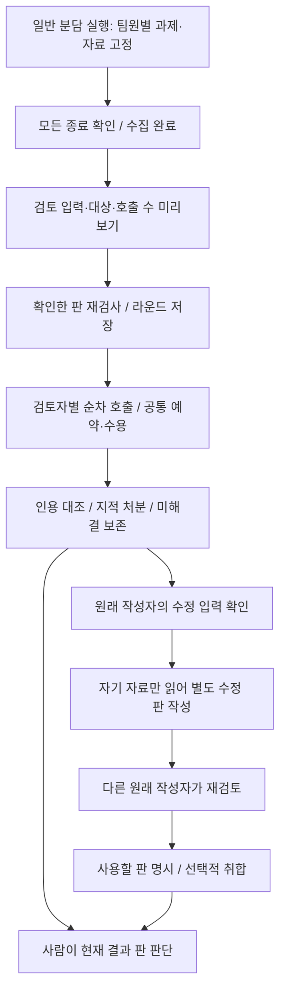

# 일반 팀원 교차검토 — 구현 전 설계

**상태: GR-1·GR-2 구현(모의·HTTP·JS 검사), GR-3 미구현.** 사용 방법은 [app 안내](../../../app/README.md)의 "일반 팀원 교차검토"다. 일반 팀원이 서로 다른 일을 맡아 낸 답을 검토하고, 원래 작성자가 자기 자료로 고친 뒤 다른 팀원이 다시 확인하는 경로다. 교차검토·수정·재검토는 격리 실행의 공개 뒤와 일반 실행의 수집 완료 뒤에 가능하다. 이 문서는 일반 실행으로 넓힐 변경 위치·입력 계약·호출 비용·완료 조건을 관리한다. 실제 모델의 개선 효과와 사용자 PC 동작은 측정하지 않았다.

시작점은 [현재 구조](../../../app/ARCHITECTURE.md), 전체 순서는 [기능 우선순위](../../FEATURES.md#후속-우선순위)다. 코드 검토 기준은 `fb544751fc428ce31d2474fd6c698b1b34d2a4f0`이다. 기존 연구의 H28·O11/12·OP06과 [역할판 검토 §6](../../reviews/2026-09-26-role-board-review/README.md)의 제한된 공개 후 검토를 구체화했다. 외부 프로젝트를 새로 실행·검증하거나 출처를 추가한 문서는 아니다.

## 1. 어디에 쓰고 무엇을 얻는가

| 사용 장면 | 기대 도움 | 한계·비용 |
|---|---|---|
| 한 팀원은 요구사항, 다른 팀원은 구현안을 작성 | 분담 사이의 충돌·빠진 조건을 원문에 연결 | 서로 다른 일을 했다는 설명 없이 비교하면 정당한 범위 차이를 오류로 지적할 수 있음 |
| 서로 다른 자료를 보고 결론 제출 | 각 답의 주장·제약·누락을 대조 | 검토자에게 자료 원문을 주지 않으므로 자료의 사실 여부를 확인하지 못함 |
| 지적을 읽었지만 답에는 미반영 | 지적→작성자의 새 판→재검토를 연결하고 반례 보존 | 수정·재검토마다 별도 호출. 좋은 지적이나 더 좋은 답을 보장하지 않음 |
| 수정 후 결과를 모아 판단 | 어떤 답의 어느 판을 모았는지 추적 | 수정 판을 소비하는 취합 단계 전에는 기존 취합이 원래 답만 사용 |

첫 범위는 **일반 실행 하나, 결과 수집 완료, 수용된 원래 CLI 작성자 둘 이상, 사람이 요청한 한 라운드**다. 실패한 팀원의 빈자리를 채우지 않고 검토하지 못한 범위를 표시한다. 일반/격리 혼합 배치, 원본 앱 카드를 일반 칸에 넣기, 새 검토 모델 추가, 진행 중 답 검토, 자동 반복은 이 작업에 넣지 않는다. 기존 격리 검토의 수동 답 참여 조건도 바꾸지 않는다.

## 2. 현재 코드와 바꿀 위치

| 책임·위치 | 현재 구현 | 일반 실행에 필요한 변경 |
|---|---|---|
| [state](../../../app/state.py) `_general_gate` | 일반 답은 도착대로 공개, 모두 정리된 뒤 `collected`; `revealed`는 거짓 | 의미 유지. 검토를 위해 `revealed`를 참으로 만들면 합성·정족수 경계까지 잘못 열림 |
| [ReviewService](../../../app/application/reviews.py) `cross_review` | 격리 공개만 허용, CLI 작성자가 다른 답을 한 번씩 순차 검토 | 모드별 적격성·입력 구성과 미리보기. 일반은 전체 목표와 각자의 맡은 일을 함께 고정 |
| [cross_review 형식](../../../app/cross_review.py) | 같은 질문의 답으로 설명, 자기 답 별도·다른 답 D 이름표, 인용 검사 | 분담 설명·자료 접근 범위·독립성 문구 분리. 기존 지적 형식·처분 재사용 |
| [RevisionService](../../../app/application/revisions.py) `_context`, `recheck` | 격리 공개만 허용, 수정 snapshot에 실행 전체 자료·공통 폴더 사용 | 일반 작성자의 배정 과제·배정 자료만 고정. 재검토도 일반 `collected` 허용 |
| [InputBuilder](../../../app/context/inputs.py) `_attempt_input`, `_member_source_dir` | 일반 실행은 팀원별 입력·자료 폴더 검증·구성 가능 | 자료 검증 재사용. 미리보기와 실제 mount의 팀원 범위 일치 확인 |
| [수정 형식](../../../app/revisions.py), [SEATS](../../../app/execution/seats.py) | 수정·재검토 결과도 격리 공개 후 독립성 문구 사용 | 일반 snapshot의 모드를 checker까지 전달. 옛 결과 문구·hash 유지 |
| [PublicQueries](../../../app/queries/public.py) | 일반 취합은 제공하지만 검토·수정 조회는 `if revealed` 안 | 검토·수정만 일반 수집 완료에 노출. 제안·모델 합성은 기존 격리 관문 유지. summary/detail 모두 적용 |
| [roles](../../../app/roles.py) `_general_status`, [workflow](../../../app/workflow.py) | 일반 상태는 참여자·취합만 반영. 공통 흐름은 검토 결과를 받으면 활용 가능 | 검토/수정/재검토 대기·실행·미확정 우선 표시. 작업 완료·내 차례·선행 admission까지 연결 |
| [역할판](../../../app/static/role-board.js), [실행 화면](../../../app/static/index.html), [수정 화면](../../../app/static/revisions.js) | 일반 화면은 취합·사람 판단, 교차검토 UI는 격리만 표시 | 일반 입력 확인·검토 결과와 단계별로 구현한 수정/재검토를 연결 |
| [보고서](../../../app/report.py) `revision_report` | 내부에서 격리 공개를 요구하는 `build_report` 호출 | 일반 수정 보고의 별도 원본 형식 필요. 기존 격리 보고의 공개 조건을 풀어 해결하지 않음 |
| [호출 원장](../../../app/execution/invocations.py), [coordinator](../../../app/execution/coordinator.py), [repository](../../../app/repository.py) | 공통 상한·자리·재시작·사람 판단 차단·새 결과 판 제공 | 기존 실행 경로 재사용과 일반 모드 회귀. 별도 실행 엔진/예약 표 불필요 |

자료 구성·공개 조회·상태·보고서까지 바뀌어야 한다. 명령의 `general` 거절 조건만 지우는 변경으로는 완성되지 않는다.

## 3. 입력 계약과 파이프라인

아래는 **목표 흐름**이다. GR-1은 검토까지, GR-2는 수정·재검토까지, GR-3은 선택한 판의 취합을 연다.

### 보낼 정보와 접근 범위

| 단계 | 보내는 내용 | 파일·기억 범위 |
|---|---|---|
| 교차검토 | 전체 목표·검토 질문, 자기 과제·답, 다른 팀원의 과제·답/hash, 배정 자료 이름/hash, 누락된 팀원, 모드·출처 범위 | 자료 본문·파일 mount 없음. 자동 기억 pack 추가 없음 |
| 수정 | 전체 목표와 자기 과제, 원래 답·앞 수정 판, 자신을 대상으로 한 지적·당시 처분·앞 재검토, 자기 배정 자료 목록/hash | 자기 자료 사본만 mount. 다른 팀원 자료와 자동 기억 pack은 추가하지 않음 |
| 재검토 | 수정에서 고정한 목표·과제·근거·처분, 해당 수정 답/hash | 자료 본문·파일 mount 없음. 자동 기억 pack 추가 없음 |
| 취합 | 사람이 고른 팀원별 판/hash, 과제, 미해결 지적·누락 | GR-3에서 별도 입력 확인. 기존 취합의 고정 기억 포함 여부를 표시하고 몰래 재선택하지 않음 |

다른 답의 D 이름표는 검토자별로 순서를 섞고 자기 답을 대상으로 고르지 못하게 한다. 과제와 답은 같은 이름표 아래 묶는다. 원래 일반 답은 자동 기억을 사용했을 수 있으므로 이 검토는 독립 판단 실험이 아니다. 출처의 기억 사용 여부·고정 pack hash는 표시할 수 있지만 옛 `assignment.prompt` 전체를 수정 prompt로 재사용하지 않는다. 그 안에는 자동 기억 전달문이 포함될 수 있다.

검토 중 자료 이름/hash는 **그 답의 입력 출처 표시**이며 검토자가 자료 내용을 읽었다는 뜻이 아니다. 자료나 기억에서 답이 이미 인용한 글은 답의 일부로 전달될 수 있다. 원본 파일·pack을 추가로 보내지 않는 경계와 이 전파를 구별한다. 자료에 기대는 주장은 확인 못 한 것으로 남긴다. 인용은 답 원문 안에 있는지만 대조한다. 현재처럼 `not_found`는 지적의 원문 불일치 표시이며 검토 전체의 형식 실패와 다르다. 지적 없음도 파싱 실패와 구별한다. `factual_check=not_performed`, `agreement_is_verification=false`를 유지하고 일반 결과의 독립성 표시는 `general_team_not_independent`로 제안한다. 옛 `post_reveal_not_independent` 결과는 다시 쓰지 않는다.

### 미리보기와 생성의 일치

현재 `POST /api/runs/{id}/cross-review`는 질문을 받아 바로 라운드를 만든다. **제안 API**는 `POST /api/runs/{id}/cross-review/preview`를 추가하고, 일반 실행의 기존 생성 경로에 아래 확인 값을 요구한다. 격리 호출자의 기존 요청 형식은 호환한다.

1. 미리보기는 모델을 부르거나 원장/예산을 예약하지 않는다. `round_id`와 고정 nonce를 만들고 같은 nonce로 입력을 재현할 수 있게 한다.
2. manifest에는 버전·모드·실행 ID·현재 결과 판, 전체 목표·배정 과제, 수용 답의 전문/hash, 팀원별 배정 자료 목록/hash, 누락 사유, 원래 카드/모델, 각 검토자의 이름표·prompt·입력 hash·UTF-8 바이트, 예상 호출 수를 넣는다. 자기 답을 포함한 모든 답 hash와 배정 자료 메타데이터의 결속을 확인한다.
3. canonical manifest hash를 `confirmation`으로 돌려준다. 화면은 전체 입력을 펼쳐 확인할 수 있고, 다른 실행/미리보기 응답이 현재 창을 덮지 못하게 한다. 실제 native plan의 크기·관측·권한 검사는 시작할 때 다시 수행한다.
4. 생성은 같은 lock/거래 경계에서 현재 적격성·답/배정 hash·결과 판·확인 값을 다시 비교한다. 라운드가 이미 있거나 확인 후 내용이 바뀌었으면 호출 없이 거절한다. 새 `round_id`로 한 라운드 제한을 우회하지 못한다.
5. 모든 검토 입력을 먼저 고정해 저장하고 각 실제 시작은 기존 `REVIEW_SEAT`와 공통 원장의 최종 예약을 통과한다. 미리보기의 호출 수는 남은 예산 보장이나 선결제 예약이 아니다.

**저장 제안:** 구현할 때 `reviews`에 nullable `snapshot`, `snapshot_sha256`을 추가한다. snapshot 안에 계약 버전·모드·round_id·검토자별 frozen manifest를 둔다. 기존 `targets`, `prompt`, `input_sha256`은 유지하되 생성 시 서로의 일치와 hash를 검증하고 읽을 때도 훼손을 성공처럼 표시하지 않는다. 옛 행의 snapshot 부재는 기존 격리 형식으로 읽으며 새 metadata를 추정해 채우지 않는다. 새 일반 수정은 기존 `answer_revisions.snapshot`에 모드·과제·자기 자료 범위를 넣는다. 현재 schema 17은 이 설계 PR에서 바꾸지 않는다. 구현 때 다음 schema로 이행하며 backup·구형 코드 거절·기존 소비 보존을 함께 확인한다.

## 4. 실행·상태·사람 판단

- 검토는 수용된 원래 CLI 작성자만 한다. 새 모델/provider 자동 대체나 자기 답 검토는 없다. 답이 없는 팀원과 관측 불가 카드는 빈자리로 표시한다.
- 한 번에 상위 호출 하나, 초안 실행 중 차단, pause·종료 미확정·자리·global/provider 상한은 기존 관문을 쓴다. 앞 검토자가 수용되지 않으면 남은 검토자를 시작하지 않고 `skipped`와 이유를 남긴다.
- 시작한 실패/unknown은 소비를 되돌리지 않는다. 미시작 대기는 호출로 세지 않는다. 재시작은 자동 재호출하지 않고 기존 복구와 종료 확인을 따른다.
- 일반 실행은 검토 후에도 `collected`다. 공개/독립 정족수나 격리 모델 합성의 자격을 얻지 않는다. 일반 상태 계산에서 검토·수정·재검토의 queued/running/unknown이 기존 사람 판단 완료보다 우선해야 한다.
- `mark_reviewed`는 이미 검토·수정·재검토 진행/미확정 중 판단 완료를 막는다. 새 결과 사건은 기존 `result_revision`을 바꾸므로 과거 판단이 새 결과까지 덮지 않는다. 라운드 시작 자체가 결과 판을 올리지 않는 동안에는 active projection과 명령 관문이 완료를 막는다.
- 목록·상세·검색·사용량·내 차례·선행 준비는 같은 공개 projection을 소비한다. 페이지 밖 실행에 검토가 생겨도 전체 작업의 active/unsettled가 유지되어야 한다. 조회 캐시는 DB 변경으로 무효화되며 명령 판단에는 쓰지 않는다.
- 원래 초안과 수정 판은 별개다. GR-2까지 기존 취합은 **원래 답을 모은 결과**로 명시한다. GR-3 전에는 수정 답을 취합했다는 표시를 하지 않는다.

## 5. 호출 비용과 도입 판단

`n`은 검토 가능한 원래 작성자 수, `r`은 수정하기로 고른 작성자 수(`r ≤ n`), `v`는 작성자당 수정 시도 상한, `c`는 수정 판당 재검토 시도 상한, `k`는 선택적인 취합 호출 수다. 첫 답 작성 호출은 아래에 포함하지 않는다. 실패를 포함한 기존 수정·재검토 상한은 각각 2, 취합은 실행당 2다.

**추가 호출 상한: `n + r × v × (1 + c) + k`.** 검토자 한 명이 다른 답을 한꺼번에 읽으므로 검토 호출은 `n`회다. 각자 다른 답을 읽는 입력량은 답 길이가 같을 때 대략 `n × (n−1)`에 비례한다. 호출 수 감소가 입력 사용량 감소를 뜻하지 않는다.

| 팀원 둘인 예 | 첫 답 이후 추가 호출 | 의미 |
|---|---:|---|
| 검토만 | 2 | 한 라운드, 작성자별 한 번 |
| 검토 + 한 작성자 수정 + 다른 작성자 재검토 | 4 | 첫 구현의 기본 사용 경로; 자동 후속 호출 없음 |
| 위 경로 + 취합 한 번 | 5 | 취합 모델이 있고 사람이 요청할 때만 |
| 양쪽 작성자가 모든 수정/재검토 상한 사용 | 최대 14 | 실패 포함 구조상 상한. 실제 예산이 허용한다는 뜻은 아님 |
| 위 상한 + 취합 상한 | 최대 16 | 초안·분담 제안 등 앞서 쓴 호출은 별도 |

화면에는 이번 행동의 호출 수·입력 바이트와 현재 provider별 사용량을 보여 준다. 구독 차감량·현금 비용·지연은 입력 바이트로 확정할 수 없다. preview 이후 다른 호출이 예산을 쓸 수 있으므로 시작 시 재검사한다. 첫 라운드 뒤 미해결이 없으면 사람이 판단을 끝낼 수 있다. 자동으로 상한까지 순환시키는 설계가 아니다.

품질 평가는 **분담 답만 읽기 / 취합만 추가 / 교차검토 추가 / 수정·재검토 추가**를 같은 과제·호출 예산에서 비교한다. 유효한 지적·잘못된 지적·정당한 분담 범위를 오류로 지적한 비율·미해결 보존·사람 검토 시간·호출과 입력량을 함께 본다. 지적 개수나 모델끼리의 동의를 품질 점수로 삼지 않는다. 이 비교와 PC 호출은 아직 실행하지 않았다.

## 6. 구현 순서와 완료 조건

| 순서 | 한 번에 끝낼 범위 | 완료 기준 |
|---|---|---|
| P1 / GR-1 | 일반 검토 입력/확인·저장·한 라운드 + 공개 조회·상태·화면·검색·호출/사용량 | 서로 다른 과제·자료를 가진 모의 팀에서 확인한 입력으로만 검토. active/unknown이 내 차례·선행 준비·판단 완료에 반영. 격리 동작 유지 |
| P1 / GR-2 | 일반 작성자의 수정·다른 작성자 재검토·원본 비교·내보내기 | 자기 자료만 mount, 이전 판/지적/hash 고정, 기존 상한·복구·새 결과 판 회귀. 일반 원본을 담는 `general-revision-history/1` 형식 제안과 `/revision-report`의 모드별 분기; 기존 격리 보고 유지 |
| P2 / GR-3 | 선택한 답의 판으로 취합·판단 근거 연결 | 팀원별 original/revision ID/hash를 미리보기와 취합 입력에 고정. 미해결·누락·선택 판 표시. 옛 취합 입력은 소급 교체하지 않음 |
| 조건부 평가 | 주 PC 관측과 실제 과제 비교, 긴 답의 입력 부담 확인 | 관측된 CLI 계획·구독 경로·호출 상한으로 실행하고 실패 포함 비용 기록. 효과가 없으면 추가 자동화보다 여기서 중단 |

GR-1의 버튼만 먼저 공개하고 상태·입력 확인을 후속으로 미루지 않는다. 서비스·순수 형식·공개 projection·UI를 연결한 사용 경로를 한 PR에서 완성한다. 파일/명령/보고서의 책임은 위 코드 지도에 두며 새 공통 엔진을 만들지 않는다. 일반 수정 보고에는 일반 실행·과제·원래 답/hash·검토·수정 이력을 담되 독립 정족수나 격리 보고 형식을 가장하지 않는다. GR-1은 화면/공개 조회에 검토를 제공하고 전용 일반 내보내기는 GR-2에서 연다.

## 7. 회귀·실패 확인표

| 확인할 경계 | 기대 결과 |
|---|---|
| 수집 전, accepted 작성자 부족, unknown, 취소 | 새 검토 호출 거절; 실패한 팀원 자동 충원 없음 |
| 배정 과제·자료 목록·답 hash·결과 판이 preview 후 바뀜 | 확인 값 불일치로 거절; 사용량 증가 없음 |
| 같은 확인 중복/동시 전송, 다른 round_id로 재시도 | 원래 한 라운드만 존재; 호출 중복 없음 |
| 두 팀원의 자료가 다르고 답에는 없는 자료 표식 포함 | 검토/재검토 prompt에 그 표식 없음; 수정은 자기 자료만 전달 |
| 자동 기억이 들어간 원래 assignment, 다른 작업 기록 | 검토/수정에 자동 pack 재주입 없음; 다른 작업/배정 자료 혼입 없음 |
| 자기 이름표, 알 수 없는 대상, 형식 오류, 인용 불일치, 빈 지적 | 대상/형식 거절과 `not_found`·지적 없음 구별; 거짓 사실 확인 표시 없음 |
| 앞 검토 실패·상한 도달·시작 거절, 저장 실패, 중간 재시작 | 미시작 검토 사유 보존, 실제 소비만 기록, 자동 재호출/환불 없음 |
| 수정 지적·처분·앞 판 변경, 자기 재검토, 상한 초과 | 현재 근거 확인 요구 또는 거절; 원래 초안·미해결 보존 |
| 이미 판단한 일반 실행에 검토 시작/새 결과/unknown | 목록·상세·내 차례·선행 준비가 같은 active/unsettled/결과 판 표시 |
| 페이지 밖 실행, 검색 종류별 조회, 늦은 preview 응답 | 전체 상태 정확성 유지; 잘못된 실행의 확인 버튼 활성화 없음 |
| 옛 DB 이행, 옛 격리 보고·prompt·기억 pack, 구형 코드 | 자동 backup과 기존 hash/소비 보존; 구형 코드의 새 schema 거절 |
| 원래 답 취합과 수정 판 보고 | 사용한 판 명시; 일반 실행을 격리 공개로 오인하지 않음 |

모의 service/HTTP 경계 검사와 실제 JavaScript 렌더·입력 이동·모바일 폭 확인을 먼저 한다. 그 통과를 native 격리나 모델 품질 검증으로 확대하지 않는다. 실제 결과는 해당 구현 PR/CI와 날짜별 기록에 남기며 이 설계의 완료 조건을 구현 완료로 바꿔 쓰지 않는다.
