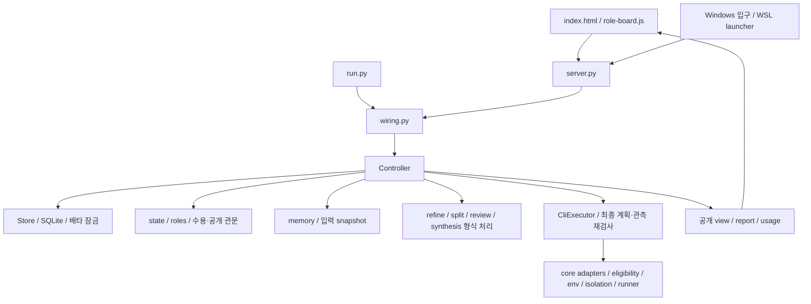

# 현재 구조와 개편할 지점

기준 코드: `892c5ebe8c53ebba23c9f8e452c67306f35f0c8a`의 `app/`, `core/`. 이 head의 제품 코드는 main `6cfb78c5a91dc26a46d95229c89f6e2bbfb6830c`와 같다. 이번에는 코드·설계를 대조했으며 PC 실측을 새로 하지 않았다. [코드 지도](current-code-map.json)의 hash·선택 읽기 범위와 [인계의 관측 출처](../../../NEXT-SESSION.md)를 구별한다.

## 실제 구조

서버와 headless는 `wiring`을 공유한다. controller는 단순 HTTP handler가 아니라 원장 예약·thread 관리·수용·공개·상위 역할·재시작·조회까지 담당한다. `state`, `roles`, `reply`, 검토/합성 모듈 등 이미 분리한 부품도 있다. “아무 경계가 없는 코드”로 규정하지 않는다.

## 현재 기반 → 목표 책임

| 현재 파일/계약 | 확인한 현재 동작 | 확장할 때의 마찰 | 목표 |
|---|---|---|---|
| `controller.prepare_run/create_run` | 역할·자료·질문·자동 기억을 검사하고 입력 명세 고정 | PDF/URL/스킬/workflow를 직접 덧붙이면 준비 책임 집중 | M01 명세 + M02 context builder + M03 명령 관문 |
| `controller.pump/_attempt/_finish` | 원자적 예약 뒤 실행, 입력 전달/종료/outcome 수용, 늦은 결과 식별 | 역할별 실행이 늘면 같은 회계·복구 규칙을 여러 경로에 적용해야 함 | M03 invocation lifecycle, M04 runtime |
| `_Seat`, 상위 역할 tables, synthesis events | 공통 seat helper가 있으나 역할별 표와 합성 사건이 함께 존재 | 조회·상한·미확정·복구가 여러 저장 형태를 알아야 함 | 공통 invocation projection부터 도입; payload는 역할별 유지 |
| `Store` | schema 14, 잠금, 자동 이전 전 backup, events와 상태의 같은 거래 | 모든 event가 전체 원장을 재생할 충분한 정보라는 보장은 없음 | M06 unit of work; 기존 원장 adapter부터 |
| `events(run_id, seq)` | seq는 해당 aggregate 식별자 안에서 증가 | 서로 다른 run의 max seq를 전역 revision으로 쓸 수 없음 | 별도 ledger revision 또는 aggregate cursor 계약 |
| `state.gate` | participant 행에서 quorum/status 계산, 저장 phase는 공개 경계 | 임의 workflow의 done 하나로 옮기면 독립성·공개 의미 소실 | M03 수용, M05 공개 정책; typed step gate |
| `Controller.view` | 공개 전 내용·길이·digest·usage·시간을 숨기는 allowlist projection | 검색·알림·별도 API가 직접 DB를 읽으면 같은 경계 누락 가능 | M07 공통 visibility-aware query service |
| `memory.select/footer` | 같은 task의 공개·비취소 이력, 어휘/최신순, 검토·판단 우선 발췌, hash/바이트 상한 | 자료·결정·절차의 별도 수명/선택 이유/검색 UI가 부족 | M02 선택 정책 + M05 출처/결정 + 파생 검색 index |
| `cross_review/report/reply` | 원문 인용 결속·검토 처분·보고서, 사실 검증은 아님 | 수정 답변 판과 후속 검토 lineage는 미구현 | M05 artifact revision + review/verification/disposition |
| `cli_executor/core` | 최종 plan 동일성, native 구독·기기 관측, 격리·전체 tree·stderr 확인 | App Server/remote를 함수 모양만 맞춰 끼우면 의미 차이 숨김 | M04 capability contract; 기존 backend 우선 보존 |
| `roles.py`·화면 | 일반과 격리 배치·상위 역할, 홈/작업/문서함 | 화면 JS에 입력·API·조회·렌더·선택 상태가 함께 있음 | M07 API client/state/view 모듈, 디자인 부품 유지 |
| `launch.py` | 서버 소유권과 stop 처리, 창 종료 후 호출 정리 | detach UI와 지속 service의 수명이 다름 | 현재 모드 유지 + 별도 M09 service lifecycle 후보 |
| `usage/account_quota` | 실행 토큰과 계정 한도 구별, provider별 합계, 미상 별도 | workflow·압축·review가 늘 때 누락 없는 합산 필요 | invocation에 provenance; M07 집계, M09 관측 |

여기서 말하는 마찰은 **설계상 확장 위험**이다. 현재 성능 장애·중복 호출이 발생했다는 새 실측 결과가 아니다. 줄 수나 파일 크기만으로 재작성 필요를 증명하지 않는다.

## 보존할 제품 의미

| 보존 계약 | 왜 개편의 기준인가 | 교체 시 비교할 것 |
|---|---|---|
| 일반 팀원·상위 역할 자동 기억, 격리 팀원 제외 | 2026-10-04 사용자 결정. 수동 우선의 과거 제안보다 현재 결정 우선 | 모든 역할의 실제 input pack·hash·off 설정 |
| 격리와 일반 실행의 공개 방식 다름 | 일반은 결과가 오는 대로, 격리는 공개 관문 뒤 | API·검색·보고·알림의 가시성 parity |
| 호출 상한·미확정 슬롯은 영속 의미 | 재시작/새 엔진이 호출 예산을 리셋하면 안 됨 | provider별 예약/소진/미상·중복 호출 수 |
| 수용은 exit 0 이상을 요구 | 입력 전달, native outcome, 전체 tree 확인 | runner contract와 controller acceptance |
| 독립 정족수와 답변 수 구별 | manual/unverified 답을 독립 증거로 올리면 안 됨 | roster 등급·quorum policy·축소 조건 |
| 검토 처분과 사실 검증 구별 | exact quote는 진실 판정이 아님 | finding disposition·check evidence·unresolved |
| 사용자 판단·과거 원문·실패 이력 보존 | 편집/복구/요약으로 사용량과 반례가 없어지면 안 됨 | immutable artifact·supersedes·origin |
| 구독 native CLI와 로컬 기기 관측 | provider가 빠져도 유료 API나 미관측 기기로 자동 대체하지 않음 | funding/capability/host manifest |

## 크게 바꿀 수 있는 구현 선택

현재 table별 상위 역할 구현, controller 메서드 배치, 단일 화면 파일, 전체 목록 응답 형태, 기억 검색 알고리즘, local process lifecycle는 **불변 제품 요구가 아니다.** 별도 증거와 이행 시험이 있으면 바꿀 수 있다. Python/SQLite를 바꿀 수도 있지만 먼저 그 교체로 해결하는 요구를 써야 한다. 현 요구는 외부 DB·message broker를 필수로 만들지 않는다.

특히 v0.4의 `single/cross_check/deliberate/build_review`는 설계의 전략명이고 현재 wire의 `isolated/general`과 일대일 enum이 아니다. 새 workflow 계층은 전략과 실행 격리 모드를 따로 저장해야 한다. 현재 읽기 전용 참여자를 이름만 `implementer`로 바꿔 쓰기 executor로 취급하지 않는다.

## 아직 없는 연결

명세→단계 의존성→담당/준비 이유, 검토→수정 답변→새 판 재검토, 기억→결정/절차 판 관리, 결과→검색/수신함, UI 단절→지속 실행 재발견이 핵심 연결 후보다. 현재 카드·원장·역할판 기반은 있으나 이 전체 파이프라인이 이미 구현된 것은 아니다. 각각을 [PIPELINES](PIPELINES.md)와 [MIGRATION](MIGRATION.md)의 독립 완료 단위로 만든다.
