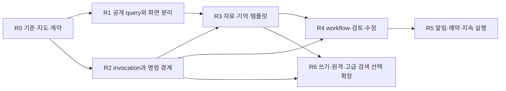

# 큰 개편을 실행 가능한 단위로 나누기

R0–R6는 이번 준비서의 **이행 단계**다. 단계마다 기존 동작 비교와 되돌릴 지점을 갖는다. 기간·속도 개선률은 아직 측정하지 않았으므로 약속하지 않는다. 모든 후보를 동시에 이슈로 만들지 않고, 시작할 조각만 기존 카드 양식으로 구체화한다. 효용과 전체 우선순위는 [PRIORITIES](PRIORITIES.md)가 관리한다.

도표는 책임 의존성이다. 실제 여러 구현자가 같은 파일을 동시에 고치라는 뜻은 아니다. 현재 원칙인 한 writer를 유지하고, 분리 가능한 작업만 별도 branch/검토 단위로 진행한다.

## R0. 비교 기준과 문서 입구

**산출물:** 현재 코드 지도, 기능→모듈→파이프라인 추적, 보존 계약, 현재/후보 분리, 우선순위. 이번 준비 작업에서 문서 지도·안내 정리와 앱의 프로젝트 안내 링크를 바로 반영한다. 아래 제품 변경들은 아직 구현하지 않는다.

**구현 전 확인:** 고정 baseline으로 mock/recorded fixture와 실제 관측 기록의 의미를 나눈다. 기존 원장은 복사한 시험 자료만 사용한다. trace fixture에는 id/time 같은 비결정 값을 정규화하되 status/visibility/budget/hash 등 의미 있는 차이를 숨기지 않는다. baseline callback을 돌려놓고 “새 engine도 같다”고 가정하지 않는다.

**완료 기준:** 구현 PR이 바꿀 module/API/data와 유지할 관측을 바로 찾을 수 있다. 기존 조사 ID가 빠지지 않고, 현재 source hash와 코드 주장이 결속돼 있다. 정리한 문서의 오래된 링크가 끊기지 않는다.

## R1. 공개 조회와 화면 책임 분리

**수직 조각:** 작업 목록→실행 상세→공개 결과 비교. `Controller.view`에서 공개 projection을 추출하고 기존 `/api/state`가 같은 값을 반환하도록 facade를 유지한다. 그 다음 목록/상세 query를 나눈다. 화면은 API client, 선택/요청 세대, view 렌더를 분리한다. TypeScript/framework 전환은 이 작업의 필수조건이 아니다.

**예상 변경:** `app/controller.py`, `app/server.py`, `app/roles.py`, `app/report.py`, `app/usage.py`, `app/static/index.html`, `role-board.js`; 실제 사용하는 `queries/` 모듈만 만든다.

**시험:** general/isolated/manual/refine/review/synthesis/unknown/cancelled의 view parity, 봉인 본문·digest·길이·usage 누출, 다른 run 선택 중 늦은 응답, 큰 모의 원장에서 목록과 상세의 조회량을 비교한다. “빠르다”는 주장에는 응답 bytes/쿼리 횟수/지연의 baseline이 필요하다.

**전환/복구:** 데이터 이행 없이 read facade를 전환하므로 구 query로 되돌릴 수 있다. 원장/공개 관문을 UI 분리와 동시에 바꾸지 않는다. UI component 개편은 동일한 query 계약 위에서 따로 검토한다.

## R2. invocation·예약·복구·명령 경계

**수직 조각:** 일반 팀원과 상위 역할 한 종류를 같은 invocation view로 읽기 → lifecycle와 budget 판정을 공통 service로 이동 → command receipt/idempotency → 필요하면 영속 invocation table. 기존 `SEATS` helper와 pure acceptance/state를 재사용한다.

**예상 변경:** controller의 pump/seat/finish/recover, `app/store.py`, `app/state.py`, `cli_executor.py` 경계, role-specific payload adapter. `core/runner.py`와 isolation을 의미 없이 재작성하지 않는다.

**시험:** 마지막 budget 한 칸의 동시 예약, thread 시작 실패, 예약 직후 crash, process 시작 후 응답 유실, 결과 저장 실패, 늦은 result, UNKNOWN 슬롯, 취소, 상위 역할 직렬화, 실행 kind/manual/usage 누락을 비교한다. 같은 command 두 번에 실제 spawn은 한 번 이하이고 모호한 시작은 unknown으로 남아야 한다. 기존 호출 정책 변경은 별도 카드다.

**전환/복구:** read-only shadow 비교는 가능하지만 같은 입력으로 새 engine에서 모델을 다시 부르는 shadow 실행은 하지 않는다. 새 쓰기 전에는 feature switch 복귀, 새 실제 쓰기 뒤에는 [데이터 복구 계약](DATA-CONTRACTS.md)에 따라 forward fix/호환 조회를 쓴다. 옛 backup을 덮어 소비 이력을 지우지 않는다.

## R3. 자료·기억·스킬·템플릿을 입력 구성으로 통합

**수직 조각:** 현재 memory pack의 선택 이유/원문/제외 이유 → 공개 이력 검색 → 팀/작업 template → source extractor preview. 한 번에 embedding·graph·자동 회고까지 넣지 않아도 완결되는 단계다.

**예상 변경:** `memory.py`, prepare/general manifest/상위 역할 입력 구성, sources 저장, report/문서함. 원본 artifact와 파생 index를 분리한다. 입력 hash는 기존 실행에서 변하지 않는다.

**시험:** 역할별 자동 기억 기본값/격리 제외, 빈 관련성·한글·정확 ID·중복·오래된 항목, pin 과잉과 제외 우선순위, preview 뒤 원문 변경, PDF 빈 페이지·변환 실패·URL 변경, template의 삭제된 모델/자료 누락. selector 비교는 동일 정답셋에서 수행하며 no-model 경계 시험과 모델 효과 평가를 구분한다.

**전환/복구:** selector version으로 기존 정책을 선택할 수 있게 하고, index는 재구축한다. saved preference/template는 사용자 데이터이므로 index처럼 버리지 않는다. 과거 pack은 새 selector로 재작성하지 않는다.

## R4. 작업 계획과 검토→수정→재검토 연결

**수직 조각:** 공개된 답 A의 수용 지적 선택 → 고정 수정 입력 → 새 답 B → A/B/남은 지적 비교. 그 위에 typed workflow의 단계·의존성·완료 기준을 연결한다. current mode와 workflow strategy를 분리한다.

**예상 변경:** `cross_review.py`, controller/review orchestration, report, Store artifact/revision relation, `roles`·UI. 실행은 R2 관문을 쓴다. 그래프 scheduler보다 이 한 왕복을 먼저 완료한다.

**시험:** 새 판에 이전 review 통과 오적용, 원문 hash mismatch, 범위 밖 finding, 실패한 수정의 원문 보존, 새 반례·미해결 소실, 한 라운드/상한/중단, plan version 변경, 의존성 순환·missing node, 단계 하나의 중복 완료 이벤트. 실제 모델의 수정 품질은 PC live 실험으로 따로 확인한다.

**전환/복구:** 기존 run/result는 계속 읽히고 revision이 없으면 legacy 단일 판으로 표시한다. 새 workflow 비활성화가 과거 결과를 지우지 않는다. 전체 plan을 완료했다고 개별 검사의 불명을 성공으로 바꾸지 않는다.

## R5. 수신함·자동화·지속 실행

**순서:** 내부 수신함/read 상태 → 필요한 outbox/인덱싱 retry → code-only schedule → bounded model workflow schedule → 명시적인 지속 service. 자동화마다 새 성공 판정기/호출 cap을 만들지 않는다.

**예상 변경:** events 후처리, inbox/outbox store, `app/run.py`의 공통 명령 재사용, `launch.py`의 별도 모드, 서버 instance discovery. GitHub webhook·메신저는 같은 action port의 선택 connector다.

**시험:** 중복 tick/timezone/DST/misfire, disabled/expired template, 관측 만료, app offline, delivery 성공 후 ack 저장 실패, old retry token, 잘못된 target, 닫힌 창과 계속 도는 worker, stale PID/원장 잠금. 알림 시험은 모델 호출 없이 수행한다. 지속 서비스·OS 알림은 실제 PC에서 확인한다.

**전환/복구:** schedule을 pause해 신규 dispatch를 중지하고 진행 중 invocation은 원래 owner가 끝까지 관리한다. 큐를 비워 버리는 방식으로 미확정 호출을 없애지 않는다. 현재 launcher 모드를 유지한 채 별도 mode로 시작한다.

## R6. 선택 확장

| 확장 | 선행 계약 | 첫 실험 / 중단 기준 |
|---|---|---|
| 코드 수정·worktree·checkpoint | artifact lineage, writer ownership, 독립 runtime capability | 임시 repo에서 dirty/stash/untracked/partial restore; 사용자 수정 보존 실패 시 중단 |
| remote worker/App Server/ACP | invocation/cancel/host/funding/capability, reconnect | 가짜 worker network loss 후 같은 계약 비교→기기 관측; 종료 확인 못 하면 미지원/unknown |
| 의미 검색·RRF·graph·회고 | 공개 자료 범위·원문/선택 이유·평가셋 | lexical baseline 대비 오검색·필수 반례·총비용; 이득 없으면 선택 기능 유지 |
| PDF/OCR/vision/voice | source provenance·누락 표시·지원 provider | 공개 합성 fixture와 기기 입력; 변환이 원문 전체로 오표시되면 거절 |
| 외부 업무 connector/plugin | 좁은 capability port·사용자 목적·전송/수정 범위 | 한 connector/작업만; off가 호출·비밀 잔존을 남기지 않는지 |

R6는 “영원히 안 함”이 아니다. 선행 조건과 실제 불편이 생기면 높은 우선순위로 올릴 수 있다. 원격/코딩 확대를 추진하더라도 기존 독립 비교의 read-only 경로를 그대로 유지할 수 있게 capability별로 나눈다.

## 구현 카드에 복사할 항목

목표 사용자 불편 / 연결된 H·O·D·OP ID / 모듈과 파이프라인 / 현 코드 기준 SHA / 유지할 계약 / 변경 API·schema / 첫 수직 조각 / 호출·외부 부작용 상한 / 오프라인 비교·PC 관측 / 전환·복구 / 완료 증거를 적는다. 다음 단계의 모든 이슈를 미리 생성해 관리 부담을 만들지 않는다.
