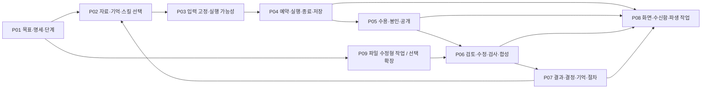
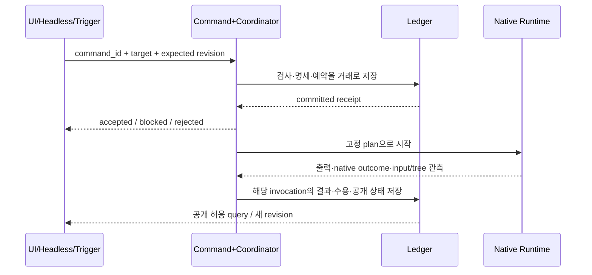

# 하나로 이어지는 작업·실행·지식 파이프라인

아래 P01–P09는 **개편 후 제안 흐름**이다. 현재 구현 여부는 [CURRENT](CURRENT.md), module ID는 [TARGET](TARGET.md), 필드 의미는 [DATA-CONTRACTS](DATA-CONTRACTS.md)가 기준이다. 흐름의 화살표는 자동 모델 호출 허가를 뜻하지 않는다. 실행 여부는 고정한 정책·호출 상한과 command gate가 결정한다.

## 전체 연결

P07→P02는 **다음 실행에서의 적격 자료 선택**이다. 진행 중 봉인 입력을 갱신하는 순환이 아니다. P06의 수정도 새 artifact/새 invocation이며 과거 답을 덮어쓰지 않는다. P09는 현재 read-only 참여자와 다른 능력을 요구한다.

## 단계별 입출력·소유권·실패 처리

| 단계 | 입력 → 출력 | 주인 / 거래 경계 | 실패·재시도 원칙 | 현재 기반 |
|---|---|---|---|---|
| P01 작업 정의 | 사용자 목표·제약·템플릿 → WorkSpec/WorkflowPlan | M01, 계획 version 저장 | graph cycle/누락 input은 blocked reason; 생성 모델 사용 시 별도 invocation | task/role_config·split 제안 |
| P02 입력 구성 | source/공개 이력/선택 skill → ContextPreview | M02, 읽기 preview; 선택 정책 별도 저장 | 추출 실패·stale·범위 초과를 표시; 누락을 조용히 전체 파일로 대체하지 않음 | UTF-8 sources·memory.select |
| P03 준비와 고정 | preview+role/capability → immutable InputManifest+admission | M02/M03, 명세 저장과 command receipt 결속 | 변경된 hash/version이면 준비를 다시 계산; 미관측 능력 허용으로 추정 금지 | prepare/create·등록/계획 확인 |
| P04 실행 | manifest+admission → Invocation/Observation | M03 예약 거래 → M04 외부 실행 → M03 결과 거래 | 외부 부작용과 DB는 원자적이지 않음; 모호하면 unknown, 자동 이중 실행 금지 | pump/_attempt/_finish/_recover |
| P05 결과 공개 | 실행 관측+원문 → accepted artifact/공개 상태 | M03 수용 + M05 공개 정책, 같은 거래 | tree/input/outcome 실패는 수용 안 함; 공개 irreversible, 취소 늦은 결과 격리 | acceptance/state.gate/봉인 |
| P06 검토·수정 | 공개된 artifact revision+질문 → findings/checks/새 판/합성 | M05, 각 모델 단계는 M03 재통과 | quote match와 factual check 분리; 새 판은 옛 검토를 승계 통과하지 않음 | cross_review·disposition·synthesis |
| P07 재사용 | 결과·판단·검사 → report/decision/memory source/procedure | M05 원본·선언 + M02 선택 정책 | 저장/선택/주입은 따로; 자동 요약은 부가 invocation; 원문 불변 | report·human_reviewed·자동 기억 |
| P08 표시·전달 | committed fact → query/inbox/index/delivery | M07 읽기, 필요 시 M08 outbox | projection/index 재생성 가능, delivery retry는 모델 retry 아님 | view/poll/report/usage |
| P09 코딩 확장 | WorkSpec+repo snapshot → isolated worktree/diff/test artifact | M01/M04/M05, 한 writer | HEAD 변경·dirty state·partial restore를 분리; worktree≠sandbox | 현재 제품 미구현, repo 협업 절차만 있음 |

## 실행의 세 가지 경계

1. receipt는 실행 완료가 아니다(tmux).
2. runtime이 끝나도 저장이나 후처리가 실패할 수 있다(Beads/Gas Town).
3. 결과가 저장돼도 봉인·검토·delivery는 별도 상태다(현재 앱/Anchor outbox).

DB commit 직후 runtime 시작 전 crash, runtime 시작 직후 시작 확인 저장 전 crash 모두 기록의 의미를 정해야 한다. 시작할 수 없었다는 확실한 근거 없이 budget을 돌려주거나 새 runtime을 자동 실행하지 않는다. “정확히 한 번” 대신 요청 중복 억제·시도 식별·불명 상태 보존을 제공한다.

## 문맥과 자료의 내부 파이프라인

`원본 등록 → 변환/추출 → 위치·버전·누락 기록 → 역할/범위 적격성 → 검색 후보 → 정렬/다양성 → 크기 예산 → 선택 이유 → frozen manifest → 실제 입력`

- 원본 PDF/URL/이미지와 추출 텍스트는 서로 다른 artifact다. 원본 hash, extractor version, page/line locator, fetched time, 실패/누락을 보존한다.
- 자동 기억은 현재 task·원장·공개 이력 범위에서 출발한다. 프로젝트 공유/선호/절차는 별도 scope/type으로 추가하며 범위 확대를 숨기지 않는다.
- 의미 검색·RRF·요약/압축은 각각 교체 가능한 정책이다. `score`, 사용자 승인, 검증된 사실을 한 등급으로 합치지 않는다.
- 기억 preview의 조회를 곧 모델 주입/유효한 결정으로 기록하지 않는다. 실제 consumed manifest가 사용의 근거다.
- 입력과 provider 내부 context가 다를 수 있다. CLI context/permission 지원 관측을 manifest capability와 함께 고정한다.

## 검토에서 실제 개선까지

`공개 답 revision A → 지정 범위 검토 → finding+원문 hash → 수용/반박/보류 → 수정 입력 고정 → revision B → A/B 차이·남은 지적 → 필요한 새 검사/재검토 → 결과 판단`

현재까지는 주로 검토와 처분까지 구현돼 있다. 개편에서 이 연결이 중요한 이유는 “검토를 받았다”를 최종 산출물 개선으로 이어가기 위해서다. 동일한 findings 수 감소만으로 개선을 주장하지 않는다. B에서 새 오류가 생겼거나 반례가 빠졌는지와 총 호출 비용을 함께 평가한다. 코드 검사, 외부 출처 읽기, 사람의 선호 판단은 check kind를 나눠 저장한다.

반복은 `max_rounds`, invocation budget, deadline, 같은 실패 반복을 포함한 stop rule을 먼저 고정한다. 지원하지 않는 자동 반복은 제안까지만 만든다. 기존 사용자 위임 범위에서 가능한 단계는 재승인 질문 없이 진행할 수 있지만, 현재 제품의 실행 확인 계약을 구현 없이 이미 없어진 것으로 표시하지 않는다.

## 재접속·설정 변경·중단의 파이프라인

| 사건 | 해야 할 일 | 하면 안 되는 추정 |
|---|---|---|
| UI 단절 | 선택 ID 보존, 새 instance/ledger 여부 확인, snapshot 재조회 | 단절=실행 종료 |
| coordinator 재시작 | 원장 잠금·미완 invocation reconcile, queued 재개 정책 확인 | 메모리에 worker 없음=프로세스 끝남 |
| cancel 요청 | receipt 기록, runtime signal, tree 관측, late result 처리 | cancel API 200=모든 자손 종료 |
| 설정 편집 | 새 version validate, last-good과 적용 이유 표시 | 기존 실행 입력도 새 설정으로 변경 |
| outbox ack 누락 | 같은 logical delivery ID로 재처리, 중복 허용/억제 계약 | 다시 알리려면 모델 다시 실행 |
| budget/관측 만료 | 다음 invocation blocked, 결과·원문 유지 | 다른 provider/API로 몰래 fallback |

## 사용 예: 문서 비교 작업을 이어 가기

1. “문서 비교” template에서 목표·필요 자료·완료 기준을 채운다(P01). PDF 변환 결과의 빠진 페이지를 확인한다(P02).
2. 일반 분석 단계라면 공개 과거 이력을 자동 선택한다. 독립 비교 단계라면 기억을 빼고 허용 공통 자료만 고정한다(P03). **한 run에 현재 미지원 일반/격리 칸을 섞었다고 가정하지 않고**, workflow의 별도 run/step으로 둔다.
3. 예약·실행하고 정족수/수용 관문을 지난 답을 공개한다(P04/P05). 화면을 다시 열어도 같은 run과 공개 상태를 읽는다(P08).
4. 중요한 상충 주장만 검토하고 수용한 지적을 넣은 새 답을 만든다(P06). 수정 전 답과 미해결 반례를 보존한다.
5. 최종 보고와 사용자의 결정을 남긴다(P07). 다음 작업은 공개된 기록을 적격 기억으로 선택하고, 유용한 절차는 별도 template revision으로 저장한다.

이 사례에서 검색창·작업판·검토 화면·기억 서랍은 별도 앱이 아니라 같은 work/run/artifact 참조를 다른 목적에서 보여주는 화면이다.
