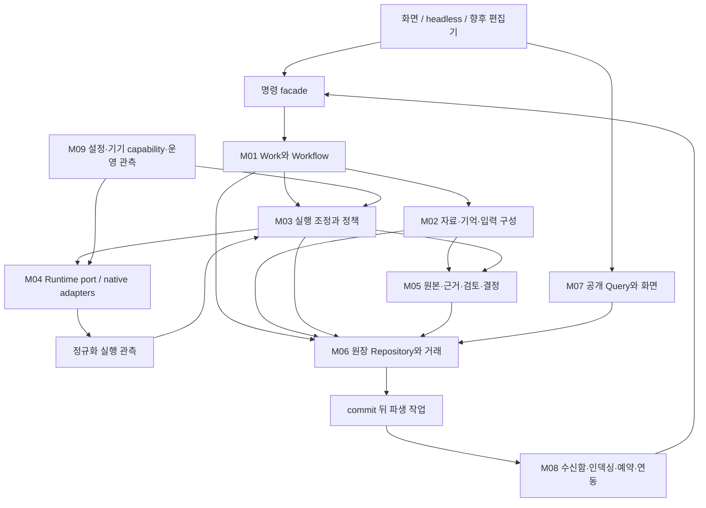

# 목표 아키텍처와 개편 대안

**선호안 B: 책임별 모듈을 갖는 하나의 Python 앱으로 재구성한다.** 내부 경계는 크게 바꾸되 초기 배포는 로컬 Python+SQLite+기존 native executor를 유지한다. 현재 기능을 호환 facade로 살려 두고 안쪽을 갈아 끼운다. 이 판단은 비용/장애 실측 최적화 결과가 아니라 현재 제품 규모·보존 계약·요청한 확장 범위에 대한 설계 권고다.

## 대안 비교

| 안 | 변경 | 장점 | 비용/한계 | 선택 조건 |
|---|---|---|---|---|
| A. 현 구조 안에서 기능 추가 | controller와 화면에 작은 helper 추가 | 빠른 편의 개선, migration 적음 | 호출/조회/기억/자동화 결합이 계속 커질 수 있음 | 한두 UI 기능만 필요할 때 |
| **B. 내부 책임 재구성** | 명령·workflow·invocation·문맥·검토·query 분리 | 깊은 기능 연결과 기존 실행기 재사용 양립 | 호출/원장 호환 설계와 비교 시험 필요 | 이번 준비서의 기본안 |
| C. coordinator service와 별도 worker | 지속 서버, IPC/remote protocol, worker registry | UI 독립 수명·여러 기기 | ownership lease·통신·인증·배포·장애 상태 증가 | 지속/원격 실행의 구체 수요와 PC 관측이 생길 때 |
| D. 외부 orchestrator/기억 시스템 기반 | Gas Town/Symphony/AnchorMind 등 운영체계 채택 | 이미 있는 많은 기능 | 구독/봉인/원장/권한 의미가 다르고 운영 부담 추가 | 사용자 ‘한 제품 기반으로 채택하지 않음’ 결정과 맞지 않아 현재 비선택; 개별 부품 비교는 유지 |

B가 완료되어야만 편의 UI를 만들 수 있다는 뜻은 아니다. 기존 facade 위에서 UI를 개선하면서 읽기/명령 경계를 옮길 수 있다. C도 B와 다른 전면 재작성보다 같은 runtime port의 별도 배포 형태로 평가한다. 범용 plugin 플랫폼이나 microservice 분리는 선행 조건이 아니다.

## 책임 지도



M08이 원본 state를 직접 바꾸는 우회로가 되지 않는다. 자동 작업 시작은 사람이 누르는 것과 같은 command/admission 경로를 쓴다. Query는 실행을 시작하지 않으며, runtime은 quorum·검토 완료·기억 승격을 결정하지 않는다. 저장소의 모든 읽기가 곧 공개 가능함을 뜻하지 않으므로 M07은 visibility policy를 적용한다.

| 모듈 | 소유하는 것 | 외부에 내주는 계약 | 소유하지 않는 것 | 주 참고 |
|---|---|---|---|---|
| M01 Work/Workflow | 목표·조건·step graph·parent/child·명세 version | Plan/StepSpec, 다음 가능한 step과 이유 | OS 프로세스·직접 DB 밖 모델 실행 | Backlog/Kiro/Gas Town |
| M02 Context/Memory | 자료 추출 계획, 선택/범위/예산, 고정 InputManifest, 선택 정책 | preview/freeze, source·selection 이유 | 과거 답의 사실성·최종 acceptance | AnchorMind/Hermes/Peek/Cline |
| M03 Execution | 명령 idempotency, invocation 예약, budget/slot, cancel/reconcile, attempt 수용 | receipt, InvocationState, blockers | native SDK 내부 turn 제어·UI 렌더 | tmux/Beads/Gas Town/Symphony |
| M04 Runtime | plan/check/start/cancel/observe, provider event 해석, 격리·자손 종료 | 고정 plan과 ExecutionObservation | 성공 답변의 진실성·자동 provider 대체 | 기존 core/Hermes/Lite-Harness 반례 |
| M05 Evidence/Review | immutable artifact, revision lineage, findings/checks/dispositions, 공개 정책·결정 출처 | 공개 artifact, review input, report, memory source | ranking 점수를 검증 상태로 승격 | Peek/WorkTrail/Cline/기존 검토 |
| M06 Ledger | SQLite transaction, source rows, migration/backup, repository ports | unit of work, committed revision | 모델 호출·UI/부품별 업무 정책 | 현재 Store/Beads 거래 경계 |
| M07 Query/UI | 허용 필드 projection, 검색/상태/비교/탐색, client 선택 세대 | query DTO, cursor/resync, action availability | 원장 직접 수정·봉인 원문 색인 노출 | tmux/Backlog/Conductor/Cursor |
| M08 Automation/Delivery | inbox/outbox, 파생 index 작업, schedule/trigger, connector job | 작업 상태·dedupe·delivery ack | invocation 성공 판정·별도 호출 예산 | Anchor outbox/Hermes/Gas Town nudge |
| M09 Capability/Operations | 유효 설정·기기 관측·가용성·진단·service 수명 | capability snapshot, effective config, health | 인증 비밀 본문·모델을 통한 상태 조회 | Symphony/Cline/기존 registration |

원자적 동작이 M01/M03/M05를 함께 바꿔야 하면 M06의 **동일 transaction** 안에서 처리한다. 모듈을 나눴다고 곧 각 모듈을 다른 DB/service로 나누지 않는다. 공개 전 입력과 원장 저장소는 participant runtime에 mount하지 않는다.

## 제안 코드 배치

아래 경로는 미생성 예시다. import 경계와 책임을 검토하기 위한 것으로 파일명을 그대로 채택할 의무는 없다.

```text
app/
  application/commands.py       # HTTP/headless/automation 공통 진입
  application/workflows.py      # typed step 진행, 기존 mode 호환
  domain/work.py                # 명세/의존성 판정
  domain/invocation.py          # 수명·budget·수용 판단
  context/builder.py            # 고정 입력 구성
  context/selection.py          # 현재 memory selector 호환
  evidence/artifacts.py         # 판·출처·공개 범위
  evidence/reviews.py           # 지적·검사·처분·수정 계보
  persistence/repositories.py   # 기존 Store 위 adapter
  queries/                     # 공개 query와 read model
  automation/                  # 필요할 때 outbox/schedule
  static/api.js, state.js, views/
core/                          # native 실행·격리·회계 의미 보존
```

첫 단계에 빈 디렉터리/추상 클래스만 잔뜩 만들지 않는다. 실제 수직 기능 하나가 사용하는 경계를 추출한다. domain은 HTTP/DOM/provider SDK를 import하지 않고, pure decision 함수는 저장/실행 부작용 없이 반환한다. port는 독립 worker를 준비할 만큼 명확하되 실제 두 구현이 필요 없는 곳에 범용 framework를 만들지 않는다.

## 기능끼리 연결할 핵심 지점

1. **명세가 입력과 검증을 함께 정한다.** 완료 기준은 report에만 붙이는 메모가 아니라 어떤 자료·worker·check가 필요한지의 참조다. 모델이 제안한 단계와 실행 허용을 구분한다.
2. **기억·스킬·자료는 하나의 입력 구성 과정에서 만난다.** 저장 유형은 다르게 두고, 역할 범위와 크기·출처를 검사한 뒤 한 manifest에 고정한다. 모든 역할에 전역 기억을 자동 주입하지 않는다.
3. **모든 모델 invocation이 같은 회계를 통과한다.** 초안, refine, review, synthesis, 요약·router도 숨은 호출이 되지 않는다. code-only 변환/조회는 별도 action kind다.
4. **답변과 검토는 artifact revision으로 만난다.** 새 답이 생겨도 옛 finding을 새 답의 통과 근거로 옮기지 않는다. 원문 hash와 적용 판을 보존한다.
5. **파생 검색·알림은 commit 뒤 움직인다.** 결과 저장과 알림 배달을 별도 완료로 표시하고 retry를 구분한다. 알림 재시도가 모델 실행 재시도가 되면 안 된다.

## 이 설계의 결정 상태

| 결정 | 상태 | 다시 볼 조건 |
|---|---|---|
| B를 개편 기준으로 사용 | 권고 | 모듈 분리가 실제 구현 복잡도만 늘리는지 R1/R2에서 비교 |
| Python·SQLite·native exec 유지로 시작 | 권고, 현재 기반 재사용 | multi-host/지속 실행 요구와 쓰기 경합 실측 |
| query 분리 후 공통 invocation 도입 | 권고 | 기존 seat별 의미를 잃는 경우 projection 단계에 머물기 |
| workflow는 typed step, plugin script 무제한 실행 아님 | 권고 | code executor·hook 정책과 실제 요구 확정 |
| 새 search/graph/embedding 서버를 기본 의존성으로 추가하지 않음 | 현재 설계 선택 | D05/OP08 평가에서 필요성과 총비용 확인 |
| 제품 정책·자동 기본값은 기존 사용자 결정 보존 | 제약 | 정책 변경을 명시한 후속 사용자 요청 |

구현 카드에서 이 선택을 수정할 수 있다. 아키텍처 문서 자체를 최종 결정처럼 고정해 이후 실측을 억누르지 않는다.
