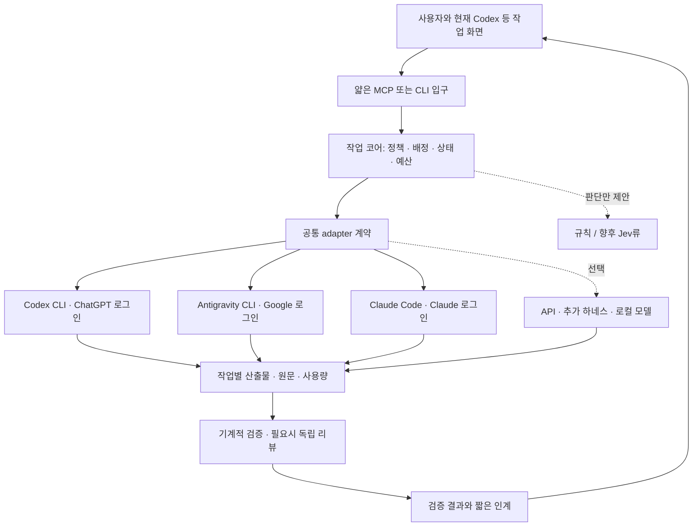

# v0.3 — 구독 하네스를 연결하는 작업 운영 구조

2026-09-22. **현재 설계 기준. 구현 완료 문서가 아니다.** 사용자가 확인한 조건은 **Antigravity(제미나이)·ChatGPT·Claude 사용, 구독 CLI 우선, API 선택, 추후 서비스와 Jev류 부품 확장**이다. 정확한 요금제·설치 버전·남은 한도는 아직 모른다.

## 핵심 결정

각 제품의 native 하네스는 도구 실행·대화·모델 호출을 담당한다. 그 위의 작은 로컬 프로그램이 **작업 단위 배정, 문맥 참조, 실행 상태, 검증 증거, 한도 기록**을 관리한다. 여러 AI가 계속 회의하는 방식은 기본값이 아니다. 지금 사용 중인 Codex 세션을 입구로 유지할 수 있고, 나중에 다른 UI에서도 같은 작업 코어를 부를 수 있다.

**모델, 하네스, 구독, 역할을 별도로 관리**한다. 예를 들어 Antigravity 안에서 사용 가능한 모델이 늘어도 새 구독이 생긴 것은 아니며, 동일 계정의 여러 모델이 한도를 공유하면 하나의 quota pool로 묶는다. ‘강한 모델은 항상 Claude’, ‘제미나이는 언제나 탐색용’ 같은 브랜드 고정 배정은 하지 않는다. 작업 종류별 실제 성공 기록으로 배정한다.

## 필요한 만큼 읽기

| 알고 싶은 것 | 읽을 문서 |
|---|---|
| 구성 요소·책임·실행 생명주기·데이터 경계 | [01. 시스템 구조](01-system.md) |
| 현재 세 구독의 공식 연결·과금·하네스 후보 | [02. 어댑터와 하네스](02-adapters.md) |
| 논문·실제 성과·반례·효과 크기의 한계 | [03. 근거 평가](03-evidence.md) |
| 왜 이렇게 결정했는지·바꿀 조건·평가·구현 순서 | [04. 결정과 검증](04-decisions-and-evaluation.md) |
| 다음 세션 시작점·미완료·출처 갱신 방법 | [HANDOFF](HANDOFF.md) |
| 원문 URL·버전·주장·한계·결정 ID 검색 | [sources.json](sources.json) |
| 이번 문서의 실제 검증 범위 | [VALIDATION](VALIDATION.md) |

근거 ID `E01`–`E31`은 sources.json의 원문과 locator로 연결된다. 결정 ID `D01`–`D09`는 04의 ADR이다. 원문의 관찰과 이 프로젝트의 추론을 구분한다. 우리 장비에서 모델 실험을 실행한 근거는 아직 없다.

## 이전 문서와의 관계

| 자료 | 현재 위치 |
|---|---|
| v0.1 | 설계 이력과 상세 원칙. 현재 추천 순서를 결정하지 않음 |
| [v0.2](../v0.2/README.md) | `bounded_patch`, 한 worker·독립 검증·최대 한 번 수리라는 첫 실행 절차와 **기존 합성 계약** 유지 |
| [9월 22일 첫 조사](../../research-2026-09-22/README.md) | 최신 사례·Jev·Codex bridge·token 측정의 상세 참고 |
| v0.3 | 구독 우선이라는 확정 조건을 반영한 전체 구조·배정·출처 추적의 기준 |

v0.3은 **아키텍처 문서 버전**이다. `contracts/v0.2/pilot.schema.json`을 대체하는 새 wire protocol이 아니다. 기존 계약의 fixture를 실제 실행 증거로 읽지 않는다. 앞선 bridge 문서의 저가 API 경로는 선택 사항으로 내려가고, 공식 native CLI adapter가 우선이다. Symphony 전체 도입은 확정하지 않으며 명세의 작업 운영 경계를 우선 참고한다.

첫 구현 목표는 **한 개 native CLI로 한 작업을 실행하고, 실제 patch와 검증 로그·사용량을 연결하는 것**이다. 이후 동일 계약으로 두 번째와 세 번째 CLI를 붙이고 비교한다. Jev·학습 router·대규모 병렬화는 그 결과를 보고 추가한다.
