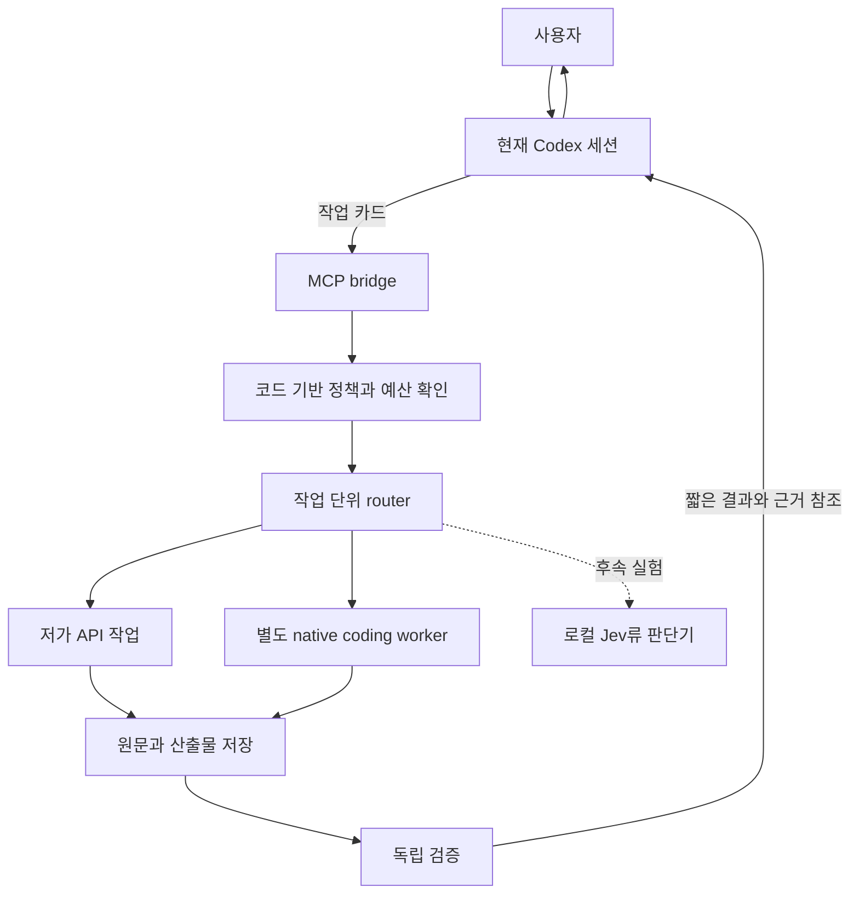

# Codex 하네스를 유지하는 연결 설계

2026-09-22 설계안. [조사 결론](README.md)과 [측정 계획](measurement-and-rollout.md)을 함께 읽는다. 아래 도구 이름·JSON·폴더 구조는 **제안이며 아직 구현되지 않았다.** 공식 기능과 우리에게 필요한 추가 구현을 구분한다.

## 1. ‘하네스 유지’의 두 가지 의미

| 의미 | 필요한 연결 | 권고 |
|---|---|---|
| 지금 쓰는 Codex UI·대화·작업 흐름을 그대로 사용 | Codex가 외부 MCP bridge를 호출 | 첫 단계 |
| 자체 runner/UI가 Codex 실행기를 여러 번 구동 | Codex SDK, `codex exec`, 필요 시 App Server | 자동화가 필요해진 다음 단계 |
| Codex 내부의 모든 추론 요청을 다른 모델로 라우팅 | custom provider / 호환 gateway | 별도 실험. 가장 작은 변경처럼 보여도 호환성 부담이 큼 |

첫 번째와 두 번째는 양립할 수 있지만 **같은 작업의 지휘권은 하나**여야 한다. Codex parent가 작업을 진행하는 동안 bridge 안에서 다른 supervisor가 같은 목표를 다시 계획하거나 무제한 하위 agent를 만들지 않는다.

### 공식 인터페이스 확인

- Codex는 외부 MCP 서버 연결을 지원한다. 로컬 프로세스용 STDIO와 Streamable HTTP가 있으며 trusted project의 `.codex/config.toml`로 범위를 제한할 수 있다. [공식 MCP 문서](https://learn.chatgpt.com/docs/extend/mcp?surface=cli)
- `codex exec --json`은 실행 이벤트를 JSONL로 내보내고, `--output-schema`는 최종 응답 형식을 지정한다. 두 옵션의 용도는 다르다. [비대화형 실행](https://learn.chatgpt.com/docs/non-interactive-mode)
- 공식 SDK는 local Codex 작업의 시작·계속·재개에 쓸 수 있다. Python과 TypeScript 경로의 구현·배포 요구사항이 같다고 가정하지 않는다. [Codex SDK](https://learn.chatgpt.com/docs/codex-sdk)
- 자체 UI에서 인증·대화·승인·이벤트를 다루려면 App Server가 해당 연결 지점이다. JSON-RPC 계열 프로토콜이며 MCP 서버가 아니다. 현재 공식 문서는 app-server command와 WebSocket transport를 experimental/production unsupported로 표시한다. 적용할 SDK·runtime 버전을 고정해야 한다. [App Server](https://learn.chatgpt.com/docs/app-server)
- 이전의 `codex mcp-server`와 독립 바이너리는 제거됐다. 위 ‘외부 MCP 연결’은 계속 지원된다. 오래된 Agents SDK + Codex MCP server 예제를 신규 기반으로 삼지 않는다. [제거 안내](https://learn.chatgpt.com/docs/mcp-server)

## 2. 첫 단계의 전체 모습



bridge는 LLM agent가 아닌 작은 프로그램이다. 모델 호출이 없어도 동작하는 정책·상태 전이·파일 참조·비용 집계 기능을 가진다. Codex의 원래 실행 loop와 도구는 그대로 두고, 분리 가능한 작업만 bridge로 보낸다.

예를 들어 parent가 이미 문제를 파악했다면, worker에게 ‘리포지토리 전체를 조사해 해결하라’를 다시 시키지 않는다. ‘이 파일의 특정 함수 수정, 이 인터페이스 유지, 이 실패 테스트 해결’ 같은 작업을 준다. 파일 경로조차 모를 때는 짧은 탐색 작업을 먼저 주고, 찾은 근거를 구현 작업의 입력으로 쓴다.

**관측 범위의 한계:** MCP bridge는 자신의 호출·worker·산출물만 볼 수 있다. Codex의 모든 native shell/read 출력이나 parent의 전체 토큰 사용량을 자동 가로채지 않는다. 따라서 이 경로만으로 ‘Codex 전체 토큰을 X% 제한한다’고 약속하면 안 된다. 전체 실행 계측이 필요하면 다음 단계의 SDK runner와 provider usage를 결합한다.

## 3. MCP 도구는 작게, 역할은 명확하게

제안하는 초기 도구 표면은 네 개다. provider별로 도구를 수십 개 노출하지 않는다.

| 제안 도구 | 입력 | 결과 | 책임 |
|---|---|---|---|
| `run_task` | 작은 task packet, 허용된 실행 profile | 짧게 끝나면 결과, 길면 `run_id` | 정책 확인 후 실행, 중복 호출 억제 |
| `get_run` | `run_id`, 선택적 이벤트 cursor | 새 상태·완료 결과·필요한 오류만 | 전체 이력을 매번 재반환하지 않음 |
| `read_artifact` | artifact ID, 행/바이트 범위 | 요청 구간+출처·생략 정보 | 원문 확장 읽기 |
| `cancel_run` | `run_id` | 취소 요청/확인 상태 | 자식 작업의 실제 정지 확인 |

긴 작업을 위해 polling을 쓰더라도 짧은 간격으로 LLM이 계속 질문하지 않게 한다. bridge가 대기/이벤트를 관리하고, 사용하는 클라이언트가 지원하는 완료 알림을 활용한다. 알림 지원은 구현 시 확인한다. 무제한 반복 `get_run` 호출도 비용이다.

MCP 응답은 짧은 상태와 참조만 우선 반환한다. 같은 긴 JSON을 `structuredContent`와 자연어 응답에 반복하지 않는다. 실제 클라이언트가 모델에 어느 필드를 전달하는지는 통합 trace로 확인한다.

## 4. 기계용 JSON과 모델용 문맥을 분리한다

controller는 version·권한·예산·시간·hash·lease·usage 등 엄격한 envelope를 보관한다. **그 전체 JSON을 모델에게 읽힐 이유는 없다.** worker에게는 목표·제약·필요한 근거·완료 조건만 렌더링한다. 인증 정보와 제어용 metadata는 controller에 남는다.

다음은 자체 형식의 합성 예시다. 기존 `contracts/v0.2` schema에 이 JSON을 그대로 검증하는 것이 아니다.

```json
{
  "version": "task-packet-draft-1",
  "task_id": "task-example-17",
  "kind": "bounded_patch",
  "goal": "빈 이름을 거부하되 기존 함수 시그니처를 유지한다.",
  "allowed_paths": ["src/name.py", "tests/test_name.py"],
  "context_refs": ["artifact:spec-17", "artifact:failure-17"],
  "acceptance_refs": ["check:name-validation"],
  "result_fields": ["status", "summary", "artifact_refs", "blockers"]
}
```

artifact ID만 던져 두고 worker가 읽을 수 없으면 문맥이 전달된 것이 아니다. adapter가 시작 전에 핵심 명세와 실패 원문을 해석해 넣거나, worker에게 해당 artifact 읽기 도구를 제공해야 한다. filesystem을 지원하지 않는 단순 API 작업에는 필요한 구간을 입력으로 넣는다. provider의 file ID가 다른 provider에서도 통한다고 가정하지 않는다.

제어부가 보관할 전체 run record의 필드는 다음과 같다.

| 묶음 | 대표 필드 | 모델 프롬프트에 그대로 전달? |
|---|---|---|
| 실행 식별 | task/run/attempt ID, parent run, idempotency key | 필요한 task 식별만 |
| 재현 정보 | base commit, dirty snapshot hash, harness/version, model revision, prompt revision | 관련 코드/제약만 |
| 권한과 실행 | workspace, allowed paths, tool/network profile, deadline | 필요한 제약만; 강제는 코드/실행 환경 |
| 비용 | 예약액, usage source, observed/estimated/unknown, pricing revision | 허용된 작업 규모만 |
| 증거 | candidate hash, 검증 설정 hash, test result refs | 실패·결과 설명에 필요한 근거만 |

worker의 짧은 결과 예시:

```json
{
  "task_id": "task-example-17",
  "status": "candidate",
  "summary": "공백 이름 검사를 추가했다. 독립 검증을 기다린다.",
  "artifact_refs": ["artifact:patch-17"],
  "blockers": []
}
```

usage는 이 자연어 생성 결과를 믿고 집계하지 않는다. adapter가 provider/harness 이벤트에서 별도로 수집한다. `candidate`는 검증 완료가 아니고, 필드가 올바른 JSON이라고 사실까지 맞는 것은 아니다.

## 5. router는 작업 경계에서만 판단한다

최초 규칙은 모델 이름이 아닌 검증한 실행 profile을 선택한다.

```text
승인된 입력 + 범위 + 수용 조건
    ├─ 파싱/검색/테스트/파일 집계로 충분 → 일반 코드
    ├─ 한정된 읽기/추출/분류 → 저가 API profile
    ├─ 범위와 검증법이 명확한 수정 → 경제형 coding profile
    └─ 다중 모듈 설계/모호한 실패 → 고성능 Codex profile

경제형 실행 완료
    ├─ 독립 검사 통과 → 결과 인계
    ├─ 수정 가능한 실패 + 남은 예산 → 최대 1회 수리 또는 상향
    ├─ 환경/인증/네트워크 실패 → 원인 해결 또는 중지
    └─ 범위 부족/요구 모호 → parent에 blocker 반환
```

환경 오류를 지능 부족으로 분류해 비싼 모델로 바꾸지 않는다. 상향은 한 방향으로 제한하고, 강한 모델에서 약한 모델로 같은 task를 계속 왕복시키지 않는다. 고성능 모델을 쓰더라도 자체 하네스가 다시 여러 worker를 생성해 예산을 확장하지 않도록 adapter 기능을 확인한다.

후속 `DecisionProvider` 인터페이스는 `state → {route, scores, abstain, model_revision}` 정도로 좁힌다. 규칙·저가 LLM·로컬 Kev/Laya가 같은 결과 계약을 구현할 수 있다. 모델이 반환한 확률을 검증 성공률로 바로 해석하지 않고 별도 task 데이터로 calibration한다. 모르는 작업은 `abstain`으로 정책에 돌려준다.

## 6. API worker와 coding harness worker를 구분한다

| worker 종류 | 적합한 작업 | 추가 책임 |
|---|---|---|
| 단순 API 요청 | 정해진 원문 추출, 후보 점수화, 짧은 분류 | 입출력 제한, schema/의미 검증 |
| native coding harness | 파일 탐색·편집·명령 실행이 필요한 작업 | 격리 workspace, 허용 도구, 취소·usage·세션 mapping |
| 새로 만든 API tool loop | 기존 하네스가 제공하지 않는 실험 | 도구 실행·메모리·복구·sandbox 전체를 직접 유지 |

모델 API를 호출하는 것만으로 해당 모델이 Codex의 도구·상태·편집 능력을 얻지는 않는다. 초기에는 실제 코드 편집을 native harness adapter에 맡기고, 직접 API 호출은 좁은 작업에 제한하는 편이 구현 책임이 작다.

adapter의 제안 인터페이스는 `start`, `events`, `cancel`, `collect`, 선택적 `resume`다. `capabilities`에는 `structured_result`, `usage`, `resume`, `cancel_tree`, `sandbox`, `tool_allowlist`, `budget_enforcement`를 supported/unsupported/unknown으로 기록한다. 지원 여부는 문서·실행 검증을 나누어 남긴다.

## 7. SDK/exec runner로 확장할 때

Codex를 프로그램이 구동할 때는 단일 task마다 실행 식별자와 thread/session ID를 매핑한다. 공식 `exec`의 JSONL에서 실행 상태와 usage를 수집하고 최종 구조화 결과와 별도로 저장한다. **stdout 이벤트를 다음 모델의 프롬프트에 통째로 붙이지 않는다.** 원본 이벤트는 보호된 run 저장소에, 검증된 요약만 결과 packet에 둔다. [공식 실행 형식](https://learn.chatgpt.com/docs/non-interactive-mode)

App Server가 필요하면 버전에 맞는 schema를 생성해 adapter에 고정한다. `initialize → initialized → thread/start → turn/start`와 실행 이벤트·승인 응답·중단을 매핑한다. 완료되지 않은 요청은 성공으로 추정하지 않는다. usage 알림이 누적 값이면 이벤트마다 합산하지 않는다. [공식 프로토콜](https://learn.chatgpt.com/docs/app-server)

새 프로세스로 실행한 Codex가 **현재 데스크톱 대화를 자동으로 상속하는 것은 설계 전제가 아니다.** adapter가 관리하는 새 작업 세션을 만들고, 필요한 task packet만 전달한다. 여러 동시 작업에서 `resume --last`처럼 암묵적인 ‘마지막 세션’을 공유하지 않는다.

인증과 청구도 adapter별로 기록한다. 저장된 Codex 로그인 재사용과 API key 실행 경로를 구분하고, 외부 provider 비용을 Codex 구독에 포함된 것으로 계산하지 않는다. 현금 청구가 확인되지 않은 구독 토큰은 추정 API 비용과 분리한다.

## 8. transparent proxy는 왜 뒤로 미루나

Codex는 custom provider/base URL 설정을 제공한다. 그러나 endpoint만 바꾸었다고 임의 모델이 native 모델과 같은 동작을 하는 것은 아니다. [공식 provider 설정](https://learn.chatgpt.com/docs/config-file/config-advanced)

우리의 적합성 시험 항목은 Responses 지원, streaming 이벤트, tool-call ID 대응, 구조화 출력, 이미지 입력, reasoning 항목, continuation state, 오류·취소·재시도·usage다. 하나라도 빠지면 ‘하네스 유지’와 별개로 기능이 달라질 수 있다.

최신 gateway에서도 모델 전환 시 encrypted reasoning의 경계 문제를 별도로 다룬다. LiteLLM은 9월 18일 전환 시 호환되지 않는 encrypted reasoning을 제거하는 처리를 공개했다. 이는 실행 오류 완화에 대한 구현 설명이지, 이전 reasoning을 보존한 채 동일 품질을 보장한다는 증거가 아니다. [제작자 설명](https://docs.litellm.ai/blog/auto-router-encrypted-content-routing)

따라서 초기 설계는 **한 작업 동안 모델·provider·세션 유지 → 완료/검증 실패 경계에서 새 작업 packet으로 상향**이다. proxy 기반 턴별 routing은 독립 실험군으로 둔다.

## 9. 작업 공간과 검증의 최소 규칙

- 구현 worker는 별도 worktree/실행 환경에서 작업한다. worktree 자체는 보안 sandbox가 아니다.
- parent에 미커밋 변경이 있으면 base commit만으로 작업을 재현할 수 없다. dirty snapshot을 명시적으로 캡처하거나 충돌 없는 작업으로 한정한다.
- 두 worker가 같은 파일·API 경계를 수정해야 한다면 기본은 순차 실행이다. 파일 예약만으로 실제 격리를 대신하지 않는다.
- patch에 기준 snapshot과 candidate hash를 결합한다. 독립 verifier는 바로 그 후보를 검사한다.
- worker가 검증 기준을 바꾸어 성공을 만들지 않게 acceptance 설정은 worker 쓰기 범위 밖에 둔다.
- 승인되지 않은 확대 범위·stale 결과는 채택하지 않는다. 취소 시 자식 프로세스와 진행 중 원격 호출 상태를 수집한다.
- bridge 설정과 실행 profile은 coordinator가 소유한다. worker 출력이 provider·권한·예산을 바꾸는 명령이 되지 않는다.

최종 상태는 `REVIEW_READY`다. 기존 v0.2처럼 자동 main merge·배포를 추가하지 않는다. 이 규칙은 모든 변경에 별도 사람 승인을 새로 요구한다는 뜻이 아니라, 현재 프로젝트가 정의한 산출물 인계 지점을 유지한다는 뜻이다.

## 10. 제안 파일 경계

다음은 후속 구현의 지도이며 실제 생성된 코드 목록이 아니다.

```text
bridge/
  mcp_server          # 작은 도구 표면
  runner              # 상태 전이, 중복 억제, 시간 제한
  router              # 규칙 우선, DecisionProvider 교체 지점
  adapters/
    codex             # 공식 실행 경로
    api_worker        # 한정된 API 작업
    local_decision    # 후속 실험
  artifacts           # 원문 보관, 범위 읽기, hash
  usage               # source별 관측/추정/미상 구분
  verifier            # 프로젝트의 실제 검증 명령 호출
```

이 일곱 책임을 반드시 일곱 서비스로 나누지는 않는다. 한 프로세스·한 writer의 journal로 시작하고, 동시 예산 예약이나 복구 요구가 생길 때 기존 DB/실행 엔진을 선택한다. 초기부터 별도 메시지 브로커, 벡터 DB, 여러 supervisor를 추가할 근거는 아직 없다.
