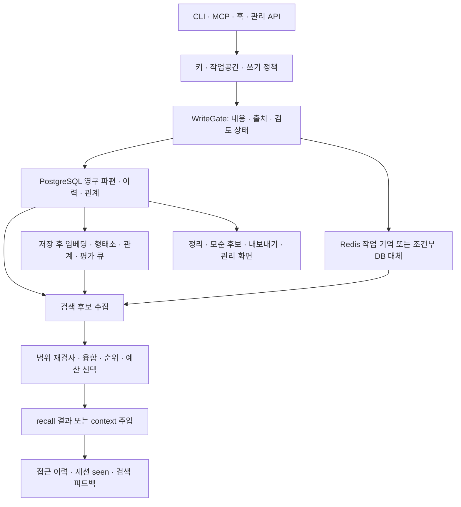

# AnchorMind: 기억 서버를 부품으로 분해하기

검토 판: `cdcdfaab9d1b9a64fa5f6af23354ac730c24c9fb` · package 6.1.0 · 루트 라이선스 Apache-2.0. 아래 `AM-*`는 [근거 문서](EVIDENCE.md)의 고정 소스 묶음이다. 관측 범위는 [출처 맵](source-map.json)에 파일별로 있다.

## 1. 전체 구조와 책임

핵심은 텍스트를 벡터 DB에 넣는 일보다 넓다. **기억의 원본 저장소, 검색용 파생물, 실행 문맥, 관리 기능**이 서로 다른 상태와 수명을 갖는다.

이 그림은 검토한 경로의 개념도다. 모든 화살표가 동일 트랜잭션에 속하거나, 모든 기능이 기본 활성이라는 뜻은 아니다.

| 부품 | 책임·주요 상태 | 확인한 구현 | 우리에게 유용한 단위 |
|---|---|---|---|
| 입력 관문 | 정규화, 민감 내용, 길이, 작업공간, 앵커 권한, 출처, 검토 | `WriteGate`, `MemoryRememberer` / AM-WRITE | 저장 전 공통 계약과 사용자에게 보일 거절 이유 |
| 영구 기억 | 파편 유형·본문·해시·토큰·메타데이터·벡터 | schema, remember / AM-CONFIG | 원본·파생물·선택 snapshot 구분 |
| 작업 기억 | session 범위의 짧은 수명, 백엔드 실패 시 대체 | remember / AM-WRITE | 임시 메모와 영구 기억의 명확한 경계 |
| 출처와 검토 | origin, observed_client, trust_tier, review_state | provenance, ReviewVisibility / AM-CONTEXT | 출처 설명·보류·거절·주입 제외 |
| 작업공간 | 명시 범위/키 기본 범위/전역, 읽기 허가 | WorkspaceScope, WorkspaceReadAuthz / AM-SCOPE | 프로젝트 범위를 모든 읽기 경로에 일관되게 적용 |
| 후보 수집 | 캐시·DB·벡터·어휘·시간·그래프 | FragmentSearch / AM-SEARCH | 검색기 교체가 가능한 공통 후보 형태 |
| 순위·크기 선택 | RRF, 증거 합치기, 재순위, 예산 | RankFusion, BudgetSelector / AM-SEARCH | 같은 자료 중복 제거, 결정적 정렬, 포함 이유 |
| 문맥 조립 | anchor/core/learning/working, 검토·등급 제외 | ContextBuilder, ContextTrust / AM-CONTEXT | 여러 기억 유형을 최종 입력 하나로 고정 |
| 관계·사건 이력 | 연결, 교체, case/entity timeline | HistoryReconstructor / AM-RELATIONS | 결정 변경의 이유와 근거를 함께 찾기 |
| 모순 후보 | 모델/NLI 비교, 구조화 주장 반대 관계 | ContradictionDetector, ClaimConflictDetector / AM-RELATIONS | 자동 판정 대신 사용자 검토할 충돌함 |
| 회고·정리 | 세션 요약, 수명, 분할·합침·압축·승격 | AutoReflect, MemoryConsolidator / AM-LIFECYCLE | 자동화 각 단계의 성공·실패·건너뜀 기록 |
| 피드백 | 검색 사용, 샘플 질문, 파라미터 조정 | FeedbackSampler, SearchParamAdaptor / AM-LEARNING | 검색 실패를 쌓아 다음 개선에 쓰기 |
| 파생 검색 표현 | 형태소, 본문에서 생성한 질문 | MorphemeTokenizer, SyntheticQueryGenerator / AM-LEARNING | 한국어·식별자 검색 강화 |
| 백그라운드 전달 | durable outbox, claim, 재시도, dead | OutboxStore/Worker, hook consumer / AM-ASYNC | 중복 전달을 허용하고 처리 결과를 추적 |
| 외부 모델 경계 | stage별 egress, 제공자 chain, deadline, semaphore | EgressPolicy, llm dispatcher / AM-EGRESS | 작업 유형마다 호출 허용·상한을 따로 둠 |
| 이동·복구 | JSONL 버전·링크·이력, import 결과 | FragmentExporter, ImportRunner / AM-TRANSFER | 사용자가 기억을 가져가고 검토해 들여오기 |
| 운영·편의 | 필터·상세·그래프·측정·초기화·감사 | AM-OPS: 주로 인터페이스 및 함수 목록 확인 | 화면 설계·초기 설정 미리보기 |

## 2. 저장: “저장했다” 뒤에 남는 일

AM-WRITE에서 확인한 주 경로는 입력 검증→scope/키 해석→쓰기 관문→quota/삽입→후처리다. 멱등 키가 있으면 같은 키 범위의 기존 기록을 먼저 찾는다. 읽은 입구에서 멱등 키 재사용 시 payload 동등성 검사는 확인하지 못했으므로, 우리에게 옮길 때는 `idempotency_key + payload_hash` 충돌 처리를 계약으로 정하는 편이 낫다.

`MEMENTO_REMEMBER_ATOMIC=true` 경로는 키 행 잠금과 quota/삽입을 트랜잭션으로 묶는다. 기본값은 false다. 관문과 저장 후 작업까지 전부 하나의 원자적 작업이 되는 것은 아니다. `_finalizeRemember`와 `RememberPostProcessor`에는 임베딩, 형태소 등록, 연결·모순 후보·평가·생성 질문 큐 등의 별도 처리가 있다. 일부는 비동기로 진행되며 실패를 기록하거나 대체 경로를 시도한다.

**가져올 설계:** 화면에서 `saved`, `index_pending`, `index_failed`, `searchable`을 구별한다. 기억 본문 저장에 성공했는데 검색 준비가 덜 된 상태를 “기억 실패” 한 가지로 뭉개지 않는다. 현재 우리 앱은 별도 임베딩 큐가 없으므로 이 상태를 지금 모두 추가할 필요는 없고, 파생 인덱스를 도입할 때 활용한다.

session scope는 sessionId가 있을 때 작업 기억 경로로 간다. 그 경로의 Redis 실패는 설정에 따라 PostgreSQL 대체 또는 저장되지 않은 `backend: none` 결과로 이어진다. **session scope에 sessionId가 없으면 선택한 코드에서는 영구 저장 경로로 떨어진다.** 이를 일반적인 기대 동작으로 복사하지 말고, 우리 쪽 계약에서는 누락을 거절하거나 명시적 범위 전환으로 처리할 후보로 남긴다. 운영 환경 재현이나 upstream 결함 확정은 하지 않았다.

## 3. 검색: 후보 생성과 최종 선택을 분리

AM-SEARCH의 `FragmentSearch`는 여러 후보 채널을 모으고 범위 predicate와 중복 처리를 적용한다. 캐시 ID, 실제 검색 결과, hydration으로 나중에 가져온 본문은 같은 랭킹 근거가 아니다. `mergeRRF`는 채널 순위를 합치면서 ID만 있던 항목을 본문 있는 항목으로 승격하고, 채널 목록과 similarity/lexical/reranker의 최대 증거를 보존한다.

Redis Set처럼 순서에 의미가 없는 채널은 `unranked`로 같은 기여를 주고, hydration tail은 중요도와 결정적 tie-break로 정렬한다. P01–P03으로 이 부분을 확인했다. 정규 본문은 먼저 채워진 값을 유지하므로 **충돌하는 본문을 진실 판정하여 병합하는 함수가 아니다.**

`MemoryRecaller`는 기본 rank-before-budget 경로에서 본 후보와 연결 후보를 함께 예산에 넣는다. `BudgetSelector`는 baseline과 greedy/MMR 후보 선택, 추정 후 정확 계산을 나눈다. 다른 점수 척도를 그대로 더하는 대신 순위 융합을 쓰는 발상, 탈락 후보를 남겨 예산 효과를 볼 수 있는 구조가 참고 대상이다. 실제 DB 검색·토크나이저 예산 계산은 이번에 실행하지 않았다.

**검색도 상태를 바꾼다.** 선택 후 접근 횟수·연결 touch·캐시 갱신이 있고, context 구성에는 session seen 기록이 있다. 따라서 UI의 “미리보기”를 기존 recall에 그대로 연결하면 평가 통계나 다음 검색이 바뀔 수 있다. 우리에게는 미리보기와 실제 첨부를 분리하는 설계가 필요하다.

## 4. 범위·검토·신뢰는 서로 다른 축

| 축 | 실제 의미 | 가져올 때 구별할 것 |
|---|---|---|
| workspace | 명시값 > 키 기본값 > global-only. 특정 workspace 조건은 그 workspace와 NULL 전역을 포함 | 프로젝트 격리와 전역 공유 정책을 별도 결정. 우리 현재 same-task 검색에 전역 기억을 암묵 추가하지 않음 |
| read authz | off/warn/enforce, master 별도 처리. 기본 warn | 경고가 곧 거절이라는 오해 금지. 실제 배포 설정을 확인해야 함 |
| review_state | pending/rejected는 일반 recall에서 작성 키에 보일 수 있으나 주입에서는 제외 | 관리 화면에서 “보임”과 모델 “주입 가능”을 따로 표시 |
| 직접 ID 읽기 | `reviewPointClause`는 keyId null(master/internal)에 빈 절 반환 | 모든 경로가 동일한 review 술어라고 일반화하지 않음 |
| trust_tier | 출처와 키 상한에 따른 정책 등급. agent_inferred·기존 NULL은 normal=2 | 검증·정확도·사용자 승인 점수로 표시하지 않음 |
| provenance 누락 | metadata lookup 자체에 없는 ID는 ContextTrust에서 제외 | 기록이 존재하고 tier만 NULL인 경우와 구별 |
| instruction rule | Unicode 정규화와 문구 패턴에 의한 검토 후보 표시 | 의미적 공격 방어의 완전성이나 사실 판정으로 해석하지 않음 |

AM-SCOPE/AM-CONTEXT, P04–P09 근거. 전송 계층부터 모든 호출자를 추적한 권한 감사는 아니다. `observed_client` 역시 initialize 메시지의 클라이언트 이름을 정리한 것이지 독립적인 신원 증명은 아니다.

## 5. 문맥 조립과 캐시 최신성

`ContextBuilder`는 core·working·anchor·learning을 읽고, 중복과 검토/등급 조건을 반영한 선택 결과에서 평문과 구조화 응답을 만든다. 같은 선택에서 두 표현을 만드는 점이 유용하다. 화면 미리보기와 실제 입력을 따로 계산하면 서로 달라질 수 있는데, 우리 `prepare_run`의 고정 명세와 잘 맞는 설계다.

`HotCacheValidator`는 DB의 현재 content_hash/review_state/valid_to를 확인하고 범위를 다시 본다. DB 확인 실패 시 캐시 miss로 취급한다. “캐시가 있다”만으로 지금 주입해도 된다고 하지 않는 구조다. 향후 우리 검색 인덱스에는 `source_run_id + source_hash + extractor_version`을 붙이고, 오래된 인덱스의 존재와 현재 원문의 유효성을 구별할 수 있다.

## 6. 정리·충돌·회고: 세 기능을 섞지 않기

`MemoryConsolidator`의 단계들은 수명/TTL, 분할·병합·중복·압축, 인덱스·관계·점수 보강, 모순·교체, 정리/보고 등으로 나뉜다. 단계 실패와 skipped를 따로 남기며 뒤 단계를 계속할 수 있다. 스케줄 한 번 성공만으로 모든 기억이 정리됐다고 하면 안 된다.

`AutoReflect`는 세션 흔적에서 요약·결정·오류·절차 등을 얻는 별도 경로다. 읽은 코드의 모델 사용 불가 분기는 `gemini_unavailable`로 **건너뛴다**. 상단 주석의 최소 fact 생성 설명과 다르므로 실행 분기를 근거로 삼았다. 함수 이름의 Gemini만으로 모든 실제 제공자가 고정이라고 단정하지 않았으며 전체 chain 구성은 별도 확인 대상이다.

`ContradictionDetector`의 모델/NLI 비교와 `ClaimConflictDetector`의 구조화 주장(S/P/O와 긍정·부정) 대조는 서로 다른 신호다. `ReconsolidationEngine`의 피드백에 따른 관계 가중치/확신 변화도 사실 검증과 다르다. 우리 앱에는 반례 원문, 주장 주체, 근거 해시, 처분자를 남기는 **충돌 후보함**을 먼저 구현할 수 있다. 모델이 알아서 오래된 결정을 삭제하는 정책은 아직 채택하지 않는다.

`HistoryReconstructor`는 case/entity/time/text를 경계로 사건과 관계를 모으고 근거를 일괄 읽는다. 일부 근거 조회 실패를 `evidence_error`로 표현한다. 우리에게 유용한 화면은 거대한 그래프보다 먼저 “이 결정을 왜 바꿨는가” 타임라인이다.

## 7. 검색 개선·평가

로컬 형태소 경로는 한국어·영어·중국어·일본어 처리를 지연 로딩하고 실패 시 단순 분리로 대체한다. `config/memory.js`의 기본 tokenizer는 local이다. 모델 호출은 없어도 패키지·사전·메모리 비용이 있으므로 우리 한국어 2-gram과 실제 자료로 비교한 뒤 고르면 된다.

SyntheticQueryGenerator는 본문에서 사용자가 물을 법한 질문을 만들고, 식별자/숫자 앵커 유실·부자연스러운 문자 추가 같은 조건을 검사한다. 생성은 기본 off이고 검색 사용 플래그와도 별개다. 생성 문장은 원본 증거가 아니라 검색용 파생물로 취급해야 한다.

SearchParamAdaptor는 충분한 표본 후 평균 결과 수에 따라 임계값을 조금 바꾼다. **결과 수를 조절한 것과 정답률 개선은 다르다.** FeedbackSampler는 일부 결과에 평가 요청 힌트를 붙이며 Redis 상태로 빈도·cooldown을 관리한다. 읽은 경로의 Redis 부재 fallback은 이 제한을 동일하게 보장하지 않는다.

RecallMetrics와 PairedBootstrap은 질의별 hit·순위·예산 내 관련성, 기준/후보의 짝지은 차이를 평가하는 도구다. P10은 bootstrap 산술·재현성만 확인했다. 정답셋이 없으면 의미 있는 품질 개선 결론은 나오지 않는다. 우리에게는 현재 기억 선택기의 **관련 단어가 하나도 없어도 최신 기록으로 채울 수 있는 동작**, 최신 24개 후보 제한, 한국어 표현 차이를 시험할 평가 틀이 먼저 필요하다.

## 8. 운영 신뢰성과 사용자 편의

| 부품 | 유용한 세부 설계 | 확인 범위·남은 조건 |
|---|---|---|
| outbox | `SKIP LOCKED`, claim token, 재시도·dead 상태 | at-least-once. timeout 후 handler가 계속될 수 있어 consumer 멱등성 필요. PostgreSQL 경쟁 시험 미실행 |
| hook consumer | payload 확인, 키 권한 재확인, 중복 claim, 처리 완료 | reflect와 complete가 하나의 트랜잭션은 아님. 전역 훅 설치보다 앱 내 이벤트 적용부터 검토 |
| egress/dispatcher | 단계별 외부 전송 정책, 제공자별 semaphore, deadline/fallback | 제공자 분류는 구독 자격 증명이 아님. 우리 whole-tree 종료·새 호출 원장을 대체하지 않음 |
| export/import | 버전 있는 JSONL, 관련 링크·선택 이력, 중복/거절/오류 보고 | 논리 export는 전체 DB 백업이 아님. import dry-run도 DB에 쓰고 rollback하는 경로 |
| init | 변경 diff를 먼저 보여주고 `--write`, 여러 파일 rollback | 헤더·함수 목록 확인. 사용자 PC의 CLI 설정 호환성 미실행 |
| 기억 UI | 필터 칩, 상세, 검색, 이력, 이상 항목, export | 인터페이스 확인. 브라우저 사용성·성능 미측정 |
| 그래프 UI | 유형/에이전트별 색, 밀집도 처리 | 인터페이스 확인. 관계 표시만으로 관계의 정확성이 검증되지는 않음 |
| metrics/scheduler | 최근 측정, 가시성 기반 polling 정리, 작업 성공·실패 상태 | 선택 인터페이스 확인. 모든 상태의 영속성·재시작 복구 미검증 |
| audit chain | 정규 JSON, 순차 번호, 이전 해시 결속 | P11–P12: 단순 변조 탐지와 전체 재작성 저항성은 다름. 외부 신뢰 기준점 필요 |

## 9. 기본값을 함께 기록할 항목

AM-CONFIG의 정의 기준이며 실행 서버의 환경값을 관측한 것이 아니다.

| 항목 | 소스 기본값 | 해석 |
|---|---|---|
| 쓰기 관문·출처·review queue | on | 키별 review mode와 별개 |
| 작업공간 읽기/앵커 권한 | warn | 차단 운영으로 단정 불가 |
| rank-before-budget / ranking fix | on | 다른 설정 조합·구버전은 다를 수 있음 |
| atomic remember | opt-in true만 활성 | DB 삽입 원자성과 전체 파생 처리 완료를 구별 |
| synthetic query 생성 | false | 자동 모델 호출이 항상 켜져 있다는 뜻이 아님 |
| consolidation split/contradiction/compress | true / true / false | 스케줄 실행 조건과 제공자 가용성도 필요 |
| 형태소 tokenizer | local | 외부 패키지 자원은 필요 |
| outbox / hook endpoint | on | 실제 인증·연결·consumer 상태는 별도 |

이 프로젝트를 통째로 도입하는 선택은 PostgreSQL·Redis·worker·관리 접근·업데이트·백업 운영을 수반한다. 부품 설계를 우리 SQLite/원장에 맞춰 독자 구현하는 선택, 외부 서비스로 연결하는 선택, Apache-2.0 조건에 맞춰 코드를 이식하는 선택을 [적용 설계](ADOPTION.md)에서 구분했다.
