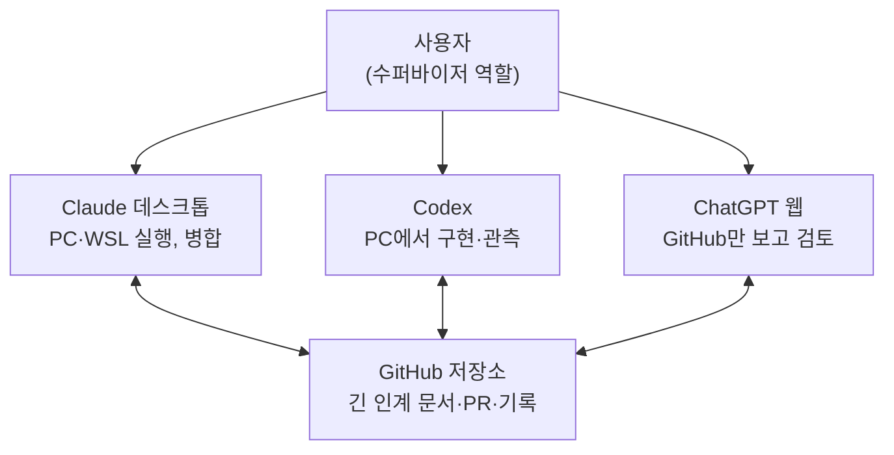
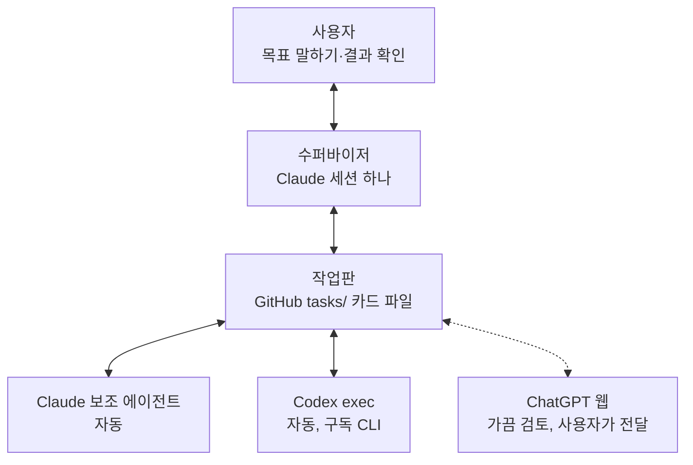

# 여러 AI 작업 방식 정리와 도구 조사 (2026-09-25)

작성: claude 세션(Claude 데스크톱 앱, `aux-pc`). 사용자가 claude.ai에서 함께 보고 댓글을 단 문서 「여러 AI 작업 방식 정리와 도구 조사」를 다른 AI 세션(ChatGPT·Codex)도 읽을 수 있게 옮긴 사본이다. 원본은 사용자 계정의 비공개 문서라 이 저장소의 세션은 열 수 없다. 이 파일은 2026-09-25 기준이고, 원본이 나중에 바뀌어도 따라 고치지 않는다.

**사용자 판단(2026-09-25):** 수퍼바이저·작업판 구조로 바로 바꾸지 않고 먼저 조사를 더 한다. 새 방식을 쓰게 되면 ChatGPT 웹은 큰 변경의 검토에만 쓴다. 이 조사는 후보이지 채택된 운영 방식이 아니다. 현재 운영은 [AGENTS.md](../../../AGENTS.md)와 [NEXT-SESSION.md](../../../NEXT-SESSION.md) 그대로다.

## 1. 내가 원하는 것

사용자는 여러 AI를 직접 중계하지 않고, 목표만 말하면 수퍼바이저 AI가 일을 나누고 결과를 모아 오는 방식을 원한다. 진행 상황은 대화(컨텍스트)가 아니라 정해진 공간에 남아서, 어느 AI든 거기서 읽고 이어받아야 한다.

| 원하는 것 | 쉬운 말로 | 됐다고 볼 기준 |
| --- | --- | --- |
| 수퍼바이저 AI | 내가 하던 "누구에게 뭘 시킬지"를 AI 하나가 맡는다 | 사용자는 목표와 결과 확인만 한다. 세션 사이에 글을 옮겨 적지 않는다 |
| 정해진 공간에 저장 | 할 일·진행 상황·결과를 대화가 아니라 파일에 둔다 | 새 AI 세션이 그 파일만 읽고 바로 일을 시작한다 |
| 컨텍스트가 차면 인계 | 한 세션의 기억이 가득 차면 다음 세션이 이어받는다 | 세션이 바뀌어도 한 일을 다시 하지 않고, 사용자가 다시 설명하지 않는다 |
| 편의 기능 | 남들이 편하게 쓰는 기능 중 우리에게 맞는 것만 넣는다 | 사용자가 터미널을 보지 않고도 "지금 뭐가 진행 중이고 뭐가 나를 기다리는지" 안다 |
| 단순함 | 기능을 늘리기보다 쓰기 쉽게 | 새 규칙·문서가 늘지 않고 오히려 줄어든다 |

이미 정해 둔 조건(NEXT-SESSION 2절의 확정 사항):

- 구독 CLI만 쓴다. 유료 API·추가 크레딧은 쓰지 않는다.
- Claude·Codex·ChatGPT 등 여러 AI가 함께 일한다. 서로의 대화는 못 보고, GitHub 저장소만 같이 본다.
- ChatGPT 같은 원본 앱의 화면을 프로그램으로 조작하지 않는다.
- 상태를 보여 주려고 모델을 더 부르지 않는다.
- 사용자는 터미널을 보지 않는다. 띄운 서버·프로세스는 AI가 끄고, 설명은 쉬운 말로 한다.

## 2. 지금 우리 방식과 막히는 곳

지금은 사용자가 수퍼바이저이고, GitHub 저장소의 긴 인계 문서(NEXT-SESSION.md)가 공유 공간이다. "정해진 공간에 저장"은 이미 절반쯤 하고 있지만, 작업 단위로 나뉘어 있지 않다.

모든 연결을 사용자가 이어야 하고, 세션끼리는 저장소를 통해서만 정보를 나눈다.

| 막히는 곳 | 어떻게 드러나는가 (2026-09-25, main `9ca0054` 기준) |
| --- | --- |
| 사용자가 병목 | 사용자가 없으면 다음 일이 시작되지 않는다. 세션 사이에 결과를 옮기는 것도 사용자 몫이다 |
| 인계 문서가 계속 커짐 | 문서가 약 16,000줄(145개 파일)로 앱 코드 약 4,700줄의 3배다. 새 세션은 처음에 긴 인계 문서와 규칙 문서를 읽는데 컨텍스트를 쓴다 |
| 누가 무엇을 맡았는지 표시 없음 | 할 일은 인계 문서의 표·목록에 섞여 있다. 두 세션이 같은 일을 잡는 것은 열린 PR을 보고서야 알 수 있다 |
| 검토에 멈춤 조건 없음 | 한 AI가 다른 AI 작업을 검토하면 항상 드문 경우를 더 찾는다. 4일 동안 PR 54개가 나왔다 |
| 한 세션의 일이 큼 | 한 세션이 검토·병합·실험·문서를 다 하면 컨텍스트가 차고, 자동 요약 뒤 세부가 빠질 수 있다 |

## 3. 컨텍스트 한계를 다루는 기존 기능

"차면 자동으로 새 세션을 띄워 넘기는" 범용 기능은 Claude Code에도 Codex에도 없다. 둘 다 같은 세션 안에서 앞부분을 요약하고 계속한다. 가장 가까운 것은 Claude Code Projects의 스레드로, 넘친 스레드가 새 세션에서 스스로 이어가기도 한다.

| 기능 | 하는 일 | 새 세션 인계? | 한계 | 확인 수준 |
| --- | --- | --- | --- | --- |
| [Claude Code 자동 요약](https://code.claude.com/docs/en/model-config) | 차면 앞부분을 요약하고 같은 세션에서 계속. 기준은 `/autocompact`로 조절 | 아니오 | 요약하면서 세부가 빠질 수 있음 | 공식 문서 |
| [Claude Code 보조 에이전트](https://code.claude.com/docs/en/agents) | 떼어 낸 일을 별도 문맥에서 하고 요약만 돌려줌 | 일부(일마다 새 문맥) | Claude만 | 공식 문서 |
| [Claude Code Projects](https://code.claude.com/docs/en/claude-projects) | 조정 대화 하나가 작업마다 스레드를 병렬로 띄움. 지침·기억 공유, "컨텍스트 관리를 안 해도 된다" | 가까움(넘친 스레드가 새 세션에서 이어가기도) | 공개 베타, Pro·Max, 데스크톱 앱·웹만. Claude만. 스레드는 클라우드(내 PC는 원격 연결 필요) | 공식 문서 |
| [Claude Code Agent teams](https://code.claude.com/docs/en/agent-teams) | 리더와 팀원, 공유 작업 목록(의존 관계, 파일 잠금으로 가져가기), 메시지함 | 아니오(팀원마다 별도 문맥) | 실험 기능·기본 꺼짐. 대화형에서만. 세션을 다시 열면 팀원 복원 안 됨 | 공식 문서 |
| [Claude Code 동적 워크플로](https://code.claude.com/docs/en/workflows) | 스크립트가 보조 에이전트 수십 개를 돌리고 교차검증. 중간 결과는 대화 밖에 둠 | 해당 없음(대화에 쌓이지 않음) | 사용량이 큼 | 공식 문서 |
| [Claude Code 세션 간 메시지](https://code.claude.com/docs/en/cross-session-messaging) | 같은 PC의 내 세션끼리 글을 주고받음 | 직접 인계는 아님(대화 기록은 안 넘어감) | WSL 세션과 Windows 세션끼리는 안 됨 | 공식 문서 |
| [Claude Code 훅](https://code.claude.com/docs/en/hooks) | 세션 시작(요약 직후 포함)·종료 때 스크립트 실행 | 만들 수 있음(종료 때 상태 파일 저장 → 다음 시작 때 읽기) | 직접 설정해야 함 | 공식 문서 |
| [Claude Code /goal](https://code.claude.com/docs/en/goal) | 완료 조건을 주면 만족할 때까지 스스로 다음 차례를 이어감. 판정은 작은 모델이 따로 함 | 아니오 | 한 세션에 목표 하나 | 공식 문서 |
| [Codex 자동 요약](https://learn.chatgpt.com/docs/config-file/config-reference) | `model_auto_compact_token_limit`에 닿으면 요약 | 아니오 | 같은 세션에서 요약 | 공식 문서 |
| [Codex 보조 에이전트](https://learn.chatgpt.com/docs/agent-configuration/subagents) | 일을 별도 스레드에서 하고 요약만 돌려줌. 역할은 `.codex/agents/`의 TOML 파일로 정의 | 일부(일마다 새 문맥) | 동시 개수는 `agents.max_concurrent_threads_per_session` | 공식 문서 |
| Codex `resume`·`fork`·`queue` | 지난 세션 이어가기·복제, 기존 세션에 메시지 넣기 | 수동 | 자동 인계는 아님 | aux-pc-wsl Codex 0.156.1 도움말 관측([기록](../../experiments/v04-01-inventory/hosts/aux-pc-wsl/help/codex-1.txt)) |

그래서 실제 해법은 기능 하나가 아니라 설계다: 일을 한 세션에 끝나는 크기로 자르고, 진행 상황을 파일에 적어 새 세션이 거기서 이어받게 한다. 앞서 채팅에서 외부 글을 근거로 말한 "Codex 보조 에이전트 기본 6개·깊이 1"은 공식 문서에서 확인되지 않았다. 공식 설정 이름은 `agents.max_concurrent_threads_per_session`이고, `agents.max_threads`는 옛 이름이다.

## 4. 유명한 앱·도구의 편의 기능과 그 이유

여러 도구가 서로 다른 이름으로 같은 다섯 가지 문제를 풀고 있다: 기억이 사라지고, 사람의 검토가 병목이고, 병렬 작업은 충돌하고, 사람이 모든 세션을 지켜볼 수 없고, 조정과 결정을 나눠야 한다는 것이다. 아래 "왜"는 각 도구가 자기 문서에서 밝힌 이유다.

| 도구 | 편의 기능 | 왜 그렇게 만들었나 |
| --- | --- | --- |
| [Claude Code Projects](https://code.claude.com/docs/en/claude-projects) | 조정 대화가 작업마다 스레드를 띄움. 개요 화면에 진행 중·내 답 필요·검토 대기를 모아 보여 주고 데스크톱 알림 | 프로젝트 없이 여러 세션을 돌리면 무엇을 맡길지, 배경 설명, 끝났는지 확인을 사용자가 직접 해야 하기 때문 |
| [GitHub Copilot 클라우드 에이전트](https://docs.github.com/en/copilot/concepts/agents/cloud-agent/about-cloud-agent) | 이슈에 Copilot을 담당자로 지정하면 작업한 뒤 PR을 만들고 검토를 요청. 작업 하나에 PR 하나, 최대 59분 | 에이전트가 백그라운드에서 일하고, 모든 과정이 GitHub에 남아 투명하게 보이도록 |
| [Cursor 2.0](https://cursor.com/changelog/2-0) | 한 번에 최대 8개 에이전트를 병렬로. 각자 별도 작업 사본(worktree)이나 원격 기계. 에이전트·계획 사이드바, 여러 파일 변경을 한곳에서 검토 | 동시에 일해도 파일이 충돌하지 않게, 관리를 한 화면에 모으려고 |
| [Conductor](https://www.conductor.build/docs/) | Claude Code·Codex·Cursor·OpenCode를 병렬로. 작업마다 브랜치·파일·터미널·diff가 따로 있고, 검토 → PR → 병합 → 보관까지 이어짐(Mac) | 작업을 격리하고 검토·병합 동선을 짧게 하려고 |
| [Beads](https://github.com/steveyegge/beads) | git에 저장하는 AI용 작업판. "막힌 것 없는 작업" 목록, 동시에 가져가기 방지, 끝난 작업 요약, 기억할 것 저장 | 긴 작업에서 맥락을 잃지 않게, 지저분한 마크다운 계획을 대신하려고 |
| [Gas Town](https://github.com/gastownhall/gastown) | 시장(조정자)·작업자(정체성은 유지, 세션은 일회용)·병합 담당·감시 역할, 메일함과 인계 | 재시작하면 맥락을 잃고, 수동 조정은 4~10개만 돼도 혼란스러워서. 규모가 커지면 사람의 감시가 꼭 필요하다고 경고 |
| [Backlog.md](https://github.com/MrLesk/Backlog.md) | 저장소 안 마크다운 작업 파일과 칸반 보드. 명세 → 계획 → 코드 세 번 검토, "작업 하나 = 컨텍스트 하나 = PR 하나" | AI가 한 시간에 만드는 코드를 사람이 하루에 다 못 읽으니, 사람이 검토할 수 있는 크기로 나누려고 |
| [Kiro specs](https://kiro.dev/docs/specs/) | 요구사항·설계·작업 세 파일. 의존 없는 작업을 묶어 동시에 실행, 실시간 상태 | 아이디어를 추적·책임이 가능한 계획으로 바꾸고 진행을 추적하려고 |
| [Cline Memory Bank](https://docs.cline.bot/prompting/cline-memory-bank) | 여섯 개 마크다운 파일(프로젝트 개요, 현재 초점, 진행 상황 등). 작업 시작마다 읽고 큰 변경 뒤 갱신 | 세션 사이에 기억이 완전히 초기화되기 때문 |
| [Devin Knowledge](https://docs.devin.ai/product-guides/knowledge) | 모든 세션이 참고하는 팁·지침. 필요할 때만 불러오고, Devin이 기억할 것을 제안(지금은 Skills로 이전 중) | 새 엔지니어 온보딩처럼, 같은 설명을 매번 반복하지 않으려고 |

공통된 다섯 가지 이유:

1. 기억은 세션마다 사라진다. 그래서 바깥 파일에 저장한다(Beads, Memory Bank, Devin, Projects, Gas Town).
2. 사람의 검토가 병목이다. 그래서 작업을 작게 자르고 PR 하나씩 낸다(Backlog.md, Copilot, Kiro).
3. 병렬로 돌리면 파일이 충돌한다. 그래서 작업마다 격리된 사본을 준다(Cursor, Conductor, Gas Town).
4. 사람이 모든 세션을 지켜볼 수 없다. 그래서 "나를 기다리는 것" 화면과 알림을 둔다(Projects, Cursor, Conductor, Copilot).
5. 조정은 AI 하나에게, 결정은 사람에게 준다. 그래서 조정자 역할을 따로 두고 병합은 검토를 거친다(Projects, Gas Town, Copilot).

## 5. 컨텍스트가 차면 넘기는 기능만 모아 보기

"새 세션으로 넘기기"는 실제로 있었던 기능이지만, 가장 앞서 도입한 Amp가 2026-05에 없애고 자동 요약으로 돌아갔다. 요즘 모델은 요약을 잘 받아들이므로, 사람이나 수퍼바이저가 "언제 넘길지" 지켜보는 것보다 작업을 작게 자르는 쪽이 낫다는 판단이다.

| 도구 | 방식 | 언제 | 왜 |
| --- | --- | --- | --- |
| [Amp Handoff](https://ampcode.com/news/handoff) (2025-10-23) | 새 스레드의 목표를 적으면 지금 스레드를 분석해 시작 지시문과 관련 파일 목록을 만듦. 보내기 전에 사람이 고칠 수 있음 | 사용자가 명령이나 버튼으로 | 요약은 정보가 사라지고, 요약 위에 요약을 쌓으며 긴 스레드를 부추긴다고 봤기 때문. 짧고 집중된 스레드가 결과가 좋다는 판단 |
| [Amp "Handoff, please"](https://ampcode.com/news/ask-to-handoff) (2026-01-13) | "넘기고 관리자 화면 만들어" 처럼 말하면 에이전트가 새 스레드를 열고 이어서 일함 | 말로 요청 | 버튼을 누르는 번거로움을 없애려고 |
| [Amp 재구축](https://ampcode.com/news/neo) (2026-05-06) | Handoff를 없애고 컨텍스트 90%에서 자동 요약. 다른 스레드를 참조해 읽는 기능은 남김 | 자동 | 요즘 모델은 요약을 잘 다루고, 작은 스레드가 여럿 이어지는 복잡함이 더 크다고 봤기 때문. 사용자가 컨텍스트 비율을 지켜볼 필요가 없게 |
| [Claude Code 세션 관리](https://code.claude.com/docs/en/sessions) | 자동 요약 외에, 한 시간 이상 쉬고 10만 토큰이 넘는 세션을 다시 열면 "요약에서 이어가기"를 제안(Pro·Max). `/branch`로 대화를 복사해 갈라질 수도 있음 | 다시 열 때 또는 사용자가 | 오래 쉬면 저장된 압축 내용이 만료돼 전체를 다시 처리하므로, 요약으로 이후 요청을 가볍게 하려고 |
| [Claude Code Projects](https://code.claude.com/docs/en/claude-projects) | 스레드는 자동 요약, 조정 대화는 최근 메시지·스레드·프로젝트 기억만으로 일함. 넘친 스레드는 새 세션에서 이어가기도 | 자동 | 사용자가 컨텍스트를 관리하지 않게. 꼭 남아야 할 것은 프로젝트 기억에 둔다 |
| [Gas Town](https://github.com/gastownhall/gastown) | 작업자의 정체성은 유지하고 세션은 일회용. 작업 상태는 git에 남겨 재시작해도 이어감 | 작업 단위 | 재시작하면 맥락을 잃어서 |

우리에게 주는 뜻: "차면 자동으로 새 세션에 넘기는" 기능을 따로 만들 필요는 없다. 각 세션은 도구의 자동 요약에 맡기고, 세션이 바뀌어도 살아야 하는 것(할 일·진행 상황·결정)만 작업판 카드에 남기면 된다. Amp가 없앤 이유(작은 스레드 여럿이 이어지는 복잡함)는 우리가 느끼는 복잡함과 같은 종류다.

## 6. 수퍼바이저형 제품: 일을 나누고 보고받는 방식

수퍼바이저를 둔 제품들은 조정자와 작업자의 문맥을 나누고, 결과와 "내 답이 필요한 것"을 한 화면에 모은다. Devin은 그 이유를 "한 세션에 너무 많은 일을 맡기면 문맥이 쌓여 집중이 흐려지고 각 일의 품질이 떨어진다"고 밝혔다. 우리가 겪는 문제와 같다.

| 제품 | 누가 나누나 | 누가 일하나 | 어떻게 보고받나 | 왜 |
| --- | --- | --- | --- | --- |
| [Devin — Devin이 Devin을 관리](https://cognition.com/blog/devin-can-now-manage-devins) (2026-03-19) | 주 Devin이 범위를 정하고 배정·감시·충돌 해결·결과 취합 | 관리되는 Devin(각자 가상 기계) | 조정 세션이 작업 중인 Devin에게 메시지를 보내거나 멈추게 함 | 한 세션에 일을 몰아 주면 품질이 떨어지므로, 작업마다 깨끗한 문맥·좁은 초점을 주려고 |
| [Claude Code Projects](https://code.claude.com/docs/en/claude-projects) | 조정 대화 | 스레드(클라우드 또는 원격 연결한 내 PC) | 개요 화면의 진행 중·내 답 필요·검토 대기, 데스크톱 알림. "스레드를 제안만 하고 기다려"라고 할 수 있음 | 사용자가 조정을 직접 하지 않게 |
| [Claude Code agent view](https://code.claude.com/docs/en/agent-view) (연구 미리보기) | 사용자가 한 화면에서 보냄 | 백그라운드 세션(파일을 고치기 전 자동으로 별도 작업 사본으로) | 상태 표(입력 필요·작업 중·완료·실패), 엿보고 바로 답하기. 입력 필요·완료·실패 때 알림 | 모든 단계를 지켜보지 않고 여러 일을 맡기려고 |
| [Gas Town](https://github.com/gastownhall/gastown) | 시장(조정 AI) | 일회용 작업자, 병합은 병합 담당이 따로 | 문제 보기 화면에서 멈춘 작업자를 보여 줌 | 수동 조정은 규모가 커지면 혼란스러워서 |
| [Codex 예약 작업](https://learn.chatgpt.com/docs/automations) | 사용자가 정한 일정이나 이벤트 | 백그라운드(데스크톱은 별도 작업 사본, 웹은 클라우드) | 사이드바의 수신함, 확인이 필요하면 읽지 않음 표시 | 반복되는 일을 맡기고 나중에 보려고. 권한은 꼭 필요한 만큼만 주라고 권함 |
| [Google Jules](https://jules.google/docs/) | 사용자 | 클라우드 가상 기계 | 코드를 바꾸기 전에 계획을 보여 주고 승인을 받음. 끝나면 알림 | 맡기고 다른 일을 하도록 |

공통점 네 가지:

1. 조정자와 작업자의 문맥을 나눈다. 작업자는 매번 깨끗하게 시작한다.
2. 시작 전에 계획을 한 번 보여 주고 승인받는다(Jules, Projects).
3. 결과는 한곳(개요 화면·수신함·PR)에 모인다.
4. 알림은 "내 답 필요·완료·실패" 같은 몇 가지 경우에만 보낸다.

## 7. 공유 기억·규칙 파일

도구들은 "항상 읽는 짧은 규칙"과 "필요할 때만 읽는 기억"을 나눈다. 우리는 세션이 시작할 때마다 세 파일(AGENTS.md·NEXT-SESSION.md·협업 규칙) 약 4만 2천 자를 읽는다(main `9ca0054` 기준). Claude Code 문서는 규칙 파일 하나를 200줄 아래로 두라고 하고, 길면 컨텍스트를 더 쓰고 지시를 덜 따른다고 적어 두었다.

| 방식 | 도구 | 무엇을 담나 | 왜 |
| --- | --- | --- | --- |
| [AGENTS.md](https://agents.md/) | Codex·Copilot·Jules·Claude·Cursor 등 25개 넘는 도구 | 빌드·시험·규칙 등 AI에게만 필요한 내용. 가장 가까운 폴더의 파일이 우선 | 사람용 README는 짧게 두고, 모든 AI가 같은 자리에서 지시를 찾게 하려고 |
| [CLAUDE.md와 자동 기억](https://code.claude.com/docs/en/memory) | Claude Code | CLAUDE.md는 사람이 쓰는 지시. 자동 기억은 Claude가 교정·취향을 스스로 적은 메모(매번 앞 200줄 또는 25KB만 읽음). CLAUDE.md가 없으면 AGENTS.md를 직접 읽음 | 짧고 구체적일수록 잘 따르고, 반복 설명 없이 교정을 배우게 하려고 |
| [Codex memories](https://learn.chatgpt.com/docs/config-file/config-reference) | Codex | 지난 세션에서 뽑은 기억을 쓸지·만들지 등을 `memories.*` 설정으로 고름 | 세션을 넘어 배운 것을 이어가게 하려고 |
| [Devin Knowledge](https://docs.devin.ai/product-guides/knowledge) | Devin | 팁·지침. 처음에 전부 싣지 않고 관련 있을 때만 불러옴 | 필요한 것만 읽어 문맥을 아끼려고 |
| [Cline Memory Bank](https://docs.cline.bot/prompting/cline-memory-bank) | Cline | 개요·현재 초점·진행 상황 등 여섯 파일, 작업마다 전부 읽음 | 세션 사이에 기억이 초기화되니까 |
| [Claude Code Projects 기억](https://code.claude.com/docs/en/claude-projects) | Claude Code Projects | 꼭 남아야 할 것과 사용자가 한 교정 | 조정 대화가 오래된 기록 대신 기억으로 일하기 때문 |

우리에게 주는 뜻:

- 시작 때 항상 읽는 부분(규칙 + 현재 상태)을 짧게 줄이고, 지난 이력은 링크로 두어 필요할 때만 읽게 하는 것이 도구들의 공통 방식이다.
- 주의할 것: 이 "공유 기억"은 프로젝트를 만드는 우리 AI들의 일이다. 우리 앱의 참여자(눈을 가리고 따로 답하는 AI)에게는 반대로 기억·규칙 파일을 끄는 것이 정해져 있다([문맥 독립성 기록](../../reviews/2026-09-25-context-independence/README.md)). 두 가지를 섞지 않는다.

## 8. 우리에게 맞는 것과 안 맞는 것

권고는 "작업판 + 수퍼바이저 세션 하나 + 작업 하나 = 세션 하나 = PR 하나"다. 새 도구를 설치하지 않고 저장소의 마크다운 파일과 운영 규칙만으로 시작할 수 있다.

점선은 화면 자동 조작이 금지라 사용자가 붙여넣는 경로다.

| 가져올 것 | 배운 곳 | 우리에게 맞는 이유 | 드는 비용 |
| --- | --- | --- | --- |
| 작업판: 작업마다 카드 파일 하나(상태·담당·완료 조건·호출 상한) | Backlog.md, Beads, Kiro | ChatGPT 웹도 GitHub에서 읽는다. 누가 무엇을 맡았는지 보인다 | 작음(마크다운 파일) |
| 수퍼바이저 세션 하나 | Claude Code Projects, Gas Town | 사용자는 목표만 말한다. Claude 작업은 보조 에이전트, Codex는 `codex exec`로 보낸다 | 작음(운영 규칙) |
| 작업 하나 = 세션 하나 = PR 하나 | Backlog.md, Copilot | 컨텍스트 한계를 크기로 해결한다. 넘치면 카드에 중간 상태를 적고 새 세션이 이어받는다 | 없음 |
| 짧은 기억 파일(현재 초점·진행 상황) | Cline Memory Bank, Devin | 긴 인계 문서 대신 새 세션이 짧게 읽는다 | 인계 문서를 한 번 줄이는 일 |
| 검토 멈춤 규칙: 명세·계획·코드에서 한 번씩 | Backlog.md | 끝없는 검토를 막는다. 실제 사용에 영향 있는 것만 고친다 | 없음 |
| "나를 기다리는 것" 화면과 알림(우리 앱 기능) | Projects, Conductor, Cursor | 터미널을 안 보는 사용자에게 가장 쓸모 있다 | 앱 화면 작업 |

맞지 않는 것:

- Gas Town처럼 20~30개를 병렬로 돌리는 방식은 맞지 않는다. 구독 사용량과 감시 부담이 커지고, tmux·Go 같은 준비가 필요하다.
- Claude Code Agent teams는 실험 기능이고, Claude만 쓰며, 대화형에서만 돈다.
- Projects로 전부 옮기는 것도 맞지 않는다. Claude만 쓸 수 있고, 우리 WSL 실험은 원격 연결 스레드가 필요하다. 작은 시험만 권한다.
- Beads·Backlog.md 도구 설치는 지금은 필요 없다. 마크다운 카드로 시작하고, 카드가 많아지면 그때 도입을 검토한다.
- Copilot 클라우드 에이전트는 지금 쓰는 구독(Claude·Codex·ChatGPT) 밖의 서비스라 제외한다.

다음 단계:

- [ ] 사용자: 수퍼바이저 + 작업판 구조로 갈지 정한다 (2026-09-25: 먼저 조사를 더 하기로 함. ChatGPT 웹은 큰 변경의 검토에만 쓰기로 정함)
- [ ] 작업판 시범: 남은 일 3~5개를 카드로 옮기고 인계 문서를 짧게 줄여 본다
- [ ] 수퍼바이저 한 바퀴 시험: 카드 하나를 Claude 보조 에이전트 구현 + Codex exec 검토로 끝낸다
- [ ] Projects가 계정 사이드바에 보이면 작은 작업 하나로 시험한다

## 9. 확인 방법·한계·출처

기능과 이유는 2026-09-25에 각 도구의 공식 문서나 원본 저장소를 직접 열어 확인했다. 검색 결과의 요약만 보고 적은 것은 없다. 저장소 규모는 같은 날 aux-pc에서 줄 수를 직접 세었다.

한계:

- 기능은 문서로만 확인했다. Projects·Agent teams·동적 워크플로는 이 PC에서 써 보지 않았고, Projects가 이 계정에 열려 있는지도 모른다.
- "왜"는 각 도구가 스스로 밝힌 설명이다. 효과를 독립적으로 검증한 자료는 아니다. 별 수·"4배 빠름" 같은 홍보 수치는 근거로 쓰지 않았다.
- Codex 보조 에이전트의 동시 개수는 외부 글과 공식 문서가 달랐다. 공식 문서를 따랐다.
- 도구들이 빠르게 바뀐다. 모두 2026-09-25 기준이다.
- OpenAI의 Codex 앱 소개 페이지는 열리지 않았다(403). 그래서 Codex 앱의 병렬 기능은 공식 문서의 예약 작업 페이지에 있는 내용까지만 적었다.
- Amp 페이지는 도구의 페이지 읽기가 실패해, 같은 페이지를 직접 내려받아 본문을 읽었다.

출처(직접 연 페이지):

- Claude Code: [Agent teams](https://code.claude.com/docs/en/agent-teams), [여러 에이전트 병렬 실행](https://code.claude.com/docs/en/agents), [Projects](https://code.claude.com/docs/en/claude-projects), [동적 워크플로](https://code.claude.com/docs/en/workflows), [세션 간 메시지](https://code.claude.com/docs/en/cross-session-messaging), [자동 요약 설정](https://code.claude.com/docs/en/model-config), [비용·컨텍스트 관리](https://code.claude.com/docs/en/costs), [훅](https://code.claude.com/docs/en/hooks), [/goal](https://code.claude.com/docs/en/goal), [세션 관리](https://code.claude.com/docs/en/sessions), [agent view](https://code.claude.com/docs/en/agent-view), [기억](https://code.claude.com/docs/en/memory)
- Codex: [보조 에이전트](https://learn.chatgpt.com/docs/agent-configuration/subagents), [설정 참조](https://learn.chatgpt.com/docs/config-file/config-reference), [예약 작업](https://learn.chatgpt.com/docs/automations). `resume`·`fork`·`queue`는 aux-pc-wsl의 Codex 0.156.1 [도움말 기록](../../experiments/v04-01-inventory/hosts/aux-pc-wsl/help/codex-1.txt)
- 인계·요약: [Amp Handoff](https://ampcode.com/news/handoff), [Amp "Handoff, please"](https://ampcode.com/news/ask-to-handoff), [Amp 재구축](https://ampcode.com/news/neo)
- 수퍼바이저형·도구: [Devin — Devin이 Devin을 관리](https://cognition.com/blog/devin-can-now-manage-devins), [Google Jules](https://jules.google/docs/), [GitHub Copilot 클라우드 에이전트](https://docs.github.com/en/copilot/concepts/agents/cloud-agent/about-cloud-agent), [Cursor 2.0](https://cursor.com/changelog/2-0), [Conductor](https://www.conductor.build/docs/), [Beads](https://github.com/steveyegge/beads), [Gas Town](https://github.com/gastownhall/gastown), [Backlog.md](https://github.com/MrLesk/Backlog.md), [Kiro specs](https://kiro.dev/docs/specs/)
- 기억·규칙: [AGENTS.md](https://agents.md/), [Cline Memory Bank](https://docs.cline.bot/prompting/cline-memory-bank), [Devin Knowledge](https://docs.devin.ai/product-guides/knowledge)
