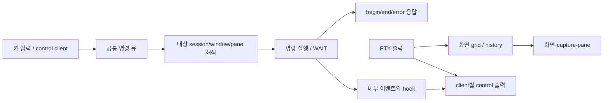

# tmux: 연결·실행·표시를 분리하는 운영 구조

고정판은 `tmux/tmux@e476c1230b958df0cb12977517d24b3dc931375b`(3.7c). [소스 범위](source-map.json)의 tmux 항목과 [실행 결과](tmux-probe-results.json)가 근거다. [2026-09-23 조사](../tmux-2026-09-23/README.md)는 당시 실행 도구가 없던 소스 분석으로 보존한다. 이번에는 공식 release를 임시 빌드해 핵심 경계를 직접 시험했다.

## 1. 부품과 실제 흐름

서버가 session/window/pane과 PTY를 소유하고 client는 그것을 보고 조작한다. 연결이 떨어지는 사건과 pane의 프로세스가 끝나는 사건은 독립적이다. 여러 client가 붙어도 실행을 하나 더 시작하지 않는다. 다만 이 상태는 **살아 있는 tmux 서버의 상태**다. 서버 재시작 뒤 복구되는 durable 작업 원장으로 해석하면 안 된다.

`cmd-queue.c`의 append/insert는 명령을 client/global queue에 연결하고 참조를 유지한다. target/client resolution 뒤 실행 handler가 반환한 값에 따라 queue가 진행하거나 기다린다. hook용 상태를 별도로 만드는 경로는 나중 명령의 대상 상태를 오염시키지 않으려는 구조다. 우리에서는 화면·자동화·향후 CLI가 같은 controller 동작을 호출하고, UI에서만 허용 조건을 검사하지 않는 원리로 가져올 수 있다.

## 2. 명령 영수증과 완료 사건

`cmdq_fire_command`는 `%begin`을 먼저 내고 handler가 `CMD_RETURN_WAIT`를 반환해도 명령 block의 `%end`를 낸다. queue는 이후 continuation을 기다린다. `%error`도 block의 경계이지 전체 작업자 프로세스의 표준 오류는 아니다.

직접 시험 T03은 control client에서 `wait-for dml-gate`를 보냈다. `%end`를 받았지만 그 뒤 `display-message AFTER_GATE`는 실행되지 않았다. 다른 client가 `wait-for -S dml-gate`를 보내자 이어졌다. 그러므로 HTTP 200이나 “명령 전달 완료”로 모델 호출 완료를 표시하면 안 된다.

**우리 계약 후보:** 명령에는 `request_id`, `target_run_id`, `expected_version`을 넣고 응답은 `accepted/rejected`와 `operation_id`를 돌려준다. 실제 결과는 원장의 attempt/종료/저장/공개 상태를 읽는다. 기존 `Controller._finish`, `_finish_unstored`, `_recover`가 이미 나누는 상태를 보존한다. tmux command number를 앱의 영속 ID로 직접 쓰지 않는다.

## 3. 안정적인 대상과 재접속

session/window/pane에는 표시 이름·순번과 다른 ID가 있다. T04에서 client를 detach해도 session은 남았고 새 control client로 재연결해 같은 ID를 확인했다. window를 rename해도 pane ID로 조회할 수 있었다. 관측 범위는 동일 서버 생존 중이다.

우리의 `task_id/run_id/attempt`가 이미 이 역할의 기반이다. 목록 3번째 칸, 팀원 이름, 최근 실행 같은 가변 표현만으로 취소·상세 보기를 전달하지 않는다. 실행 전 확인 명세에 고정 ID를 묶는 현재 방식을 재사용한다. 다른 원장을 열면 선택된 ID와 읽기 요청 세대도 함께 바뀌어야 한다.

재접속은 “이전 화면을 그대로 재생”과 다르다. **현재 snapshot + 그 이후 변경**이 필요한 경우, 시작 cursor와 snapshot 사이의 빈틈을 어떻게 막을지 설계해야 한다. tmux notification에 연결했다고 우리 durable replay가 자동으로 생기지 않는다. 초기에는 현행 조회를 유지하고 재접속 시 원장 전체 상태를 다시 읽는 것이 작은 조각이다.

## 4. 출력 흐름 제어와 상태 구독

`control.c`는 client별 pane 출력 backlog를 다룬다. 늦은 client에 대해 pause 경로는 pending pane 출력을 버리고 pause를 알리며, 허용 지연을 넘는 다른 경로는 `too far behind`로 client 종료를 예약한다. 이 코드를 “모든 출력이 lossless하게 보관된다”로 읽으면 반대다. `NOOUTPUT`도 화면 전송 억제이지 권한 격리가 아니다.

format subscription은 1초 timer로 값을 평가하며, session 구독의 `last`와 같으면 알림을 보내지 않는다. push라는 이름만 보고 매 변경 즉시·정확히 한 번 전달된다고 가정할 수 없다. 내부 notify는 control 알림과 hook 실행을 분리한다. hook을 알림마다 모델 호출로 연결하면 원래 없던 비용·재진입이 생긴다.

우리 S3의 조회 순서·중복 억제와 S6의 원장 조회 재사용은 이미 부분 적용이다. 추가 후보는 선택한 실행만 상세 조회, 숨겨진 창 backoff, `revision`이 같은 결과 생략, 느린 client에 `resync_required`를 표시하는 것이다. 실행 결과 원본은 화면 이벤트 버퍼와 별개로 보존해야 한다. 이번에는 slow-client stress, 대량 출력의 실제 메모리 사용, pause 후 모든 복원 경로를 실행하지 않았다.

## 5. capture-pane은 원본 로그가 아니다

`cmd-capture-pane.c`는 screen grid의 cell을 문자열로 만든다. 옵션에 따라 줄 합치기, escape, hyperlink, 줄 번호 등을 달리한다. PTY 이전의 stdout/stderr 구별을 되살리는 기능이 아니다.

T05에서 stdout과 stderr marker가 같은 화면 history에 들어갔고 `before\rafter `는 덮어쓴 화면인 `after`로 남았다. `capture-pane -p -S -`로 history까지 읽었다. 기본 visible screen만 읽으면 종료 안내가 밀어낸 첫 줄을 놓칠 수 있었다. **상태판의 화면 캡처를 원장 raw stdout/stderr나 성공 판정 근거로 대체하지 않는다.**

우리에는 원본 출력, 정규화 outcome, 사용자 답변·검토 projection이 이미 분리돼 있다. 터미널 미리보기를 추가한다면 `rendered_screen`임을 표시하고 원문 링크를 유지한다. ANSI·OSC·UTF-8 parser를 새로 만들어 모델 결과를 읽는 방향은 지금 필요한 기능보다 크다.

## 6. wait-for와 pane 종료의 한계

`cmd-wait-for.c`의 채널은 서버 메모리의 waiter/locker 목록과 woken 상태다. T07에서 먼저 보낸 signal을 나중 wait가 소비했다. durable 메시지 큐, 분산 lease, 세대가 있는 재시도 토큰이 아니다. 서버가 죽거나 동명 채널을 재사용하는 문제를 이것만으로 해결하지 못한다.

`server-fn.c`의 remain-on-exit 처리와 `window.c`의 destroy-ready 검사는 pane의 종료 상태와 출력 drain을 다룬다. T06에서 exit 7인 pane은 `pane_dead=1`, `pane_dead_status=7`로 화면에 남았다. 화면이 존재한다고 실행 중도 성공도 아니다. 이 경로는 우리 `tree_confirmed_empty`의 운영체제 전체 자손 확인을 대체하지 않는다.

## 7. 편의 기능을 옮길 단위

아래 탐색·메뉴 항목은 이번 전체 함수 감사가 아니라 tmux 기능/파일 구조와 기존 조사에 기초한 **UI 후보**다. 명령 파일 경로는 inventory에서 찾을 수 있다.

| tmux 표면 | Decision AI에서의 쓰임 | 확인해야 할 경계 |
|---|---|---|
| session/window/pane 계층 탐색 | 프로젝트→작업→실행→팀원 이동, 저장된 필터 | 화면 label 변경과 ID 별개 |
| choose-tree·검색 | “실행 중/질문 대기/복구 필요” 즉시 찾기 | 숨겨진 결과를 완료로 오해하지 않기 |
| display-menu·command-prompt | 선택 실행에서 가능한 명령만 표시, 키보드 palette | 서버에서 동일한 허용 조건 재검사 |
| layout·zoom | 두 답변/두 검토를 옆에 놓고 한 칸 확대 | 독립 초안은 공개 전 교차 노출하지 않기 |
| status format·사용자 option | 현재 원장·실행·호출 상한·연결 상태 요약 | 저장값과 실제 effective 설정 구별 |
| notification·activity | 완료/대기 표시와 선택적 알림 | 화면 알림 누락이 결과 유실이 되지 않기 |

적용 조각은 [OP01–OP03](ADOPTION.md)에 있다. tmux를 native CLI의 필수 런타임으로 설치하는 결정은 하지 않았다. 현재 launcher는 창을 닫으면 호출 종료를 기다린 뒤 서버를 끈다. 상시 실행 모드를 만들려면 종료 소유권·원장 잠금·서버 발견·관측 기기를 먼저 설계해야 하며 이번 조사로 그 동작이 바뀌지는 않았다.
