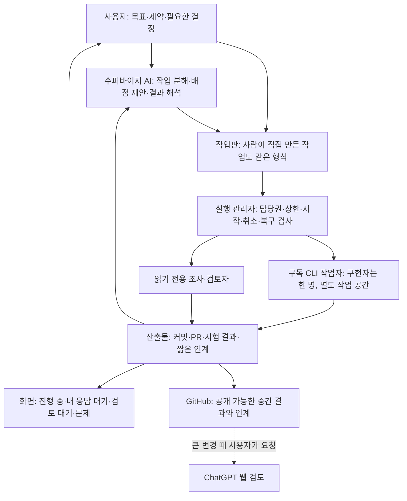

# 여러 AI 작업 방식 — 추가 조사·설계 검토

2026-09-25 · ChatGPT 웹 세션 · 기준 main `6e69346852e4863af9a160523170135bdcec7d03`.

**결론: 방향은 맞다. 다만 ‘수퍼바이저 AI + 파일’에서 끝내지 말고, AI의 판단과 프로그램의 실행 관리를 나누는 것이 좋다.** 세션은 바뀌어도 작업·산출물·남은 예산이 이어져야 한다. 기능을 통째로 들여오기보다 작은 작업판으로 먼저 시험할 것을 권한다.

이 문서는 [첨부 원문에 해당하는 조사](../../research/multi-ai-workflow-2026-09-25/README.md)를 검증·확장한 **제안**이다. 사용자의 ‘먼저 조사’ 판단을 유지한다. 운영 규칙·제품 코드·CLI 설정·독립성 판정·호출 상한은 변경하지 않았다. 이 조사 문서를 모든 개발 세션의 필수 시작 문서로 추가하지 않는다.

읽는 순서: 이 문서의 결론·구조·우선순위 → 필요한 쟁점의 [출처 대조](EVIDENCE.md). R 번호는 그 파일의 검토 내부 출처다.

## 1. 첨부 문서에 대한 판단

공유 공간에 진행을 남기고, 작업을 작게 나누며, 사용자가 매번 AI 사이를 중계하지 않게 하자는 방향에 동의한다. 특히 개발 AI의 공유 기억과 앱 참여자의 독립 판단을 분리하자는 원문의 §7은 그대로 지켜야 한다.

다음은 보완이 필요하다.

| 원문의 표현 | 더 정확한 표현과 이유 |
|---|---|
| 작업 하나 = 세션 하나 = PR 하나 | **검토 가능한 변경 하나를 작업 단위로 삼되, 한 작업이 여러 시도·세션에 걸칠 수 있다.** 세션을 바꿀 때마다 새 작업/PR을 만들면 오히려 인계와 검토가 늘어난다. |
| 파일에 저장하므로 컨텍스트를 아낀다 | **필요한 부분만 읽을 때** 아낀다. 모든 파일을 매번 읽으면 문맥을 다시 채운다. 저장은 기억의 지속성을, 선택적 읽기는 문맥 절약을 담당한다(R01). |
| 자동 요약에 맡기므로 새 세션 인계 기능은 필요 없다 | 평소에는 기본 자동 요약을 쓰되, **중단 복구·작업 경계·명시적 새 시작을 위한 인계는 남긴다.** Amp의 선택은 모든 업무의 일반 해답이 아니며, Anthropic은 요약만으로 부족한 장기 작업 사례를 보고했다(R06·R07). |
| 카드 파일 + 수퍼바이저는 비용이 작다 | 한 작성자가 관리하는 수동 시범에는 맞다. **자동 배정·재시도·취소·중복 방지까지 공짜로 생기지는 않는다.** 원격 Git 파일을 바꾸는 것만으로 여러 PC가 동시에 잡은 작업을 막을 수 없다. |
| Projects로 원격 연결한 로컬 작업을 관리할 수 있다 | 이번에 읽은 공식 문서는 **로컬 세션의 Projects 편입 불가**를 명시한다. 우리 WSL 실행을 바로 옮길 수 있다고 전제하지 않는다. 문맥 초과 뒤 자동 새 세션 이어가기도 조건부다(R05). |
| Beads는 git에 저장하는 작업판이다 | 현재 구현은 **Dolt 기반 작업 데이터베이스**다. export 파일과 실제 저장소, 단일/다중 작성자 모드를 구분해야 한다. 단순 Markdown 도구처럼 도입 비용을 평가하지 않는다(R10). |
| 명세·계획·코드를 매번 각각 검토한다 | 모든 작은 수정에 적용하면 검토 병목이 커질 수 있다. **위험도에 따라 검토 횟수를 정하고, 완료 조건과 멈춤 조건을 먼저 정한다.** |

원문의 문서 줄 수·파일 수·PR 수는 원문에 적힌 과거 main의 관측이다. 이번 세션은 다시 세지 않았으며 현재 값으로 인용하지 않는다. 원문의 모든 제품 설명을 재검증한 것은 아니다. 검증한 항목과 한계는 EVIDENCE.md에서 구분한다.

## 2. 권장 구조: 판단하는 AI와 실행을 관리하는 프로그램



수퍼바이저는 ‘무엇을 누구에게 시킬지’를 판단한다. 실행 관리자는 ‘이 작업이 이미 실행 중인지, 지금 시작해도 되는지, 취소가 끝났는지’를 검사한다. 실행 상태를 확인할 때마다 수퍼바이저 모델을 부르지 않는다. 사용자가 직접 만든 작업도 동일한 실행 검사와 상한을 거친다.

수퍼바이저를 반드시 Claude에 고정할 이유는 없다. 시범에서는 하나를 명시적으로 선택하고, 교체 가능성을 유지한다. 쉬운 상태 분류는 코드로 처리하고, 계획·복잡한 판단에만 적절한 모델을 쓴다. 상급 모델끼리의 교차검토는 중요한 변경에 한정해 켜는 선택지다. ‘항상 저가 모델이 모든 상급 모델을 지휘’하거나 ‘언제나 모든 모델을 호출’하는 고정 구조는 권하지 않는다.

OpenAI Symphony가 가장 가까운 추가 참고다. 이슈별 작업 공간과 단일 실행 관리 상태, 제한된 동시성, 중단·재시도·상태 재확인을 명세로 나눈다. 다만 강한 격리나 우리 호출 예산을 보장하는 제품은 아니다. Linear·Elixir를 도입하지 않고 그 책임 분리만 배운다(R08·R09).

### 서로 섞으면 안 되는 두 공간

| 구분 | 개발 작업 공간 | 앱의 독립 판단 실행 |
|---|---|---|
| 목적 | 이 프로젝트를 만들고 고친다 | 같은 질문에 서로의 답을 보지 않고 답한다 |
| 공유 정보 | 승인된 목표·개발 규칙·코드·작업 진행·검토 결과 | 실행에 고정된 공통 질문과 허용 자료만 |
| 쓰기 | 구현자는 한 writer, 검토자는 읽기 전용 | 논의자는 읽기 전용, controller가 결과를 수용·공개 |
| 기억 | 검증된 프로젝트 사실과 진행을 공유할 수 있다 | 개발 기억·다른 초안·개인 메모리를 주입하지 않는다 |
| 인계 | 같은 작업을 다른 세션에 맡길 수 있다 | 공개된 peer 답을 본 세션을 새 독립 참여자로 세지 않는다 |

개발 수퍼바이저가 앱에 검토를 요청하는 경우에도, 고정한 입력으로 새 실행을 만들고 기존 봉인·독립 정족수 관문을 통과해야 한다. 개발 작업판이나 실행 DB를 참여자에게 통째로 연결하지 않는다. 수퍼바이저의 제안은 사용자의 권한 위임을 확대하는 허가가 아니다.

## 3. 공유 공간은 ‘아무거나 쌓는 폴더’가 아니라 작은 작업 기록

처음에는 새 서비스 없이 카드 파일을 시범으로 쓸 수 있다. **카드의 담당/진행 상태를 확정하는 작성자는 하나**로 두고, 작업자는 자기 산출물과 결과를 제출한다. 두 PC가 각자 받은 Git 사본에서 owner를 바꿨다고 전역 중복 실행 방지가 되지는 않는다.

자동 실행을 제품에 넣는 단계에서는 한 호스트의 실행 관리자가 거래로 담당권과 시도를 예약하게 한다. GitHub는 다른 세션도 볼 수 있는 작업 정의·완료 증거·인계의 공유 지점으로 유지하고, 빈번한 진행 이벤트마다 커밋하지 않는다. 로컬 실행 상태를 별도로 두더라도 GitHub export는 읽기용 투영으로 명시한다. DB와 Markdown을 둘 다 자유롭게 편집하는 양방향 동기화는 만들지 않는다. 다른 PC로 실행 주인을 옮길 때는 기존 실행 종료와 원격 체크포인트를 먼저 확인한다.

### 수동 시범용 카드 예시 — 아직 운영 파일이 아님

```yaml
id: DEV-EXAMPLE
status: proposed
objective: "사용자가 응답해야 하는 작업을 한 화면에서 찾는다"
scope: "표시와 탐색만; 독립 초안 공개 정책은 변경하지 않음"
owner: null
blocked_by: []
input_refs:
  - "기준 commit과 필요한 파일/절"
acceptance:
  - "사용자 응답 대기와 실행 중을 구분한다"
  - "봉인 중 초안 내용이 새 화면에 나타나지 않는다"
  - "관련 회귀 검사 결과를 남긴다"
checkpoint:
  last_pushed_commit: null
  completed: []
  next_action: "현재 상태 투영과 화면 경로를 확인"
  evidence_refs: []
  open_questions: []
```

자동화할 때 추가되는 `attempt_id`, 담당 세대 번호, 실제 실행/종료 상태, 상한 소비 기록은 실행 관리자가 소유한다. AI가 카드의 숫자를 고쳐 예산을 늘리게 하지 않는다. 작업 정의가 바뀌면 판을 올리고, 옛 입력을 보고 실행한 결과가 새 완료 조건을 충족했다고 자동 인정하지 않는다.

### 무엇을 얼마나 읽을 것인가

항상 읽는 것은 짧은 규칙 지도와 현재 맡은 카드다. 필요한 설계·코드·시험만 링크에서 읽고, 긴 조사와 과거 대화는 필요할 때 찾는다. 새 세션의 인계에는 ‘완료한 것, 다음 행동, 근거 위치, 남은 불확실성’이 있어야 한다. 설명만 있고 검증할 커밋·시험 출력이 없으면 완료 증거로 쓰지 않는다.

중요 결정은 출처와 적용 범위를 붙여 남긴다. 폐기·대체된 결정은 표시한다. 모델이 스스로 적은 메모가 사용자 확정 규칙을 덮어쓰지 않게 한다. AGENTS.md·NEXT-SESSION.md·카드·별도 MEMORY.md에 같은 현황을 네 번 복사하지 않는다. 채택 시 NEXT는 현재 작업의 짧은 입구로 줄이고, 이미 있는 Git 이력과 보관 문서를 활용한다. 이번 조사에서는 구조를 대대적으로 바꾸지 않았다.

## 4. 컨텍스트가 차면 새 세션으로 넘기는 기능은 있는가?

**부품은 있고, 일부 제품에는 조건부 자동 인계도 있다. 그러나 우리가 원하는 여러 공급자 공통의 안전한 인계를 설정 하나로 얻는 것은 아니다.**

| 기능 | 실제 하는 일 | 우리에게 적용 |
|---|---|---|
| 자동 요약 | 같은 대화의 앞부분을 줄인다 | 평상시 기본값. Codex는 임계값 설정 제공, Claude도 자동 관리(R01·R02) |
| resume | 저장한 기존 대화를 이어간다 | 대화를 이어가는 기능이지 깨끗한 문맥으로 교대하는 기능은 아님(R01·R04) |
| fork | 기존 기록을 복사해 새 대화를 만든다 | 새 ID만 보고 독립된 정보·빈 문맥이라고 판단하면 안 됨(R04) |
| subagent | 작은 하위 일을 별도 문맥에서 수행한다 | 조사/검토의 긴 중간 과정을 주 대화와 분리. 권한 상속과 사용량 증가를 고려(R03·R12) |
| Projects의 새 세션 이어가기 | 넘친 스레드에서 자동 이어가기 안내가 있을 때 계속한다 | 그 안내가 없으면 새 스레드를 요청해야 한다. 로컬 WSL 작업을 포함하는 범용 기능이 아님(R05) |
| 새 작업자 시도 | 저장한 작업 상태로 새 대화를 시작한다 | 우리 프로그램이 복구·예산·기존 실행 종료를 검사해서 연결해야 하는 기능 |

Codex App Server는 새 대화, 재개, 분기, 요약, 중단을 구조화된 통신으로 제공한다(R04). 원본 앱 화면을 클릭하는 자동화와는 다르다. **로컬 제어 API라는 말이 유료 모델 API 결제를 뜻하지는 않는다.** 공식 문서는 ChatGPT 관리 로그인과 API key 로그인을 구분한다. 다만 설치판의 스키마·구독 인증·권한·수명 동작을 우리 기기에서 확인해야 하며 이번에는 실행하지 않았다. 현재 exec 우선 결정을 유지하고, 양방향 상호작용이 실제로 필요해질 때만 App Server 전환을 비교한다.

### 권장 인계 정책

평소에는 도구의 자동 요약을 사용한다. 작업의 의미 있는 중간 단계마다 진행과 커밋을 남기고, 종료/요약 훅은 보조 수단으로만 사용한다. 갑작스러운 종료는 훅을 실행하지 못할 수 있다. 큰 단계가 끝났거나 작업이 막혔거나 사용자가 ‘새 세션으로 이어가기’를 선택하면 저장된 카드에서 새 시도를 만들 수 있게 한다.

문맥 사용량에 따른 자동 전환은 나중 후보다. 현재 활성 문맥을 신뢰할 수 있게 관측하는 provider에서만 임계값을 시험한다. 파일 바이트 수·문자 수·누적 과금 토큰으로 문맥 잔여율을 꾸며내지 않는다. 모든 모델에 80% 또는 Amp의 90%를 일괄 적용하지 않는다. 관측이 없으면 ‘알 수 없음’으로 표시하고 작업 경계와 실행 시간 등 명시적 정책을 쓴다.

### 새 시도를 열기 전 순서

1. 해당 작업의 새 배정을 막고, 현재 시도가 마지막으로 한 일을 기록한다.
2. 작업 ID·입력 판·기준/진행 커밋·완료/다음 행동·시험 근거·남은 상한을 체크포인트로 저장한다. 정상 인계라면 커밋의 원격 push를 확인한다. 미완료 코드도 미완료로 표시하고 main에 섞지 않는다.
3. 기존 프로세스와 자손의 종료를 확인한다. 종료 여부가 모르면 `unknown`으로 막고 새 작업자를 중복 실행하지 않는다. 시한 만료나 heartbeat 끊김만으로 종료를 가정하지 않는다.
4. 같은 작업·브랜치·PR을 유지하며 새 `attempt_id`로 시작한다. provider의 대화 ID와 우리 작업/시도 ID는 별도로 저장한다.
5. 새 작업자는 짧은 인계와 실제 Git 상태·시험을 대조하고 다음 단계부터 진행한다. 수퍼바이저 자신이 교체돼도 같은 과정을 따른다.

갑작스러운 종료라면 마지막 원격 체크포인트 이후 변경이 있는지 먼저 조사한다. PR 생성이나 push가 성공했는데 응답만 유실됐을 수 있으므로 원격 결과부터 확인한다. 인계는 생각의 내부 상태를 완벽히 복제하는 것이 아니라, 검증 가능한 작업 상태를 복구하는 것이다.

LangGraph의 체크포인트와 장기 저장소 구분도 참고할 만하다(R11). 다만 [공식 Checkpointers의 Replay 절](https://docs.langchain.com/oss/python/langgraph/checkpointers)은 체크포인트 이후 노드의 모델 호출과 API 요청이 다시 실행된다고 명시한다. ‘체크포인트가 있으니 외부 작업도 정확히 한 번’이라고 생각하면 안 된다. 우리 쪽에서도 늦은 결과·같은 제출·원격 변경을 식별하고 재실행 전에 대조해야 한다.

### 사용량과 무한 반복을 막는 조건

작업 전체와 provider별 실행 상한, 시도당 시간/출력 상한, 재시도 상한은 수퍼바이저 세션이 바뀌어도 유지한다. 요약 실패나 새 세션 시작은 예산 환불 근거가 아니다. 취소는 지속 상태로 남기고 다음 세션이 되살리지 않는다. 상한 소진은 멈춤과 설명으로 처리하며 유료 API나 다른 모델로 조용히 대체하지 않는다.

CLI 프로세스 시작 횟수와 모델 추론 횟수는 다르다. 한 CLI 안의 반복 추론·보조 에이전트·요약도 사용량을 쓸 수 있다. 시범에서는 숨은 하위 에이전트를 켜지 않고, 지원/관측된 실행 제한과 사용량 필드를 따로 기록한다. 정확한 내부 호출 수를 모르면 모른다고 표시한다. 상태 감시를 위해 모델을 반복 호출하지 않는다.

## 5. 기존 코드에서 재사용할 것과 새로 필요한 것

기준 main의 문서와 관련 구현 범위는 [근거 표](EVIDENCE.md)에 적었다. 전체 코드 재감사나 새 기능 실행 검증은 아니다.

| 현재 부품 | 이미 확인한 역할 | 권고 |
|---|---|---|
| `core/runner.py`와 `core/contract.py` | 제한된 실행·취소·종료 결과, 기록과 실행이 공유하는 계획 | 새 일반 실행 엔진을 만들기보다 이 계약을 활용할 수 있는지 먼저 본다 |
| `core/isolation.py`, `core/adapters.py` | 독립 논의자를 위한 격리와 읽기 전용 실행 | **현재 논의자에게 쓰기 권한을 풀어 코딩 작업자로 바꾸지 않는다.** 개발 작업자는 별도 권한 profile/입력과 관측이 필요하다 |
| `app/store.py` | SQLite 거래, 원장 단일 작성자, 고정 호출 상한 | 상태 저장 패턴은 재사용 후보. 개발 작업판을 봉인 원장과 공유하지 않는다. 새 DB 프레임워크는 불필요하다 |
| `app/controller.py` | 시도 ID·기대 상태 검사, 지속 취소, unknown 차단, 재시작 후 명시적 resume | 자동 재시도/교대는 **현재 기능이 아니라 새 정책**이다. 기존 fail-closed 동작을 조용히 바꾸지 않는다 |
| `app/state.py`·계정 조회·화면 | 원장에서 상태 투영, 관측 범위가 있는 사용량 표시 | ‘내 응답 대기’·진행/검토 이유 표시의 기존 경로를 확장할 후보다. 초안 봉인 투영은 보존한다 |
| 아직 별도로 필요한 것 | 작업 의존성·담당권, 작업과 시도 분리, 짧은 체크포인트, 개발 권한 경계 | 시범 후 필요가 확인된 작은 기능만 추가한다. blind controller를 범용 작업 엔진으로 비대하게 만들지 않는다 |

구현자 한 명 규칙을 유지한다. 병렬성을 시험하더라도 읽기 전용 조사·검토부터 시작한다. 다른 작업 공간을 주는 것은 파일 충돌을 줄일 뿐, 공유 DB·포트·원격 서비스까지 격리하는 것은 아니다. 개발 작업의 원장·출력에서도 인증 값이나 개인 정보를 GitHub에 올리지 않는다.

## 6. 다른 도구에서 가져올 편의 기능 — 우선순위

아래는 **우리에게 주는 효용에 대한 제안**이며 도구의 성능 우열표가 아니다.

| 우선 | 기능 | 참고 | 우리 앱/개발 흐름에서의 모습 |
|---|---|---|---|
| P0 | ‘나를 기다리는 일’ 묶음 | Projects Overview(R05) | 막힌 이유, 필요한 선택, 선택 뒤 할 일을 표시한다. 모든 진행 로그를 읽지 않아도 된다 |
| P0 | 검토 묶음 | Symphony의 완료 증거(R08·R09) | 변경 목적·diff·시험 근거·남은 불확실성·PR을 함께 보여 준다. ‘완료’와 ‘검토 대기’는 구분한다 |
| P0 | 짧은 인계와 마지막 원격 저장 표시 | Anthropic 장기 harness(R07) | 마지막으로 GitHub에 저장된 커밋과 다음 행동을 보인다. 로컬 저장만 된 것은 구분한다 |
| P1 | 실행 가능한 작업만 배정 | Symphony·Beads(R08·R10) | 선행 작업·입력·상한이 준비되지 않았으면 모델을 부르기 전에 기다린다 |
| P1 | 일시정지와 전체 중지 구분 | Projects와 기존 controller | 일시정지는 새 시작 차단, 중지는 실행 중 시도 취소와 실제 종료 확인까지 표시한다 |
| P1 | 상한 소진·실패·취소 후 복구 안내 | 기존 원장과 App Server(R04) | 자동 반복 대신 보존된 작업과 다음 가능한 행동을 보여 준다 |
| P1 | 변경 파일·검토·PR로 바로 이동 | [Vibe Kanban 원본 README](https://github.com/BloopAI/vibe-kanban) | 다른 CLI 선택과 PR 동선을 한곳에 모으는 UI 참고. 제품 통째로 교체하거나 병합 권한을 늘리지 않는다 |
| P2 | 저장 후 새 세션으로 이어가기 | R04·R06·R07 | 같은 작업을 유지하고 새 시도만 만든다. 먼저 수동 버튼, 검증 후 제한된 자동화 |
| 보류 | 상시 다중 리더, 수십 작업자, 벡터 기억 DB, 범용 DAG/분산 큐 | 이번 요구에 대한 설계 판단 | 현재 중계·복구 문제를 푸는 데 비해 운영 부담이 크다. 필요가 입증되기 전 추가하지 않는다 |

알림은 사용자 응답 필요·실패·검토 준비처럼 행동할 일이 있을 때만 보낸다. 개발 상태 화면과 독립 판단 결과 화면을 같은 UI에 두더라도 저장소·노출 권한은 분리한다. 수퍼바이저가 ‘지금 잘 되고 있다’고 반복해서 말하는 알림은 상태 투영으로 대신한다.

## 7. 과잉 검토를 줄이는 완료 규칙

작업을 시작하기 전에 완료 조건과 검토 범위를 고정한다. 작은 변경은 관련 결정적 시험과 한 번의 집중 검토를 기본 후보로 삼는다. 수정 후에는 해당 지적이 해결됐는지만 확인하고 저장소 전체를 다시 감사하지 않는다. 명세·계획·코드에서 각각 독립 검토할 필요는 권한·비용·데이터 손실·공개 경계 같은 큰 변경에 한정해 정한다.

검토자는 재현 가능한 결함, 근거, 심각도, 완료 조건에 미치는 영향을 적는다. ‘발견 없음’도 정상 결과다. 스타일 선호나 별개 개선은 다음 카드로 넘긴다. 재시도/수정 상한에 닿으면 실패나 남은 쟁점을 보고하며 끝없는 상호 검토를 시작하지 않는다. 중대한 결함을 발견한 경우는 미해결로 남기고 멈춘다. 횟수 제한을 이유로 위험을 합격 처리하지 않는다.

수퍼바이저는 변경 범위·상한·검토 기준을 스스로 확장하지 않는다. GitHub 병합은 현재 AGENTS/NEXT에서 허용한 주체가 정확한 head의 검사를 확인한 뒤 한다. 이 제안은 ChatGPT 웹의 자동 호출이나 자동 병합 권한을 만들지 않는다.

## 8. 도입 전 작은 시범과 합격 기준

**단계 0 — 이번 작업:** 조사·출처 대조·권고를 저장한다. 새 운영 구조를 채택하거나 모델 실험을 실행하지 않는다.

**단계 1 — 카드 시범:** 실제 남은 작업 중 작은 변경·읽기 전용 조사·의도적 중단 복구를 포함한 3–5개를 골라 카드로 표현한다. 현재 인계의 중복 현황을 카드로 옮길지 비교하되 사용자 확정 규칙은 바꾸지 않는다. 한 수퍼바이저, 한 구현자 규칙을 유지한다. 한 작업을 새 세션에서 이어받아 재설명 없이 다음 행동을 찾아가는지 본다.

**단계 2 — 모델 없는 실행 관리 시험:** 큐/자동화가 필요하다고 확인되면 기존 fake 실행 경로를 활용할 수 있는지 검토한다. 다음은 아직 실행하지 않은 시범 완료 조건이다.

| 상황 | 기대 결과 |
|---|---|
| 같은 작업을 두 번 배정 | 시작은 한 번, 중복 요청은 기존 작업으로 연결 |
| 이전 시도의 늦은 결과 | 새 시도의 상태를 덮어쓰지 않음 |
| 실행 중 관리자 종료 | 종료 불명은 막힌 상태로 복원, 재실행 전에 정리 확인 |
| 취소 직후 관리자 재시작 | 취소가 유지되고 새 세션이 자동 재개하지 않음 |
| 상한 소진 뒤 세션 교체 | 작업 전체 상한이 복원되고 추가 시작을 거절 |
| commit은 됐지만 push 실패 | ‘원격 인계 준비 완료’로 표시하지 않음 |
| PR 생성 뒤 응답 유실 | 원격 PR부터 대조하고 중복 PR을 만들지 않음 |
| 입력/완료 조건이 교체됨 | 옛 시도 결과를 새 요구사항의 성공으로 자동 수용하지 않음 |
| 사용자 응답 대기·유휴 상태 | 상태 표시 때문에 모델을 부르지 않음 |
| 개발 작업판을 blind 참여자가 읽으려 함 | 접근 경계를 유지하고 기존 봉인/정족수 회귀가 유지됨 |

**단계 3 — 제한된 실제 한 바퀴:** 구독 로그인·설치판·권한을 확인한 환경에서 시범의 전체/provider별 상한과 멈춤 조건을 기록한다. 구현→시험→읽기 전용 검토→인계까지 한 바퀴를 돌리고 필요한 경우 같은 작업의 새 세션 재개를 본다. 기존 소진 원장을 재사용하지 않는다. 자동 하위 에이전트는 처음에는 끈다. 끝난 서버와 작업자는 종료한다.

성공 여부는 토큰 절약 추정치보다 사용자의 중계 횟수, 새 세션 재설명 필요, 중복 작업, 검토 왕복, 실제 사용량, 복구 뒤 이어진 행동으로 평가한다. 중복 실행과 유휴 상태용 모델 호출은 없어야 하고, 모든 완료 표시는 산출물과 연결돼야 한다. 시범이 수동 방식보다 불편하면 기능을 더 쌓기보다 카드와 실행 범위를 줄인다. 아직 이러한 개선 효과를 측정했다고 주장하지 않는다.

## 9. 이번 작업의 범위와 다음 인계

- GitHub에서 기준 main의 운영 문서·관련 실행/저장 구현과 시작 시 열린 PR/브랜치를 확인했고, 외부 공식 본문과 원본 저장소를 대조했다. 세부 출처와 한계는 EVIDENCE.md에 있다.
- 사용자 PC/WSL·현재 계정·CLI 실행 동작은 새로 관측하지 않았다. 컨테이너의 Git clone은 DNS 해석 실패로 실행되지 않아 GitHub 연결을 사용했다. 로컬 전체 시험을 실행했다고 하지 않는다.
- 참여자 모델 CLI 호출은 0회다. 코드·설치·실행 원장·인증·원본 앱 화면은 바꾸지 않았다. 원문의 날짜 기록은 보존했다.
- 작업 브랜치는 `chatgpt/workflow-evaluation-20260925`. 조사 범위와 출처를 먼저 원격 커밋했고, 이 문서와 인계를 같은 PR에 정리한다. 검증 결과는 **최종 head의 PR Checks**를 기준으로 읽는다. CI는 기능 실측을 대신하지 않는다.
- 다음 판단은 ‘도구를 설치할 것인가’보다 **작은 카드 시범이 사용자의 중계를 실제로 줄이는가**다. 채택 전에는 현재 운영을 유지한다. 이 문서에서 제안한 복구 정책을 현재 controller에 이미 구현된 기능으로 해석하지 않는다.
