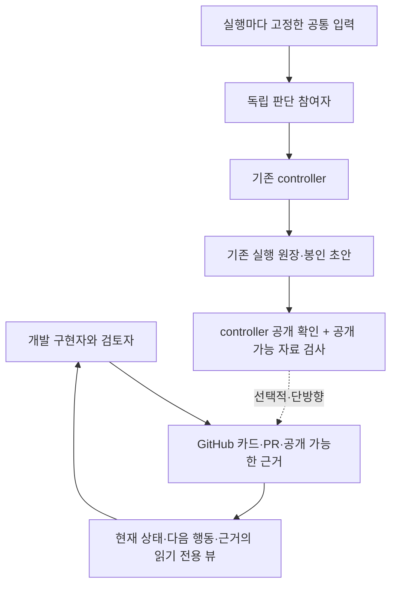

# WorkTrail은 우리 작업에 얼마나 도움이 되는가

2026-09-25 · ChatGPT 웹 세션 · 기준 main `2bcdd20dd95209e96ff5a2c540540584754bd57a` · WorkTrail 검토판 `3fb48f980133fd2fb458362648c7bb04cfdbea2b`.

**결론: 개발 AI의 인계 방식에는 배울 점이 많다. 그러나 지금 WorkTrail을 통째로 붙이는 것보다, 기존 GitHub 카드에 필요한 기록·탐색 방식만 적용하는 편이 낫다.** 우리 앱의 독립 판단·실행 원장을 대신할 제품은 아니다. 추가 서비스 없이 작은 시범으로 순이익을 먼저 확인하고, 부족한 부분이 반복될 때만 읽기 전용 연동을 검토한다.

이번 변경은 **평가와 적용 제안**이다. 운영 규칙·카드 양식·실행 코드·MCP·CLI 설정은 바꾸지 않았다. 설치, 호스팅 가입, 데이터 전송, 모델 호출도 하지 않았다. 사용자 요청에 따라 중간 결과를 원격 커밋으로 남겼으며, 진행 이력은 이 파일을 늘리지 않고 git/PR에 둔다.

읽는 순서: §1–3 판단과 적용 가치 → §4–6 경계와 선택 → §7–9 구체적 시범. 사실의 출처·확인 범위는 [EVIDENCE.md](EVIDENCE.md)의 W·L·A 번호로 연결한다. 이는 검토 내부 참조이며 전역 근거 원장 항목이 아니다.

## 1. 먼저 구분할 것: 기억 도구와 실행 관리자는 다르다

WorkTrail은 코딩 에이전트가 작업하면서 남기는 **작업의 이유와 다음 행동을 보존하는 도구**다. 저장소에 어떤 변경을 했는지뿐 아니라, 무엇을 하려 했는지·왜 선택했는지·어떤 관측에 기대는지·다음은 누구 차례인지를 나눈다. 기록 코어는 자체 모델 호출 없이 동작하도록 Casebook의 조사 기능과 분리돼 있다(W01–W03).

우리 프로젝트에는 다른 층위의 문제가 함께 있다.

| 층위 | 우리가 해결하려는 일 | WorkTrail의 관련성 |
|---|---|---|
| 개발 협업 | Claude·Codex·ChatGPT가 같은 프로젝트를 이어 만들고, 사용자의 반복 설명과 세션 중단 손실을 줄인다 | **직접적**. 작업 상태와 이유를 작게 남기는 패턴이 유용하다 |
| 모델 논의 | 여러 모델이 독립 초안을 내고 근거·반례를 비교한다 | **간접적**. 공개된 결과의 추적에는 도움을 줄 수 있지만 추론 품질·독립성·정족수를 보장하지 않는다 |
| 실행 관리 | 호출 예약, 한도, 단일 writer, 취소, 자손 종료, 수용, 봉인/공개 | **대체 불가**. 우리 controller와 원장의 책임이다 |
| 코드 보존 | 실패 전에 작업 코드를 원격에 보존한다 | **보조적**. 기록과 Git anchor가 있다고 미커밋 파일이나 미push 커밋까지 원격 보존된 것은 아니다 |

따라서 “WorkTrail을 달면 AI 협업 시스템이 완성된다”도, “우리에겐 Git이 있으니 쓸모없다”도 정확하지 않다. **작업의 의미를 잇는 층은 참고하고, 실행의 권한과 안전을 다루는 층은 분리해야 한다.** 이 책임 분리는 [이전 작업 방식 평가](../2026-09-25-workflow-evaluation/README.md)에 이미 있다(L03). 이번 문서는 새로운 오케스트레이터 설계가 아니라 그중 기록·인계 부분의 구체화다.

## 2. 이미 있는 것과 실제로 더 나아질 수 있는 것

우리 [카드 양식](../../../.github/ISSUE_TEMPLATE/card.md)은 목표·범위·완료 조건·입력 commit·모델 상한·체크포인트를 이미 가진다. [카드 시범 기록](../../experiments/2026-09-25-card-pilot/README.md)에는 다른 세션이 사용자 재설명 없이 이어받은 사례도 있다. 따라서 WorkTrail의 기본 효용 전체를 우리에게 새로 생기는 이익으로 계산하면 과장이다(L02).

| WorkTrail의 방식 | 우리 쪽 현재 대응 | 남은 개선점 / 판단 |
|---|---|---|
| 질문·변경 하나를 세션을 넘어 유지 | 카드 하나를 같은 작업으로 이어감 | 이미 채택. 세션마다 새 카드/PR을 만들지 않으면 된다 |
| focus·open·next 분리 | 목표·남은 질문·다음 행동이 카드에 있음 | 정보 자체보다 **빠르게 찾고 최신 상태를 구별하는 방법**이 개선 대상 |
| 결정·근거·해석 구분 | 사용자 결정, 근거 원장, 검토 기록, PR에 분산 | 특정 결정이 어떤 관측에 기대며 무엇을 대체했는지 연결하면 유용 |
| 다음 행동의 owner와 시각 | 상태/agent 라벨과 댓글 | 같은 agent의 여러 세션을 구분하고 오래된 체크포인트를 드러낼 여지 |
| 현재 상태를 먼저, 과거는 필요할 때 | 짧은 인계와 날짜 기록 분리 원칙 | 카드→현재 결정→선택한 근거 순으로 읽는 **탐색 경험**을 다듬을 가치가 큼 |
| 저장소 정체성과 worktree/branch 분리 | GitHub 저장소·카드·브랜치 규칙 | 새 PC나 세션에서도 task ID를 유지하되 로컬 경로를 전역 ID로 삼지 않기 |
| 기록 재전송 중복 처리 | 실행 원장과 예약의 자체 계약 | 외부 기록 export를 만들 때 참고. 실행 예약 로직을 WorkTrail 것으로 교체하지 않음 |

추가 가치가 생길 가능성이 가장 큰 실제 사례는 **인계에 실행 설정의 위치·셸 주의가 빠져 과거 기록을 찾아야 했던 경우**다(L02). 필요한 것은 모든 대화를 수집하는 것이 아니라, 다음 작업에 꼭 필요한 입력을 정확한 commit/파일/절로 가리키는 것이다.

## 3. 가져올 가치가 큰 설계 원칙

### 3.1 현재 상태와 이력을 다른 깊이로 읽기

WorkTrail의 시작 훅은 현재 작업과 다음 차례를 먼저 보여 주고, 자세한 상태는 resume, 경위는 trail, 특정 근거는 inspect로 읽게 한다. 상한은 코드상 문자열 길이이며, 이를 토큰 절약률로 해석하면 안 된다(W04–W05).

우리 쪽에서는 **카드 제목·상태·다음 담당·다음 행동·마지막 원격 commit**을 첫 화면에 보여 주고, 선택한 카드에서 결정과 근거를 펼치는 형태가 적합하다. 전체 회의록·실험 원장·모든 과거 리뷰를 기본 prompt에 넣지 않는다. GitHub에서 읽을 수 있는 작은 카드가 기준이면 새 MCP가 없어도 ChatGPT 웹 세션이 같은 출발점에 도달한다.

### 3.2 관측, 해석, 결정, 배제를 섞지 않기

“테스트 출력은 이렇다”는 관측이고, “이 때문에 실패했을 것 같다”는 해석이며, “이 구현을 쓰기로 했다”는 결정이다. 결정은 사실임을 증명하는 문장이 아니다. WorkTrail은 이 구분과 supersedes를 명시한다(W02–W03).

우리 카드에서 중요한 결정만 **선택·이유·근거 링크·결정 주체·대체한 선택**을 함께 남기면 된다. 별도의 결정 원장을 무조건 신설할 필요는 없다. 정책 사실은 원래 주인 문서, 코드 변경 이유는 PR, 관측은 실험 기록에 두고 카드는 링크로 잇는다. 날짜 기록을 다시 고치거나 같은 사용자 결정을 여러 곳에 전문 복사하지 않는다.

### 3.3 “다음”을 행동·담당·입력으로 쓰기

“계속 검토”보다 “담당: 다음 개발 세션 / 입력: 특정 commit의 설정 예 / 행동: 모의 실행에서 export 누락 재현”이 이어받기 쉽다. 담당 agent 이름만으로 동시 세션을 구분할 수 없으면 세션 식별자와 branch를 덧붙인다. 이는 기록상의 담당이며 OS 파일 잠금이나 전역 작업 예약 증명은 아니다(W03·W06).

### 3.4 실패한 가설도 유효 범위를 붙여 재사용하기

WorkTrail의 rule_out은 근거와 범위를 요구한다(W03). 우리에게는 “어느 PC·CLI 판·계획·자료·commit에서 실패했는가”가 특히 중요하다. 옛 판에서 안 됐다는 기록을 새 판의 영구 금지로 만들면 안 된다. 반대로 같은 범위에서 이미 배제한 실험을 이유 없이 반복할 필요도 없다.

관측 기록의 유효성·만료 규칙은 기존 체계를 따른다. 카드의 요약이 관측 기록을 대신하거나 유효 기간을 늘리지 않는다. 새 증거나 범위 변경이 있으면 재검토로 돌리고, 확인 못 한 것은 unresolved로 남긴다.

### 3.5 원문을 많이 모으기보다 근거를 정확하게 가리키기

WorkTrail도 Git이나 파일에 있는 것은 참조하고 필요한 원문만 적게 기록하도록 안내한다(W05). 우리에게 중요한 것은 채팅 전체가 아니라 **마지막 push된 코드, 실제 검사 결과, 해결하지 않은 반례**다. 원문을 저장했다는 사실은 그 내용의 진실성·완전성·독립성을 보장하지 않는다.

복구 체크포인트는 “기록됨 / 커밋됨 / 원격에서 확인됨”을 혼동하지 않아야 한다. dirty 파일과 미push 상태가 있으면 명시한다. 실패 전에 실제 커밋·원격 저장을 하는 기존 방식은 그대로 필요하다.

## 4. 그대로 도입할 때의 위험과 비용

| 쟁점 | 왜 우리에게 중요한가 | 적용 조건 |
|---|---|---|
| 상태 이중화 | GitHub 카드는 ready인데 WorkTrail은 진행 중이면 어느 것이 맞는지 다시 중계해야 한다 | 한 사실의 주인을 정한다. 초기에는 GitHub가 개발 작업의 기준이며 별도 뷰는 읽기용 |
| 독립 초안 오염 | 개발 결정이나 다른 모델의 요약이 SessionStart/MCP를 통해 참여자에게 들어갈 수 있다 | 개발 작업자에만 제한. 독립 참여자에게 공유 기록을 연결하지 않는다 |
| 권한 오해 | `authority=user`는 출처 표기이지 검증된 실행 승인 토큰이 아니다 | 호출 상한·승인·격리·정족수·병합 권한은 기존 코드와 규칙만 판단 |
| 프롬프트 주입 | 외부 note·증거 안에 지시문이 있을 수 있다 | 검색 결과는 자료로 취급하고 실행 지시/정책으로 승격하지 않는다. 핵심 권한은 프로그램으로 제한 |
| 원문 유출 | 오류·diff·대화에 인증 값·개인 정보·봉인 내용이 섞일 수 있다 | 공개 GitHub에는 허용한 비식별 자료만. 호스팅 자동 수집/전송은 기본 금지 |
| 기록의 신뢰성 | append-only API는 저장소 관리자에 대한 변조 방지가 아니고, 해시는 사실 확인도 아니다 | 관측 출처·scope·원격 ref를 별도로 확인. 가린 파생본에는 별도 hash/분류를 부여 |
| 동시 수정 | 스레드 바인딩·next owner·댓글 선점은 강제 단일 writer가 아니다 | 수동 시범은 기존 협력 규칙. 자동화가 필요해지면 한 실행 주인과 충돌 검사부터 설계 |
| 운영 부담 | SQLite·MCP·웹 서버·훅·업데이트·인증·백업이 새 관리 대상이 된다 | 없애기 쉬운 선택 기능이어야 하며, 인계 절약보다 관리 부담이 크면 쓰지 않는다 |
| PC 이동과 웹 접근 | WSL 지원과 우리 구성은 맞지만 로컬 DB만으로 ChatGPT 웹과 공유되지는 않는다 | GitHub 공유 지점 유지. 원격 연결·가상 worktree 이름은 별도 확인 |
| 라이선스 | FSL은 현재 Apache-2.0과 다르다 | 내부 시험과 코드 편입/상업 배포를 구분하고, 복사·파생물 배포 전 조건 검토 |

위 위험은 “공개 취약점을 재현했다”는 주장이 아니다. 읽은 소스의 보장 범위와 우리 사용 시나리오를 대조한 통합 설계상의 위험이다(W02–W08, L01–L04).

**라이선스 판단:** 원문은 내부 사용·비상업 연구를 허용하므로 연구용 로컬 시험 자체를 금지로 볼 이유는 없다. 다만 경쟁하는 상용 제공과 재배포에 조건이 있고, 각 판 공개 2년 뒤의 Apache 허가를 지금 적용할 수는 없다. 당장은 코드 복사보다 설계 아이디어를 우리 요구에 맞춰 독립 구현하는 선택을 권한다. 이것도 상업 배포의 최종 법률 판단을 대신하지 않는다(W08).

**호스팅 판단:** 신청 페이지의 데이터 안내 본문을 확인하지 못했다. 보관 기간·운영자 열람·삭제·백업을 검증하지 않은 상태에서 실제 기록을 전송하는 안은 보류한다. 공개 소스라는 사실과 운영 서버의 데이터 취급은 별개다(EVIDENCE의 미확인 항목).

## 5. 선택지 평가

아래는 **우리 구조에 대한 정성적 설계 평가**이지, 생산성 시험 점수나 외부 제품의 우열 순위가 아니다.

| 선택지 | 기대 이익 | 새 부담 | 권고 |
|---|---|---|---|
| A. 기존 카드의 체크포인트를 더 명확히 작성 | 인계 재설명·누락·과거 문서 탐색 감소 가능 | 작은 기록 습관 변화 | **지금의 기본안**. 설치 없이 시범 |
| B. GitHub 카드/근거의 읽기 전용 투영을 우리 화면에 추가 | 현재 상태와 이유를 한 화면에서 빠르게 탐색 | 인증, 페이지 나눔, 캐시·오래됨 표시, UI 유지보수 | 반복된 탐색 불편이 확인될 때 |
| C. WorkTrail을 격리된 개발 작업에만 로컬 시험 | 완성된 기록 도구의 사용감을 실제 비교 | 별도 DB·MCP·훅, 백업/동기화 | A로 남는 문제가 있을 때 작은 실험 |
| D. WorkTrail을 필수 공용 서비스나 양방향 원장으로 도입 | 자체 기록 UI 개발을 줄일 가능성 | 이중 진실, 웹 연결, 보안·권한·라이선스·운영 | **현 단계에서는 보류** |
| E. 독립 판단 참여자 전원에 WorkTrail 연결 | 과거 작업을 쉽게 재사용 | 독립성 훼손과 관측 계획 변경 | **현재 목적에는 부적합** |

WorkTrail을 거절하기 위한 비교가 아니다. 범용 메모리나 진척 저장이 전혀 없는 프로젝트라면 C의 가치가 더 클 수 있다. 우리 프로젝트는 이미 카드와 원장·격리가 있으므로 **전체 기능 수가 아니라 현재 방식보다 추가로 좋아지는 부분**을 기준으로 선택해야 한다.

## 6. 추가로 찾아본 도구: 무엇을 배우고 언제 볼 것인가

| 도구 | 가져올 만한 것 | 지금 우리에게 맞는 적용 | 도입을 미루는 이유 |
|---|---|---|---|
| **Entire CLI** (A01) | 변경 commit과 관련 세션/근거를 연결해 “왜 바뀌었는가”를 추적 | 카드의 원격 commit↔PR↔검사 근거 링크부터 강화. 필요하면 별도 비공개 시험 저장소에서 구현자 세션만 비교 | 전체 대화 수집은 작은 인계와 목적이 다르고 공개 저장소 전송 위험이 있음. 활성 코드 브랜치의 자동 commit/push 보장과도 다름 |
| **Beads** (A02) | 의존 작업, ready 조회, 담당권 획득 | blocked-by와 다음 가능한 작업을 기존 카드에서 먼저 표현 | 이미 앞선 평가에서 조사. Dolt 기반 저장을 더하는 비용이 있으며 단순 Markdown 도구로 볼 수 없음 |
| **MCP Agent Mail** (A03) | 작업자별 메시지와 경로별 예약/만료라는 충돌 예방 방식 | 같은 파일 충돌이 실제로 반복되면 touched-paths·담당·만료의 작은 시범 | 예약은 advisory. 별도 조정 서버를 달아도 파일 격리나 우리의 실행 관리가 자동 해결되지 않음 |

이 셋은 서로 같은 제품의 대체재가 아니다. WorkTrail은 인계의 의미, Entire는 코드와 세션의 추적, Beads는 작업 의존성, Agent Mail은 작업자 사이의 조정에 가깝다. 각각의 통합 비용을 피한 채 장점을 모두 얻을 수 있다는 뜻도 아니다. **지금은 네 제품을 한꺼번에 설치하지 않는다.**

## 7. 적용한다면 이렇게: 기존 책임은 그대로, 조회만 얇게

### 7.1 설치 없는 시작

기존 카드에 새 섹션을 계속 늘리는 대신, 멈추거나 넘길 때의 댓글을 다음처럼 작성해 본다. 아래는 **예시이며 운영 계약 변경이 아니다**.

```text
현재: <완료한 것 한 줄, 아직 확인하지 않은 것은 구분>
근거: <원격 commit/PR/실제 검사 기록 링크>
결정: <중요한 선택과 이유; 원래 결정 문서 링크, 없으면 생략>
다음: <담당 세션 또는 사용자>가 <입력 파일/절>로 <구체적 행동>
주의: <남은 질문, dirty/미push 여부, 관측이 유효한 범위>
```

실행 명령·큰 출력·정책 전문을 반복해서 붙이지 않는다. 설정이 필요한 작업이면 **재사용할 정확한 설정 예/절**을 입력 링크에 넣는다. `NEXT-SESSION.md`에는 작업별 상태를 복제하지 않고 카드/검토 링크만 둔다. 새 CI 규칙이나 필수 읽기 목록은 시범에서 실제 누락이 반복됐을 때 기존 규칙을 먼저 고치는 방향으로 검토한다.

### 7.2 이후 필요할 때의 읽기 전용 구조



GitHub는 **개발 작업의 기준**, controller 원장은 **실행 상태·초안·예산의 기준**이다. 서로 다른 책임이라 둘이 존재하는 것 자체가 이중화는 아니다. 같은 상태를 양쪽에서 편집하게 만드는 것이 문제다. WorkTrail을 시험하더라도 뷰나 부가 기록 역할에 한정하고 원장의 대체·복제로 만들지 않는다.

미래 코드 변경의 주인 후보는 기존 책임에서 정한다. 공개 결과는 `app/report.py`의 책임 경계 뒤에서 허용한 자료만 취하고, 화면은 기존 서버·뷰에서 읽는다(L04). **이번에 안전한 exporter가 구현돼 있다는 뜻은 아니다.** `app/store.py`의 스키마나 참가자 실행 어댑터를 먼저 바꿀 이유는 없다.

| 구현하게 될 경우의 계약 | 요구하는 동작 |
|---|---|
| 선택적 활성화 | 기본 끔. 실패하거나 제거해도 controller의 종료·예산·봉인이 영향받지 않음 |
| 공개 관문 | controller가 공개를 허용한 결과만 대상으로 함. 공개 전 초안·요약·길이·시간 등 파생 정보도 내보내지 않음 |
| 개인정보 관문 | 공개됐다는 이유만으로 GitHub 공개 가능이라고 간주하지 않음. 허용 필드와 비식별화가 별도 필요 |
| 원장 분리 | 원장 DB 파일·디렉터리·인증 자료를 MCP나 독립 참여자에게 제공하지 않음 |
| 재전송 | 안정적인 record ID와 내용 hash. 같은 ID/내용은 중복 처리, 같은 ID/다른 내용은 충돌로 멈춤 |
| 시점 | input/base commit·관측 시각·scope를 함께 보여 줌. 오래됐으면 오래됐다고 표시 |
| 수정 권한 | 뷰에서 결정·예산을 직접 바꾸지 않음. 수정이 필요하면 원래 GitHub 카드/PR 경로로 이동 |
| 실패 표시 | 전송 보류를 실행 실패나 완료로 오인하지 않음. 네트워크 복구 때문에 모델을 재호출하지 않음 |
| 동시 작업 | 자동 배정이 필요해지면 기대 revision/담당권 세대를 검사. 충돌은 숨기지 않으며 별도 실행 관리 책임으로 둠 |

기존 controller DB에 기록 동기화용 테이블과 일반 작업 스케줄러를 미리 추가하지 않는다. B/C를 시작할 실제 이유가 생기면 가장 작은 변경으로 위 계약을 검증한다. 참가자 훅·MCP·문맥을 바꾸는 경우에는 **현재 E2 허가를 그대로 재사용할 수 없으며 변경된 계획을 새로 관측해야 한다**(L01·L04).

## 8. 효과를 확인하는 작은 시범

이 절은 **실행 전 제안**이다. 측정 결과가 아니다. 기존 카드 시범의 사용자 중계·이어받기·중복·상한 기준을 재사용한다(L02). 새 평가 체계를 크게 만들지 않는다.

### 단계 A — 기존 방식과 개선한 댓글 비교

실제 작업 카드 또는 민감 정보 없는 과거 작업을 고정한 예제로 비교한다. 목표는 최소한 “현재 문제 / 유효한 결정 / 근거 / 다음 행동”을 새 세션이 정확히 찾는가이다. 난도가 비슷한 작업을 짝지어 기본 댓글과 §7.1 댓글을 번갈아 사용하고, 같은 예제를 본 학습 효과는 구분한다.

시범 규모의 예는 인계 6–10건이다. 통계적 일반화를 위한 규모가 아니라 불편과 누락을 찾기 위한 것이다. 실제 구현 모델 호출이 필요하면 기존 승인·새 원장·상한을 따르고, **상태 요약을 위한 별도 모델 호출은 추가하지 않는다**.

| 관찰 항목 | 측정 방식 | 판단 |
|---|---|---|
| 이어받기 정확성 | 현재 결정·입력·다음 행동을 원문과 대조 | 틀린 선택을 따라가거나 누락을 숨기면 개선으로 보지 않음 |
| 사용자의 중계 | 재설명/복사 전달 횟수 | 기존보다 늘지 않아야 함 |
| 읽기 부담 | 인계 파일/도구 응답의 실제 읽은 양과 재개까지 걸린 시간 | 저장량이 아니라 읽은 양을 비교. 문자 수를 토큰 수로 바꿔 부르지 않음 |
| 기록 부담 | 체크포인트 작성·수정 시간 | 절약한 시간보다 기록 비용이 크면 축소 |
| 반복과 경합 | 중복 실험·중복 담당·낡은 결정 재사용 | 발생하면 원인을 따로 기록 |
| 안전 | 비밀 값·봉인 정보 유출, 허가/예산 우회 | 한 건이라도 있으면 중단하고 경계부터 고침 |

채택 문턱의 예로 “정확성 저하 없이 재개 시간 중앙값 약 20% 감소, 기록 부담은 전체 작업 시간의 10% 이하”를 미리 정할 수 있다. 이 숫자는 **제안한 편의 기준**이지 검증된 효과·통계적 유의성·보편 기준이 아니다. 작업 종류별 편차가 크면 한 평균으로 합치지 않고 더 단순한 방식을 선택한다. 이미 재설명이 거의 없는 카드에는 개선 여지가 작을 수 있다.

### 단계 B — A로 남는 문제가 있을 때만 WorkTrail 시험

별도 개발 worktree와 별도 가상환경에서 고정한 WorkTrail commit을 **로컬 모드**로 시험한다. 합성 자료로 시작하고, 기존 사용자 전역 훅·인증 설정·독립 참여자의 설정을 덮어쓰지 않는다. 원격 호스팅과 자동 업데이트는 시험 범위 밖으로 둔다. 실제 데이터로 확대하기 전 백업/삭제/내보내기와 공개 범위를 먼저 확인한다.

GitHub 카드와 WorkTrail 양쪽을 수동으로 계속 갱신해야 한다면 그 자체를 운영 비용으로 센다. 동기화 코드를 먼저 크게 만들지 않는다. 한쪽이 없을 때 다른 세션이 이어갈 수 없는 구조라면 우리의 GitHub 공유 원칙과 맞지 않는다.

### 기능 확대 전에 확인할 실패 사례

| 시나리오 | 기대 결과 |
|---|---|
| 기준 commit이 바뀌었거나 다른 PC의 관측 | 현재 입력과 불일치 표시. 과거 합격을 새 실행 승인으로 재사용하지 않음 |
| 두 세션이 같은 결정을 대체 | 두 기록을 보존하고 충돌 표시. 조용한 마지막 쓰기 승리로 확정하지 않음 |
| 쓰기는 성공했는데 응답이 끊김 | 재시도해도 같은 기록은 하나. 다른 payload이면 충돌 |
| 근거 파일이 없거나 검사 출력이 불완전 | 미확인/접근 불가를 표시. 기록 존재만으로 통과 처리하지 않음 |
| 초안이 아직 봉인 중 | 직접 내용과 요약·길이·시간 같은 파생 정보가 export/검색/시작 훅에 노출되지 않음 |
| 민감한 문자열을 합성 원문에 삽입 | 공개 GitHub나 원격 서비스에 남지 않음. 가린 사본은 원문과 구분 |
| 네트워크 단절/기록 서버 재시작 | 실제 작업은 기존 상한을 유지. 전송 실패 때문에 새 실행을 만들지 않음 |
| 선택 기능 제거 | 원래 카드·PR·기존 원장으로 복귀 가능. 필수 런타임 의존성이 남지 않음 |

시험을 끝내면 자신이 띄운 프로세스를 종료하고 선택적 훅/MCP 등록만 되돌린다. 원본 코드·기존 원장·근거는 지우지 않는다. 이번 세션에서는 설치·서비스 시작이 없어 해당 정리 작업은 발생하지 않았다.

## 9. 권고 우선순위와 최종 판정

**지금:** 기존 카드 시범을 유지하고, 다음 실제 인계에서 §7.1처럼 근거와 입력 위치를 더 정확히 남긴다. 이 문서를 모든 세션이 반드시 읽는 안내에 추가하지 않는다. 사용자의 요구를 반영한 평가 기록으로만 둔다.

**그다음:** 반복되는 불편이 “상태와 이유를 찾기 어렵다”면 읽기 전용 뷰, “작업 의존성 때문에 다음 일을 못 고른다”면 Beads의 ready/blocked 패턴, “동시 수정 충돌”이면 Agent Mail의 예약 패턴, “코드가 왜 바뀌었는지 추적이 안 된다”면 Entire의 commit 연결을 검토한다. 문제가 다르므로 하나의 설치로 모두 해결하려 하지 않는다.

**보류:** WorkTrail 전체 편입, 기록의 양방향 동기화, 대화 원문 자동 공개 전송, 독립 참여자에게 개발 공유 기억 연결, 효과를 보기 전 새 DB·스케줄러·대규모 UI 추가.

최종적으로 **배울 가치: 높음 / 즉시 통째 도입할 가치: 낮음 / 개발 인계의 최소 적용: 권고 / 독립 판단 엔진으로의 채택: 비권고**다. 우리에게 필요한 것은 기록을 하나 더 만드는 일이 아니라, **기존 기록에서 다음 행동을 더 빨리, 더 정확하게 찾게 하는 일**이다.

## 10. 이 평가의 검증 범위

GitHub 커넥터로 우리 저장소의 규칙·인계·카드·실행 원장과 WorkTrail의 지정 소스 범위를 읽고 비교했다. 추가 도구는 공식 저장소 문서로 스크리닝했다. 상세 경로와 읽은 범위는 [EVIDENCE.md](EVIDENCE.md)에 있다.

DCInside 본문은 접근 오류로 읽지 못했으므로 그 글의 주장·댓글을 근거로 삼지 않았다. WorkTrail 호스팅의 데이터 안내도 확인하지 못했다. 웹 컨테이너의 GitHub DNS 실패로 clone/로컬 전체 시험을 하지 못했으며, 사용자 PC/WSL이나 WorkTrail 런타임은 시험하지 않았다. 따라서 생산성·보안·다중 PC 사용 성공을 실측했다고 주장하지 않는다.

이번 PR의 CI 결과는 PR Checks에서 확인한다. 그 결과는 **문서 변경과 기존 저장소 검사**에 관한 것이며 외부 도구의 실제 동작 검증이 아니다. main 병합은 저장소의 기존 협업 규칙을 따른다.
