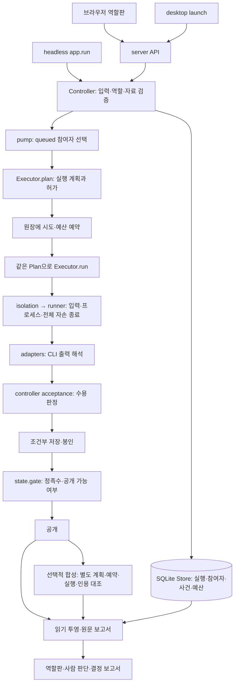

# 아키텍처·파이프라인·코드 건강성 검토

2026-09-26 · Codex · 현재 Windows PC의 별도 clone과 GitHub에서 검토. 제품 코드 기준은 [`8fc945d`](https://github.com/inlight37-design/decision-model_lab/commit/8fc945d410bec31d7f104199a684e9aab4f5b9a3)(역할판 #101), 읽은 전체 트리는 [`a232de7`](https://github.com/inlight37-design/decision-model_lab/commit/a232de7d4ae7de097dd014be5a791348b7881ea3)(#103)다. main [`435ba02`](https://github.com/inlight37-design/decision-model_lab/commit/435ba02f50d287f62dce7512a0ceae9b9c2f164b)와의 차이를 구분했다. #102·#103은 문서 변경이므로 두 head의 제품 코드는 같다.

## 판단부터

**실행 코어와 원장의 기본 구조는 건강하다. 다만 기능을 덧붙이는 접점에서 결과의 최신성, 실패 정리, 화면 조회 비용이 일관되지 않다. 지금은 전체 재작성보다 이 접점을 먼저 정리할 시점이다.** 기능이 정상 순서로 진행되는 것과 예외·반복 실행까지 올바른 것은 다르며, 후자에서 구체적인 반례를 찾았다.

사용자가 우려한 “AI가 여러 번 고치면서 빙빙 돌아가는 코드”에 해당하는 흔적은 있다. 초안에 있던 저장 보호가 합성에는 빠졌고, 화면은 같은 원장의 합성 이력을 한 요청 안에서도 여러 번 해석하며, 실행 생성 성공을 다시 전체 조회에서 찾아야 화면 이동을 끝낸다. 반면 실행 준비 조회, 실행 직전 허가 재검사, 프로세스 종료와 답 수용의 분리는 필요한 방어다. 이것까지 중복으로 보고 지우면 정확성을 잃는다. **코드에서 비대칭과 중복은 확인했지만, 그 원인을 AI 작성 자체로 단정할 근거는 없다.**

앞선 [Peek 리뷰 비교](../2026-09-26-codex-peek-comparison/README.md)의 “검증한 범위와 다시 믿을 기록을 구분하자”는 방향은 여전히 타당하다. 이번 검토에서는 외부 도구 도입보다 우리 코드의 `human_reviewed`, 합성 종료 기록, 동일 manifest 판 확인을 먼저 고칠 이유가 확인됐다. 과거 구조 검토의 결함 목록을 복사하지 않고 현재 소스와 새 재현으로 판단했다.

| 영역 | 판단 | 이유 |
|---|---|---|
| 실행·격리·수용·봉인 | 기본 경계는 좋음, 시작 뒤 예외 정리는 보완 필요 | exit 0만 믿지 않고 입력·모델·전체 자손 종료를 각각 확인한다. 스레드 시작 실패의 정리 누락은 남아 있다 |
| 지속 상태·예산·복구 | 대체로 건강 | SQLite 거래, 단일 원장 소유자, 상태+attempt 조건부 갱신, 불명확한 실행의 슬롯 유지가 있다 |
| 반복 합성·사람 판단 | 정리 필요 | 합성 결과 판이 바뀌어도 과거 판단 완료가 계속 유효하다. 초안/합성의 결과 저장 보호도 다르다 |
| 화면·조회·전달 | 현재 가장 눈에 띄는 누적 부채 | 전체 이력 polling, 반복 사건 해석, 응답 역순 적용, 생성 성공 뒤 조회 실패가 얽힌다 |
| CLI 준비·허가 | 책임 분리는 좋음, 같은 증거를 읽는 경계 보완 | 검사 시점 둘은 필요하지만 한 검사 안에서 파일을 두 번 읽으면 서로 다른 판을 인정할 수 있다 |
| 코드 크기·모듈 구성 | 제어기는 비대하지만 분리 근거를 좁혀야 함 | 긴 파일 자체보다 수명·저장·조회 간 비대칭을 기준으로 나누는 편이 낫다 |
| 검증 | 오프라인 방어는 상당함, 아래 경계는 시험에서 빠짐 | 기존 suite의 성공과 새 반례의 재현은 동시에 성립한다. 모델 품질·실환경 안전의 증명은 아니다 |

## 실제로 실행되는 파이프라인

준비 조회(`readiness`)는 실제 질문을 실행하지 않는 사전 점검이다. 실제 시도는 `pump`에서 Plan을 한 번 만들고, 그 객체를 실행한다. `run`에서 허가를 다시 보는 것은 계획 이후 철회·변경을 확인하기 위해서다. `isolation.plan`이 최종 격리 명령을 만드는 일과 provider의 명령 계획도 서로 다른 층이다. “계획을 여러 번 다시 만드는 엔진”이라고 설명하면 부정확하다.

`core`는 프로세스·격리·CLI 프로토콜·계약, `app`은 실행 흐름·지속 상태·화면/API를 맡는다. 현재 `core/app → tools` 역방향 import는 없다. `app.run → app.server`의 설정 helper 의존은 정리 후보지만 전체 의존 구조가 순환한다는 증거는 아니다.

설계 문서의 v0.4는 연구 방향까지 포함한다. 현재 앱 전체가 범용 DAG, 자동 교차검토·라우팅 엔진으로 구현된 것은 아니다. `core.membership`의 일부는 계약/시험에 쓰이고, 현재 controller의 실행 gate는 참여자 행에서 계산된다. 옛 `runs.roster` 필드가 남았다는 이유만으로 두 상태 엔진이 동시에 원장을 지배한다고 평가해서도 안 된다.

## 그대로 보존할 구조

1. **프로세스 성공, 답 수용, 공개를 분리한다.** 종료 코드·본문·입력 전달·전체 자손 종료를 확인하고 보고된 모델 불일치를 거절한다. 모델을 보고하지 않은 `model_match=None`까지 거절하는 구조는 아니다. 수용 후에도 독립 정족수와 공개 조건이 남는다.
2. **원장이 중심이다.** 상태와 사건을 거래로 묶고, 늦은 결과는 상태와 attempt가 맞을 때만 기록한다. 취소 뒤 도착한 답으로 되돌아가지 않는다. `state.gate`는 별도 지속 상태를 만들지 않는 파생 판단이다.
3. **불명확한 실행을 자동 재시도하지 않는다.** started만 남은 합성, 종료 불확실성은 unknown과 슬롯 유지로 나타난다. 이를 “에러면 성공 처리”로 단순화하지 않는다.
4. **공개 전 투영은 허용 필드만 낸다.** UI·보고서가 원장 내부 초안을 직접 읽지 않는다. 역할판도 공개 투영을 소비한다. 이번 검토에서 화면을 통한 봉인 우회는 찾지 않았다.
5. **상한·provider 선택을 명시한다.** 원장에 묶인 예약 상한과 조용한 유료 fallback 부재는 장점이다. 예약 환불이나 자동 재호출로 아래 예외를 감추지 않는다.

## 먼저 다룰 발견

자세한 조건·소스·반례·수정 후 기대값은 [FINDINGS.md](FINDINGS.md)에 있다. P1은 호출 수명 정리의 우선 결함, P2는 정상 사용 또는 구체적 실패 조건의 정확성·운영 결함이다. 빈도나 실제 피해를 측정한 등급은 아니다.

| ID | 우선도 | 문제와 사용자 영향 | 어디서 생겼나 | 확인 방식 |
|---|---|---|---|---|
| AH-01 | P2 | 새 합성에도 이전 ‘판단 완료’가 남아 새 결과를 놓칠 수 있음 | #101 추가 | 임시 원장·합성 executor |
| AH-02 | P2 | 한 작업 폴더 준비 실패가 queued 선두에 남아 다음 실행도 막음 | main에도 존재 | 일반 파일 충돌 fixture |
| AH-03 | P1 | 프로세스 생성 뒤 IO 스레드 시작 예외에서 정리 호출을 건너뜀 | main에도 존재 | Popen/Tree 대역 |
| AH-04 | P2 | 초안에서 처리하는 metadata 문자열을 합성은 저장 못 해 unknown으로 남김 | main에도 존재 | 실제 parser+합성 응답 |
| AH-05 | P2 | 겹친 polling이 최신 상태를 덮고, 생성 성공 뒤 조회 실패 시 안내를 잃음 | 기존 polling + #101 생성 흐름 | 제품 JS 함수·지연 응답 대역 |
| AH-06 | P2 | 전체 이력 재전송과 같은 합성 사건의 반복 조회·해석 | main의 기본 조회 구조부터 존재 | 합성 원장 정량 측정 |
| AH-07 | P2 | launcher 동시 시작의 실패한 쪽이 정상 서버의 위치 기록을 덮음 | main에도 존재 | launcher 함수·동시 시작 대역 |
| AH-08 | P3 | 동시 파일 교체 때 한 허가 검사에 적격성 A와 기기 등록 B가 섞임 | main에도 존재 | 검사 사이 파일 교체 fixture |

## 효율: 어디가 실제로 돌아가는가

**확인된 낭비는 모델 추론이 아니라 조회·상태 전달 쪽이다.** 화면은 매초 전체 `/api/state`를 요청한다. `view()`는 controller lock 안에서 실행별 자료를 조립하면서 같은 합성 lifecycle을 실행별 두 번, 전역 두 번 읽는다. 최신 합성 결과 조회는 별도로 더 있다. 사건 tail은 이미 `LIMIT 12`이며 인덱스도 있다. “모든 이벤트를 매번 tail로 읽는다”는 과거 지적은 현행 코드에 맞지 않는다.

각 실행에 초안 8,192자 둘과 합성 8,192자 하나를 넣은 임시 원장의 결과다. 네트워크·브라우저·실제 모델 시간은 제외했다. 자세한 fixture와 모든 값은 [EVIDENCE.md](EVIDENCE.md), [결과 JSON](evidence/projection-results.json)에 있다.

| 원장 실행 수 | 요청 | SELECT 수 | 응답 크기 | view 중앙값 | JSON 직렬화 중앙값 |
|---:|---|---:|---:|---:|---:|
| 1 | 전체 | 15 | 37,270 B | 0.483 ms | 0.086 ms |
| 30 | 전체 | 276 | 1,112,150 B | 11.526 ms | 3.147 ms |
| 100 | 전체 | 906 | 3,706,840 B | 34.551 ms | 10.475 ms |
| 100 | 한 실행 | 15 | 37,270 B | 4.359 ms | 0.147 ms |
| 1, 합성 이력 50개 | 전체 | 15 | 449,065 B | 3.245 ms | 1.237 ms |

이 fixture의 전체 조회는 `9N+6` SELECT로 늘었다. 한 실행만 요청해도 전역 합성 이력 해석은 남는다. 쿼리 수가 같아도 payload가 커지면 읽기·JSON 해석 비용이 증가한다. JSON 직렬화는 controller lock 밖에서 일어난다.

**이 수치는 사용자 원장에서 이미 느리다는 측정이 아니다.** 기본 live 원장에는 작은 호출 상한과 launcher의 원장 교체가 있으므로 큰 fixture를 일상적인 실제 모델 사용량처럼 해석하지 않는다. 수동/mock 이력과 향후 장기 보관에서의 증가 구조를 보여 준다. 계정 quota의 서버 측 backoff도 있어 매초 GET이 매초 모델 호출이라는 뜻은 아니다.

첫 개선은 요청 하나의 동일한 원장 snapshot에서 lifecycle을 한 번 계산해 전역/실행별 투영에 공유하는 것이다. 다음은 목록 요약과 선택한 실행 상세를 분리하는 것이다. UI의 단일 polling 책임도 함께 정리해야 한다. 별도 캐시 DB나 실시간 메시지 서버를 먼저 추가하면 상태 무효화 문제가 더 생긴다.

## 코드가 덧붙는 것을 줄이는 변경 순서

| 순서 | 작게 묶을 변경 | 완료 조건 |
|---|---|---|
| 1 | 시작 전 폴더 실패, 시작 뒤 cleanup, 합성 저장 진단 정리(AH-02·03·04) | 실패한 참여자는 기록되고 다른 queue가 진행함. 생성된 프로세스는 모든 예외에서 bounded cleanup을 시도함. 확인 못 한 종료는 여전히 unknown |
| 2 | 결과 판과 사람 판단을 묶고 생성 성공 영수증을 유지(AH-01·05) | 새 합성은 재검토 대상으로 보이며, 조회 실패에도 이미 생성한 run_id를 잃지 않음 |
| 3 | launcher 소유권(AH-07) | 실패한 경쟁 시작이 정상 owner를 덮지 못함 |
| 4 | 읽기 투영 한 번 계산 + 목록/상세 + polling 직렬화(AH-05·06) | 반례 fixture의 반복 조회 감소를 측정하고, 공개/unknown/슬롯 의미가 기존과 같음 |
| 5 | 위 변경에서 필요한 만큼 모듈 분리·계약 강화 | controller의 mutation/worker 책임을 남기고 read projection과 공통 결과 진단만 명확히 분리. manifest 검사도 같은 raw bytes로 묶는다(AH-08). headless 공용 setup은 실제 변경 때 처리 |

새 provider·역할 확장 전에 위의 수명과 표시 문제를 정리하는 것을 권한다. 작은 공통 helper는 유익하지만 초안과 합성의 의미까지 하나의 범용 Workflow 클래스로 강제 통합할 필요는 없다. 초안은 독립 봉인, 합성은 공개 이후 반복이라는 차이가 있다.

TypeScript 전환, 웹 프레임워크 교체, 마이크로서비스·분산 큐, 새 기억 도구는 이번 반례의 해결 조건이 아니다. Windows runner와 제한된 legacy 계약도 현재 사용자와 시험이 있으므로 “안 쓰는 코드”로 일괄 삭제하지 않는다. 파일 줄 수나 시험 개수로 건강성 점수를 만들지 않았다.

## 검토 범위와 후속 판단

이 기록은 **리뷰와 재현 자료**다. 제품 코드의 문제를 고쳤다고 주장하지 않는다. 실제 사용자 원장·계정·CLI·WSL·브라우저를 대상으로 새 실험하지 않았고 모델 호출도 하지 않았다. 코드 읽기, 임시 SQLite, mock 실행 경계, 제품 JS 함수의 대역 실행을 구분해 기록했다. 기존 suite와 최종 PR CI는 [검증 근거](EVIDENCE.md#저장소-검사)와 PR Checks를 따른다.

내 의견은 **핵심 구조를 유지하면서 정확성 경계부터 정리하고, 그 다음 읽기 경로를 단순화하는 것**이다. 이 프로젝트의 강점은 상태와 증거를 보수적으로 다루는 데 있다. 다음 확장에서는 새 설정/역할을 늘리는 속도보다 “어떤 실행의 어떤 결과를 지금 보고 있는가”를 한 번에 추적할 수 있는 구조를 우선해야 한다.
