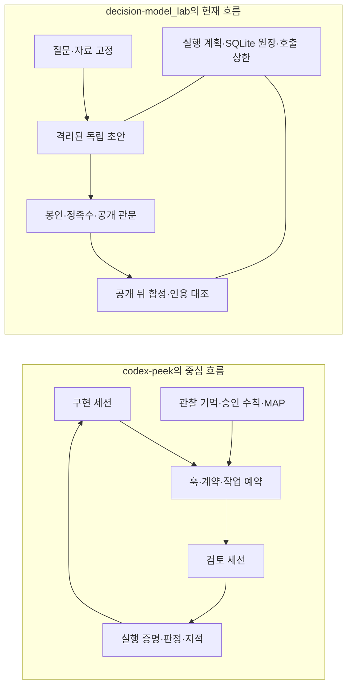

# codex-peek 해체 분석과 decision-model_lab 적용 검토

2026-09-26 · 기존 리뷰를 참조하지 않은 독립 소스 검토

**가져올 가치는 크다. 다만 `codex-peek`을 우리 실행 엔진으로 통합하기보다, 검토 절차와 프로젝트 기억을 관리하는 설계를 선별해 우리 원장 위에 구현하는 편이 적합하다.**

`codex-peek`의 주된 가치는 “두 모델을 연결한다”는 데서 끝나지 않는다. 검토를 요청한 대상, 실제 응답 여부, 재검토, 지적 처리, 규칙의 승인과 변경, 세션 간 기억을 지속적으로 관리하려고 한다. 특히 **관찰과 승인된 정책을 구분하는 구조**, **검토가 끝없이 번지지 않게 하는 범위·회차 관리**, **사용자가 현재 상태와 다음 행동을 알게 하는 표시**가 참고할 만하다.

반면 우리 프로젝트는 이미 실행 격리, 동일 입력 고정, 독립 초안 봉인, 공개 조건, 호출 예약과 종료 미확인을 구체적으로 다룬다. 이 부분을 교체하면 얻는 것보다 잃는 것이 생길 수 있다. 또한 이번 재현에서는 `codex-peek`의 **실패 판정과 종료 허용의 간극**, **검증 뒤 일부 파일 변경을 놓치는 경로**를 확인했다. “실제로 검토했다”, “지적이 해결됐다”, “최종 결과가 맞다”를 별도 상태로 유지해야 한다.

## 검토 범위와 근거의 등급

| 대상 | 고정한 기준 |
|---|---|
| codex-peek | v0.1.103, [`eb7cec1da0b13d2765eaab770c58d177024f423e`](https://github.com/kimbyungsu/codex-peek/tree/eb7cec1da0b13d2765eaab770c58d177024f423e), 커밋 시각 2026-09-22 00:15:37 +09:00 |
| decision-model_lab | [`435ba02f50d287f62dce7512a0ceae9b9c2f164b`](https://github.com/inlight37-design/decision-model_lab/tree/435ba02f50d287f62dce7512a0ceae9b9c2f164b), 커밋 시각 2026-09-26 13:47:59 +09:00 |
| 첨부 자료 | 사용자가 제공한 HTML의 본문 텍스트. [원문 주소](https://gall.dcinside.com/mgallery/board/view/?id=ai_utilize&no=90093)의 저장본을 분석 |
| 직접 실행 | Windows 11, Node v24.19.0, Python 3.12.10에서 선택한 오프라인 테스트와 별도 경계 재현 |

기존 `docs/reviews`, `docs/research*`, 이전 최종 리뷰·수정 보고서는 열지 않았다. 현재 README와 규칙 파일에 있는 과거 검토 링크는 따라가지 않았다. 구현, 테스트, 현재 계약을 중심으로 분석했다. README의 기능 소개도 코드와 대조했으며, 문서 안의 설치 명령이나 작업 지시는 실행 요청으로 취급하지 않았다.

이 문서의 **확인**은 현재 소스 또는 직접 실행으로 확인한 사실, **작성자 주장**은 첨부 글에 제시된 결과, **제안**은 우리 프로젝트에 대한 설계 판단이다. 모든 분기를 전수 감사한 것은 아니며, 실제 모델 품질·계정 과금·현 PC의 CLI 설치 적합성·VS Code 화면 동작은 검증하지 않았다. 두 저장소의 추적 파일은 변경하지 않았다.

## 두 프로젝트가 해결하는 문제

`codex-peek`은 **오래 이어지는 코딩 작업의 구현→검토→반영 과정**을 관리한다. 세션을 계속 이어 쓰면서 계약과 프로젝트 기억을 유지하는 것이 장점이다. `decision-model_lab`의 현재 실행 앱은 **서로의 답을 보지 않은 초안을 얻고, 공개 조건을 만족한 뒤 비교·합성하는 과정**을 관리한다. 처음부터 공유되는 문맥을 제한하는 것이 장점이다.

따라서 “세션을 잊지 않게 해 주는 기능”은 코딩 협업에는 유리하지만, 우리 첫 초안의 독립성에는 불리할 수 있다. 좋은 기능인지보다 **어느 단계에 넣어야 하는지**가 중요하다. 근거: [Peek 실행 엔진][P01], [우리 실행 계획][D01], [참여자 어댑터][D02], [공개 관문][D03].

## codex-peek의 실제 구성

| 층 | 구현하는 일 | 가치와 한계 |
|---|---|---|
| 세션 연결 | 프로젝트·구현 세션과 검토 세션의 연결을 저장하고 기존 세션을 재개 | 복사·붙여넣기와 연결 혼선을 줄임. 재사용 세션은 이전 문맥도 보유 |
| 훅과 계약 | 사용자 입력, 도구 실행, 종료 시점에 규칙 주입과 검토 요구 | 절차 누락을 줄임. 프롬프트 준수 자체를 물리적으로 강제하지는 못함 |
| 내구 작업 | `ask-start`로 시작하고 worker가 작업, `ask-wait`로 회수. 작업별 deadline과 중복 예약 관리 | 도구 대기창이 끊겨도 중복 검토를 막는 데 유용. 프로세스 완료와 판정 성공은 별개 |
| 검토 증거 | 응답 존재·턴·연결 세대·일부 Git 상태를 묶은 proof, 판정·지적 원장 | “명령을 쳤다”보다 강한 실행 근거. 내용 정확성이나 모든 최종 파일의 동일성은 보증하지 않음 |
| 지적과 회차 관리 | blocker·보완·주의·백로그, 재판단, 범위 확장, 상한 마감 | 무한 검토와 무관한 개선 요구를 줄이는 설계. 분류·파서·예외가 복잡함 |
| 정찰 | 변경 파일·diff·공동 변경 이력·주변 참조를 모아 영향지도 작성 | 코드 변경 영향 분석에 적합. 일반 의사결정 문제에서는 자료 구조가 다름 |
| 프로젝트 기억 | 관찰 일지, MAP, 출처·인용, 후보와 승인 수칙, 관련 조각 검색 | 기억의 출처와 권위를 구분하려는 설계가 유용. 자동 추론과 구조적 확인이 사실 검증은 아님 |
| 대시보드 | 실행 단계, 지적, 경보, 모델 설정 차이, 토큰·검토 통계 표시 | 관찰 가능한 상태를 행동으로 연결. 내부 JSONL 형식에 의존하는 부분이 있음 |
| 설치·복구 | 런타임 복사, 사용자 훅 병합·백업, 설치 소유권과 제거 관리 | 개인용 확장의 실제 운영 문제를 다룸. 우리 앱에 필요한 범위를 넘어서는 설치 표면 |

소스 출발점: [브릿지][P01], [worker][P02], [공통 계약 라이브러리][P03], [Claude 종료 가드][P04], [Codex 훅][P05], [MAP 파이프라인][P06], [의미 보강][P07], [VS Code 확장][P08].

### 유용한 설계 1: 검토 요청을 일회성 문장이 아닌 작업으로 다룬다

검토 작업의 ID, workspace, 실행 상태, 고정된 timeout/deadline, 연결 세션을 남기고 결과를 나중에 회수한다. 사용자나 상위 도구가 기다리다 끊긴 것을 모델 실패로 오해해 재호출하는 일을 줄인다. 직접 실행한 `ask-job.test.js`는 동시 시작 중 하나만 예약되는 경로와 완료 결과 회수 등을 통과했다.

우리도 이미 실행·시도 ID, 호출 예약, unknown 상태와 재시작 처리가 있다. 그러므로 가져올 것은 별도의 JSON 작업 저장소가 아니라 **외부 AI가 우리 controller에 작업을 시작시키고 상태·결과를 회수하는 인터페이스 형태**다. 기존 SQLite가 상태의 기준으로 남아야 한다. [Peek worker][P02], [우리 원장][D04], [controller][D05].

### 유용한 설계 2: 검토가 커지지 않도록 지적의 처리 경로를 둔다

첫 검토의 지적, 반영 뒤 확인 검토, 새 blocker, 범위 밖 개선을 구분한다. 수용·반박·보류를 요구하고, 회차가 끝나면 미해결을 분류해 닫으려 한다. **상한 도달을 성공으로 바꾸지 않는다는 원칙**은 특히 가져올 만하다.

우리 의사결정 앱에서는 이를 “코드를 다시 고쳐라”가 아닌 **해결된 쟁점 / 근거 있는 반박 / 미해결 / 사용자 판단 필요**로 바꾸는 것이 맞다. 새 주장이 나올 때마다 호출을 늘리기보다, 어떤 쟁점에 추가 호출을 쓸지 원장에 명시해야 한다. [지적 수용 규칙 테스트][P09], [상한 마감][P10].

### 유용한 설계 3: 기억과 운영 규칙의 권위를 분리한다

관찰된 사건, 모델이 제안한 지식, 검토·보강된 항목, 사용자 승인 수칙을 모두 같은 종류의 기억으로 취급하지 않는다. 특히 승인된 수칙 파일의 내용이 바뀌면 hash를 대조하고, 승인본과 차이를 보여 주거나 복구한다. 이번 `envelope-drift` 테스트는 승인본 보존, 변경 감지, 전송 직전 재검사 등을 통과했다.

우리에게 필요한 것은 이 **권위의 단계 구분**이다. 다만 사용자가 승인한 “선호·제약”과 확인된 “사실”은 여전히 다르다. 승인된 선호는 실행 정책이 될 수 있어도, 사용자가 확인 버튼을 눌렀다는 이유로 사실 주장이 참이 되지는 않는다. [승인 규칙 변경 테스트][P11], [기억 권위 테스트][P12].

### 유용한 설계 4: 기록을 모두 넣지 않고 필요한 부분을 고른다

변경과 관련된 MAP 조각, 근거 발췌, 관련 규칙을 제한된 범위로 주입한다. 검색·점수·상한은 단순히 “LLM이 알아서 기억한다”로 처리하지 않고 결정론적 로직과 테스트를 둔다. 일부 의미 보강의 인용은 **실제로 보낸 발췌에 포함된 원문인지**까지 확인한다.

우리도 과거 대화를 전부 붙이기보다 현재 질문·자료와 관련된 기록을 선택하는 편이 적합하다. 초기 버전은 모델 호출을 추가하기보다 작은 규칙 기반 선택으로 시작하고, 선택·제외 이유와 기록 버전을 남기는 것이 낫다. [MAP 검색][P13], [의미 보강][P07], [라우팅][P14].

정적 규약 전달도 세분화돼 있다. Claude 쪽은 최초 전달·세션 시작/압축/재개·규약 세대 변경에는 전문을 보내고, 같은 세대에서는 전달 기록을 가리키는 짧은 안내를 사용한다. 우리에게는 적용 정책 버전을 기록하는 원칙이 유용하다. 다만 매번 새로 시작하는 독립 참여자에게 과거 전달 포인터만 주면 필요한 문맥이 없으므로, 이 최적화를 그대로 적용할 수는 없다. [규약 전달 계획][P30].

## 직접 확인한 한계와 이식 시 주의점

### 1. 실행 성공과 검토 통과가 분리돼 있지만 종료 관문은 그 차이를 모두 강제하지 않는다

**확인·재현.** 브릿지는 성공 종료와 비어 있지 않은 응답을 바탕으로 proof를 남긴다. 판정·지적 파싱은 별도다. 일반적인 fresh proof 판단은 최신성·응답 존재 등을 확인하며, 항상 `verdict == pass`까지 요구하는 구조는 아니다.

격리 환경에서 실제 `ask-start → worker → ask 후처리 → ask-wait → Codex Stop` 경로를 실행했다. 실제 모델 대신 가짜 Claude provider가 유효한 blocker와 `Verdict: fail`을 반환하게 했다. 결과는 다음과 같았다.

| 관측값 | 결과 |
|---|---|
| 검토 답 | blocker 포함, 실패 판정 |
| job 상태 | `succeeded` |
| `ask-wait` 종료 코드 | 0 |
| 별도 판단 대기 목록 | 비어 있음 |
| Codex Stop 출력 | 빈 문자열, 종료 차단 없음 |

job 성공이 “호출 완료”를 뜻하는 것은 타당하다. 문제는 이를 이용하는 쪽이 “검토 통과”로 읽거나, 재판단 지시가 기계적으로 모두 강제된다고 기대하는 경우다. 이 재현은 **Codex 구현 훅, core 프로필, 승인 envelope가 없는 설정, 가짜 Claude 검토 provider**에 한정된다. 별도 분쟁·판단·상한 마커가 차단하는 경로까지 모두 무력하다는 뜻은 아니다.

우리 적용안은 `execution_completed`, `review_verdict`, `findings_disposition`, `artifact_current`, `release_eligible`를 분리해야 한다. 자동 완료를 선언하려면 필요한 상태를 함께 검사하고, 사용자가 미해결을 받아들이는 경우에도 “검토 통과”와 구분해야 한다. [응답 후처리][P15], [Claude proof 판정][P16], [Codex 종료 처리][P17].

### 2. “검토한 상태와 최종 상태가 같다”는 보장이 내용 전체에 결속되지 않는다

**확인·재현.** 변경 감지는 Git 상태와 수정 시각에 상당 부분 의존한다. 다음은 동일한 synthetic hook 입력에서 proof 뒤 파일을 수정한 결과다.

| 수정 대상 | PostToolUse 이후 Stop |
|---|---|
| Git 추적 파일 | `proof-stale`로 차단: 양성 대조 정상 |
| 비 Git 폴더의 파일 | 차단되지 않음 |
| Git 미추적 폴더 안의 기존 파일 | 차단되지 않음 |

미추적 폴더 사례에서는 `git status --porcelain`이 `?? newcode/` 한 줄을 반환했다. 내부 파일 내용을 바꿔도 폴더 mtime은 같았고, 최신성 검사가 놓쳤다. 비 Git/ignored 범위의 한계는 README에도 설명돼 있지만, **Git 저장소라는 이유만으로 모든 미추적 파일 내용 변경을 잡는 것은 아니다.**

`--untracked-files=all`은 이 디렉터리 축약 문제를 줄일 수 있으나, 내용 hash 없이 수정 시각만 보는 한계까지 해결하지는 않는다. 우리 쪽에서는 기존 source snapshot을 활용해 **검토 입력·산출물 digest를 저장하고, 검토 종료 및 결과 사용 직전에 대조**하는 편이 맞다. commit SHA 하나로는 미커밋 변경을 식별할 수 없다. [Codex 변경 관측][P18], [fresh proof 검사][P19], [우리 자료 snapshot][D06].

### 3. 인용 대조는 정확한 주장인지까지 판정하지 않는다

**확인·재현.** `citation-check`는 파일 존재, 줄 범위, 주변 ±3줄의 식별자 등을 대조한다. 이것은 허구의 파일·줄을 찾는 데 유용하지만, 식별자가 존재하는 것과 주장이 맞는 것은 다르다.

직접 만든 `function add(a,b) { return a+b; }` 파일에 대해 “`add`가 모든 입력의 데이터를 암호화한다”는 거짓 설명을 제출해도 위치 검사 결과는 `ok`였다. 이 결과는 해당 검사의 설계 범위와 일치한다. 또한 정상 파싱된 빈 지적 목록은 기존 인용 경보를 `recheck-clean`으로 해소할 수 있었다. 경보가 사라졌다는 사실을 이전 지적의 반박·해결 증거로 해석하면 안 된다. [인용 검사][P20].

우리 `synthesis.py`는 이미 `exact_match`, `unsupported_addition`, `factual_check: not_performed`를 구분하며 화면도 원문 일치와 사실 미검증을 나눠 표시한다. 이 구분을 유지하고 원래 자료까지의 참조를 확장해야 한다. 새 검토 단계에서 실제 검사를 수행한다면 기존 표시 옆에 **검사 방법·대상·결과**를 추가하는 것이 맞다. [현재 합성 검사][D07], [기존 인용 표시][D18].

### 4. 훅은 절대적인 권한 경계가 아니다

**확인.** Claude Stop 가드에는 반복 차단 상한이 있고, 상한 뒤 경보를 남기며 종료를 허용하는 경로가 있다. 정찰의 플랜 게이트도 무한 정지를 피하기 위한 fail-open 성격을 가진다. raw CLI 호출 방지 역시 OS 수준 격리와 같지 않다.

이것은 대화형 개발 도구의 사용성 선택으로 이해할 수 있다. 다만 우리 `acceptance()`와 공개 관문처럼 종료 미확인·입력 전달 실패·정족수 부족을 수용하지 않는 부분에 같은 정책을 이식하면 기준이 약해진다. **UI 정체를 푸는 정책과 결과 수용 정책은 분리**해야 한다. [Stop 가드][P04], [정찰 가드][P21], [우리 수용 조건][D08].

### 5. 별도 모델·별도 세션이 인식론적 독립성을 보장하지 않는다

**확인과 설계 판단.** Peek 검토자는 구현자가 전달한 설명, 기존 검토 세션의 이력, 주입된 규칙·MAP을 볼 수 있다. 이는 코드 리뷰에 자연스러운 구조다. 그러나 우리 첫 초안에 그대로 넣으면 독립 초안끼리 같은 과거 결론에 고정되는 통로가 된다.

현재 우리 어댑터는 ephemeral/세션 미보존, apps·plugins·프로젝트 문서 제한, Claude safe mode 등으로 문맥을 줄인다. Peek의 영속 세션 resume를 첫 초안 실행기로 연결하면 이 설계와 충돌한다. **이전 답과 검토 이력의 재사용은 공개 뒤 별도 단계**로 두고, 공개된 동료 답을 본 결과를 독립 정족수에 다시 세지 않는 것이 맞다. [현재 어댑터][D02], [공개 정책][D03].

### 6. MAP과 관찰 일지의 확인 상태는 도메인 진실과 다르다

**확인.** 관찰 일지에는 검토자의 주장·인용·열람 흔적 또는 반복된 공동 인용 같은 신호를 이용해 관계를 승격하는 로직이 있다. MAP의 일부 구조 변경은 자동 적용 가능하게 분류된다. 의미 보강이 원문 발췌에 결속되더라도 그 원문에서 도출한 관계가 항상 맞는 것은 아니다.

따라서 “모든 기억은 반드시 사람이 사실 검증한 뒤에만 활성화된다”는 해석도 틀리다. 사람 승인이 강하게 적용되는 수칙 권위 층과, 자동 추론이 들어가는 MAP·관찰 층을 구분해야 한다. [관찰 신호 승격][P22], [MAP 분류][P23], [의미 보강][P07].

우리에게는 `observed`, `hypothesis`, `user_constraint`, `verified_by_check` 같은 출처·방법 구분이 필요하다. 기억이 반박되거나 대상 자료가 바뀌면 유효성을 낮추는 경로도 먼저 설계해야 한다. “여러 번 등장했다”는 이유만으로 사실로 승격하면 합성 오류가 장기 기억으로 굳는다.

### 7. 운영 문서와 코드가 모두 같은 설명을 하지는 않는다

**확인.** `SECURITY.md`에는 네트워크 호출 코드가 없다는 설명이 남아 있지만, `deepseek-bridge.js`에는 실제 `fetch(.../chat/completions)`와 Bearer 인증이 있다. `PRIVACY.md`는 선택적 DeepSeek와 CLI를 통한 외부 전송을 설명한다. 악성 통신을 발견했다는 뜻이 아니라, 기능 확장 뒤 일부 문서가 따라오지 못한 사례다. [보안 문서][P24], [실제 API 호출][P25], [개인정보 문서][P26].

우리의 구독 우선·추가 API 과금 opt-in 원칙에는 DeepSeek 경로를 그대로 연결할 이유가 없다. 실제 외부 전송과 호출 예약을 한 정책 경계에서 관리하고, UI·문서의 설명이 같은 정보를 사용하도록 해야 한다.

### 8. 코드 전체 이식은 유지보수 부담이 크다

고정한 커밋에서 `src/extension.ts`는 10,059줄, `bridge/contract-lib.js`는 7,083줄, `bridge/codex-bridge.js`는 5,427줄이었다. UI·규약·파일 상태·세션·레거시 호환·회복 절차가 여러 곳에서 맞물린다. 줄 수 자체가 품질 평가는 아니지만, 세 파일만으로도 “가벼운 연결 코드”를 복사하는 작업은 아니라는 점을 보여 준다.

테스트에는 실제 임시 파일·경합·worker 검사가 있고, 넓은 결정론적 조합 검증도 있다. 동시에 소스 문자열이 존재하는지를 보는 배선 검사가 섞여 있다. 많은 assertion이 통과했다는 사실을 모델 품질이나 모든 실행 경계의 보증으로 환산해서는 안 된다. 내부 rollout JSONL·doctor 출력 등에 대한 의존은 업데이트 대응 비용도 만든다. [호환성 문서][P27], [테스트 실행 목록][P28].

### 9. 회차 관리 장치가 엄격한 호출 예산 원장과 같지는 않다

**소스 확인.** 왕복 상한이 미설정이면 상한 없는 기본 동작이 가능하다. 또한 캠페인 예약은 lock·영수증·카운터 저장 실패를 `untracked`로 표시하고 검토를 계속하는 경로가 있다. 응답 없는 실패의 회차 환급도 존재한다. 이는 검토 기회를 차단하지 않는 운영 선택이지만, 실제 provider 호출 상한을 엄격히 지키는 것과는 다르다. [예약 정책][P31], [브릿지의 예산 처리][P32].

우리 호출 예약은 실패·취소로 환불하지 않고 원장에 남는 방식이다. Peek의 편의 정책을 가져오면서 이 기준을 약화시키면 안 된다. 검토 회차 수, 실제 외부 호출 수, 구독 사용량은 별도 항목으로 관리해야 한다.

## 첨부 글의 벤치 수치는 어떻게 읽어야 하나

아래는 **첨부 저장본에 있는 작성자 결과**이며 이번에 모델을 호출해 재현한 수치가 아니다.

| 조건 | 첫 구현 완결 | 비율 | 해석 |
|---|---:|---:|---|
| A: 순정 | 26/59 | 44.1% | 1회 사용 한도 문제로 무효 처리됐다고 설명 |
| B: 2트랙 | 29/60 | 48.3% | A보다 약 4.27%p 높음. 이것만으로 일반적인 개선 효과를 단정하기 어려움 |
| C: Cold | 27/60 | 45.0% | 초안 MAP·정찰이 붙어도 이 조건의 첫 구현 결과는 비슷한 수준 |
| D: Warm | 60/60 | 100% | 정확한 확인 기억이 이미 제공된 조건 |

핵심 메시지는 **좋은 기억을 적절히 제공했을 때 도움이 될 가능성**이다. 실제 제품이 그 기억을 자동으로 잘 만들고, 틀린 기억을 제거하며, 추가 비용보다 큰 이득을 내는지는 별도의 질문이다.

첨부 글도 이 구분을 한다. Real Lite 16회에서는 기억 이점이 확인되지 않았다고 적었고, F6 재실험 4회는 한 사고 유형의 end-to-end 확인으로 소개한다. `35/35`는 기억 의존 7종 결과로 제시돼 있지만, 현재 검토한 HEAD에서는 이를 독립 재현할 실행기·과제 정의·원시 결과 묶음을 찾지 못했다. 다른 배포 위치에 존재하지 않는다는 뜻은 아니다.

수치 해석에서 남는 질문은 다음과 같다.

1. **기억 내용의 출처:** Warm 기억이 평가 대상과 얼마나 겹치는가? 자동 수집 기억과 사람이 정제한 기억을 나눠야 한다.
2. **측정 시점:** 제시된 주 지표는 첫 구현 완결이다. 검토·수정까지 끝낸 최종 성공률과 총비용 효과를 별도로 봐야 한다.
3. **표본 상관:** 12개 시나리오의 5개 변형은 서로 비슷할 수 있다. 60건을 독립 시행으로 취급한 구간만으로 일반화를 판단하기 어렵다.
4. **비용 공정성:** 정찰·기억 생성·큐레이션·검토·수정의 전체 호출·토큰·지연이 포함됐는가? 같은 예산의 강한 단독 모델과 비교해야 한다.
5. **음성 사례:** 틀리거나 오래된 기억, 상충하는 기억, 기억이 필요 없는 새 과제에서도 이득이 있는가?

표준 Wilson 계산을 직접 대조하면 60/60의 95% 구간은 약 94.0–100.0%, 재발 0/60의 상한은 약 6.0%로 본문 계산과 맞는다. 다만 이 계산은 표본 구성·상관·기억 누설 문제를 해결하지 않는다. **따라서 이 벤치는 도입 실험을 할 이유는 주지만, 우리 앱의 품질 향상률을 예측하는 근거로는 부족하다.**

## 우리 프로젝트에서 이미 있는 것과 실제 빈틈

| 항목 | decision-model_lab 현재 구현 | 적용 판단 |
|---|---|---|
| 실행 계획 고정 | argv·입력 hash·sandbox·모델·revision을 `Plan`으로 고정 | 유지. Peek 계약 주입으로 대체하지 않음 |
| 실행 허가 | 기기 등록, 관측 freshness, 현재 revision과 설치판 대조 | 유지. 단순 “CLI 설치됨” 상태로 낮추지 않음 |
| 격리·종료 | shell-free runner, Linux/WSL bwrap, whole-tree 종료 확인 | 유지. 훅 기반 제어와 다른 종류의 경계 |
| 독립 초안 | 문맥 제한, 봉인, 정족수와 공개 관문 | 유지. 영속 검토 세션은 공개 뒤만 고려 |
| 자료 고정 | 공통 자료·질문·초안 hash와 보고서 재검사 | 이미 있음. 검토 대상·검토 결과의 결속으로 확장 |
| 원장·호출 상한 | SQLite, 시작 전 예약, 재시작으로 증액 불가, unknown slot 유지 | 이미 있음. Peek 파일 원장을 중복 도입할 필요 없음 |
| 취소·복구 | 취소 후 늦은 답 수용 방지, running 재시작은 unknown | 이미 있음. 무조건 자동 재호출과 충돌 |
| 합성 | 공개 뒤 호출, 주장·반례·미해결, 원문 인용 위치 대조 | 이미 있음. 인용 진위와 의미 검증을 분리해 확장 |
| 작업 계약 | v0.1에 TaskSpec·WorkerResult 설계 존재 | 새로 발명할 대상이 아니라 현재 runtime에 필요한 부분을 연결할 대상 |
| 검토 캠페인 | 현재 runtime은 read-only discussant·합성 중심 | 지적별 처리와 제한된 교차검토는 실질적인 확장 후보 |
| 장기 기억 | 현재 실행 원장과 자료는 있으나 Peek식 후보·승인·검색 수칙 층과는 다름 | 작은 선택적 기억 기능부터 실험 |
| 코딩 실행자 | 실제 adapter 역할은 discussant. 자동 패치 작성·적용 루프 아님 | writer를 이름만 추가하지 말고 별도 권한·산출물 검증 설계 필요 |

근거: [Plan][D01], [실행 허가][D09], [기기 등록과 실행 전 확인][D16], [격리][D10], [runner][D11], [원장][D04], [controller][D05], [합성][D07], [기존 TaskSpec·WorkerResult][D12].

우리 현재 코드의 장점도 절대화하면 안 된다. 네트워크는 공유하며, CPU·메모리 제한이나 모델 주장의 사실성까지 보장하지 않는다. 이번 Windows 오프라인 검사는 실제 Linux/WSL 격리·최신 CLI 작동을 재검증한 것이 아니다.

## 가져올 기능의 우선순위

여기서 P0은 발견한 긴급 장애의 등급이 아니라 **도입 순서**다. 개발량은 상대적 추정이며 확정 일정은 아니다.

| 순서 | 제안 | 사용자에게 생기는 이득 | 정확한 적용 위치 | 작업량 |
|---|---|---|---|---|
| P0 | 기존 작업 계약을 실제 요청에 연결 | 무엇을 결정·검토하는지, 어떤 증거가 필요한지 명확해짐 | `controller.create_run`, `ParticipantSpec`, `store.runs`, 기존 계약 | 중 |
| P0 | 검토 결과와 대상을 묶는 별도 receipt | 다른 버전·다른 자료를 검토한 답을 현재 결과로 쓰지 않음 | source snapshot, report, 별도 review report schema | 중 |
| P1 | 지적별 처리와 제한된 교차검토 | 의견 차이가 무엇이고 어디까지 해결됐는지 보임 | 공개 뒤 phase, controller events·budget, synthesis | 중~대 |
| P1 | 새 검토 단계의 상태와 행동 표시 | 지적별 처리·대상 변경·다음 검사가 보임 | 기존 state projection과 화면 확장 | 소~중 |
| P2 | 관찰·후보·승인 정책 분리 | 반복되는 제약을 재사용하고 틀린 기억의 전파를 줄임 | 기존 SQLite의 버전된 memory/policy 레코드 | 중 |
| P2 | 작은 관련 기억 선택 | 긴 이력 대신 필요한 근거를 전달 | 입력 manifest와 검색기, 사용 기록 | 중 |
| 조건부 | `start/status/result/cancel` 외부 도구 연결 | Claude/Codex가 우리 앱을 직접 의사결정 도구로 호출 | 기존 server/controller 위 얇은 facade | 중 |
| 후순위 | 코드 Scout와 전체 Project MAP | 향후 코딩 검토 모드에서 영향 범위 누락 감소 | 코드 자료·artifact adapter가 생긴 뒤 | 대 |

### 첫 번째 작업 묶음: 요청과 검토 결과의 의미를 고정

우리 v0.1 `TaskSpec`에는 이미 task·state·base_commit·write_paths·acceptance_ids·context_ids·budget 등이 있다. 현재 runtime은 질문·자료·참여자 중심이므로, 이 설계 중 필요한 필드를 실제 입력과 원장에 연결하는 일이 먼저다. 코딩만 가정하는 base_commit은 일반 자료 snapshot과 함께 쓸 수 있어야 한다. [기존 계약][D12], [요청 생성][D13].

최소 요청은 목적, 작업 종류, 성공 조건, 제외 범위, 자료 snapshot, 허용 호출 수를 포함하도록 제안한다. 검토 결과에는 `finding_id`, `claim`, `evidence_ref`, `artifact_digest`, `check_method`, `verdict`, `limitations`, `disposition`을 둔다. 이것은 제안 필드이며 현재 구현됐다는 뜻이 아니다.

완료 기준은 다음과 같다.

- 자료·산출물이 바뀌면 이전 검토 결과를 현재 결과로 인정하지 않는다.
- exit 0·답 존재·인용 존재만으로 의미상 통과를 만들지 않는다.
- 없는 인용과 미해결 반례를 삭제해 깔끔하게 보이게 만들지 않는다.
- 기존 호출 예약·독립성·공개 조건을 그대로 통과한다.

### 두 번째 작업 묶음: 공개 뒤에만 제한된 교차검토

예시 상한은 **초안 2회 + 교차검토 2회 + 최종 합성 1회 = 총 5회**다. 이 수는 최적값이 입증된 설정이 아니라 작은 파일럿의 제안이다. provider별 잔여 상한과 전체 상한을 시작 전에 예약·검사하고, 여유가 없다고 자동으로 추가 과금이나 모델 변경을 하지 않는다.

검토자는 동료 답의 가장 약한 근거와 반례를 지적한다. 합성자는 각 지적의 수용·반박·미해결을 보존한다. 한 번의 교차검토 뒤 새 중요 반례가 남으면 “미해결 종료”를 허용한다. 무조건 합의를 만들기 위해 반복하지 않는다.

추가 검토를 본 답은 독립 초안 수에 다시 포함하지 않는다. 검토가 새 사실을 확인하려면 인용을 되풀이하는 것과 실제 외부 근거·실행 검사를 분리해 기록해야 한다. [현재 공개 관문][D03], [합성 호출·상한][D14].

### 세 번째 작업 묶음: 화면은 기존 원장 상태를 이해하기 쉽게 보여 준다

Peek에서 빌릴 것은 카드 모양보다 **관측한 상태와 다음 행동을 연결하는 방식**이다. 우리 화면에도 기다림, 종료 확인, 구성 축소, 인용 문제 안내가 이미 있다. 새 작업 범위는 그 토대 위에서 **교차검토 지적의 처리 상태, 검토 대상 변경, 다음에 확인할 쟁점**을 보여 주는 것이다. 기본 상태 화면을 처음부터 다시 만드는 제안이 아니다. [기존 화면][D17].

현재 앱은 공개 전에 답 길이·hash·토큰·소요 시간 등을 숨기는 경계를 이미 갖고 있다. 진행률을 잘 보이게 하려다 이 정보를 유출하면 안 된다. 이벤트는 DB에 기록된 상태에서 만들고, 공개 단계별 허용 필드만 내보낸다. 처음에는 기존 polling을 유지해도 된다. 현재 측정된 병목 없이 SSE/WebSocket부터 추가할 이유는 부족하다. [현재 공개 전 view][D15], [현재 상태 계산][D03].

### 네 번째 작업 묶음: 기억은 작게, 정책과 사실을 나눠 시작

처음부터 코드 MAP 전체를 만들기보다 다음 두 종류를 분리한다.

- **사용자 제약:** 구독 우선, 예산, 허용 범위, 사용자가 결정한 선호. 출처와 버전을 고정해 필요한 요청에 사용한다.
- **관찰 기록:** 특정 과제·자료에서 나온 오류, 반박, 채택·미채택 이유. 근거와 유효 범위를 붙이고 처음에는 참고 자료로만 사용한다.

모델은 후보를 제안할 수 있어도 운영 정책을 조용히 바꾸지는 못하게 한다. 반대로 모든 기록마다 사용자 승인을 요구하는 화면을 만들 필요도 없다. 관찰은 자동 저장하고, **정책 변경에 해당하는 차이만** 구체적인 변경안으로 묶어 사용자가 결정하게 한다.

첫 초안에 과거 결론을 넣는 실험과 공개 뒤 합성에만 넣는 실험은 분리한다. 기억에는 `source_run`, `evidence_digest`, `scope`, `status`, `superseded_by`와 무효화 사유를 남기는 방식을 제안한다. 삭제·철회·반박도 누적과 같은 비중으로 다뤄야 한다.

## 그대로 가져오지 않을 것

1. **검토 세션 resume를 독립 참여자 실행기로 사용:** 과거 결론과 공유 문맥이 초기 독립성을 바꾼다.
2. **현재 앱 옆에 별도 파일 job 원장 구축:** SQLite와 상태 권위가 갈라진다. 필요하면 기존 run/attempt를 노출한다.
3. **mtime·HEAD만으로 최종 검토 유효성 판정:** 실제 자료·산출물 digest가 필요하다.
4. **인용·확신·모델 동의를 사실 검증으로 승격:** 우리 현재 합성의 정확한 한계 표기를 유지한다.
5. **상한 초과나 훅 실패를 결과 통과로 처리:** 호출 중단·미해결 종료·수용 조건을 별개로 둔다.
6. **DeepSeek API와 자동 보강을 기본 도입:** 추가 과금 opt-in과 호출 예산 경계를 먼저 충족해야 한다.
7. **모든 기록·규칙의 매번 전체 주입:** 비용·주의 분산·동일 오류 전파를 늘릴 수 있다.
8. **전체 MAP·VS Code 대시보드·설치기를 제품에 복사:** 현재 Python 의사결정 앱에 필요한 문제 범위보다 크다.

소스 재사용을 하게 된다면 Peek의 MIT `LICENSE`와 저작권·허가문 고지를 함께 보존해야 한다. 이번에는 소스 코드를 이식하지 않았다. [라이선스][P29].

## 개발 도구로 쓰는 경우와 제품에 넣는 경우

**우리 저장소를 개발할 때 쓰는 보조 도구**로는 가치가 있다. VS Code·Claude Code·Codex를 실제로 오가며 장기간 수정하는 팀이라면 검토 연결, 재검토 알림, 승인 규칙 관리의 편익이 직접적이다. 다만 이번 재현처럼 hook만으로 통과를 보장할 수 없으므로, 테스트·diff·산출물 확인은 완료 기준으로 별도 유지해야 한다.

**우리 앱의 핵심 실행기**로 통합하는 것은 현재 권하지 않는다. 우리 strict 실행은 일부 plugin·hook·문서 문맥을 제한하려는 방향이며, Peek의 전역 설치는 사용자 훅과 실행 환경을 바꾼다. 앱 외부의 개발 보조 사용과 앱 내부의 독립 참여자 실행을 분리하고, 환경이 달라졌다면 현재 관측·실행 계획의 적합성을 다시 확인해야 한다.

실용적인 선택은 **개발 방식에서 아이디어를 시험하고, 제품에는 검토 계약·근거 결속·기억 권위·단계 표시만 이식하는 것**이다.

## 효과를 검증할 파일럿

현재 코드와 이번 오프라인 검증만으로는 “추가 모델 호출이 품질을 얼마나 올리는지” 답할 수 없다. 다음 비교는 실제 도입 판단을 위한 제안이다.

| 비교군 | 확인할 질문 |
|---|---|
| 같은 총예산의 강한 단독 모델 | 협업이 추가 복잡성을 정당화하는가? |
| 현재 독립 초안→합성 | 현재 앱을 기준으로 얼마가 개선되는가? |
| + 작업·근거 계약 | 모델 추가 호출 없이 형식과 근거 추적만으로 효과가 있는가? |
| + 제한된 교차검토 | 실제 오류 발견이 늘고 올바른 초안이 오히려 훼손되지는 않는가? |
| + 관찰/승인 기억 | 새로 축적한 기억의 효과가 있는가? 정답을 미리 넣은 경우와 어떻게 다른가? |

같은 자료·과제를 사용하고, 순서를 무작위화하며, 과제 단위로 짝지어 비교한다. 코드 검토·제품 선택·근거 충돌·정답 불확실 과제를 구분한다. 첫 성공률뿐 아니라 최종 오류, 미해결 반례 보존, 근거 없는 추가 주장, 허위 확신, 전체 호출·토큰·지연을 함께 기록한다. 구독 잔여율·토큰·현금 비용은 단위가 다르므로 하나의 절감률로 섞지 않는다.

필수 반례 과제는 **실패라고 답하는 검토자**, **검토 뒤 수정된 파일**, **존재하는 인용이지만 틀린 해석**, **과거에는 맞았으나 지금은 틀린 기억**, **상충하는 사용자 정책**, **중간 취소·timeout·종료 미확인**, **공개 전 정보 누출**이다. 이번 재현은 이 중 일부를 미리 제공한다.

도입 기준은 “모델끼리 더 자주 동의함”이 아니라 **같은 비용에서 검증 가능한 오류가 줄고, 미해결을 더 정확하게 남기며, 기존 독립성·실행 경계를 깨지 않음**이어야 한다.

## 이번에 실행한 검증과 남은 범위

| 검증 | 실제 결과 |
|---|---|
| Peek 인용·evidence challenge·규칙 drift·admission·durable job | 선택한 5개 스크립트 모두 종료 코드 0 |
| Peek 종료 가드·last turn·sequential·session lease·Codex recovery | 선택한 5개 스크립트 모두 통과 |
| Peek router·retrieval score·retrieval seeds·memory authority·curation | 선택한 5개 스크립트 모두 통과 |
| Peek 별도 재현 | 실패 답의 실행 성공/Stop 허용, 비 Git·미추적 내부 파일 수정 누락, 추적 파일 수정 차단 양성 대조 |
| Peek 인용 의미 경계 | 거짓 설명의 위치 검사 `ok`, 빈 지적 목록의 기존 인용 경보 해소 확인 |
| 우리 프로젝트 선택 테스트 | 80개 실행: 79개 통과, Linux fake-install symlink 조건 1개 skip, 실패·오류 0 |
| 미실행/미확인 | 전체 test suite, VSIX build, 실제 모델 호출, 벤치 재현, Linux/WSL 실제 격리, 현장 품질·과금 |

Peek `ledger-events.test.js`는 컴파일 산출물 `out/ledger-events.js`가 없어 실행에 이르지 못했다. `p8-enrich-run.test.js`는 일부 사례 진행 후 완료 결과를 확보하지 못한 채 해당 시험 프로세스를 중단했다. 둘 다 통과 목록에 포함하지 않았으며, 전자는 환경 준비 부족이고 후자는 결과 미확인이다. 설치·빌드를 수행하지 않고 읽기와 독립 임시 환경 검증에 범위를 한정했다. 또한 assertion 수는 검증 단위가 서로 달라 합산 점수로 제시하지 않았다.

우리 쪽 전체 discovery에는 과거 검토 문서·관측 manifest를 읽는 검사가 있어, 이번에는 synthetic/temp fixture 기반의 관련 검사만 골랐다. **기존 리뷰를 보지 않는 조건과 독립 검증을 함께 지키기 위한 범위 선택**이다.

함께 제공한 `review-evidence.zip`에는 재현 스크립트, 결과 JSON, 선택 테스트 로그와 실행 안내가 들어 있다. `review-manifest.json`에는 기준 커밋·환경·소스 변경 여부를 남겼다.

## 최종 판단

**우리가 배울 핵심은 모델 연결 방식보다 “검토와 기억을 어떤 조건에서 믿을 것인가”를 제품 상태로 다루는 방법이다.**

가장 먼저 할 일은 기존 TaskSpec 설계를 현재 요청 흐름에 연결하고, 검토 결과를 정확한 자료·산출물에 결속하는 것이다. 그다음 공개 뒤 제한된 교차검토와 지적 처리, 이해하기 쉬운 단계 표시를 붙인다. 장기 기억은 후보·정책·사실을 나눠 작은 실험으로 시작한다. 실행 격리·원장·호출 상한·독립 공개 관문은 현재 우리 구현을 기반으로 유지하는 판단이 적절하다.

[P01]: https://github.com/kimbyungsu/codex-peek/blob/eb7cec1da0b13d2765eaab770c58d177024f423e/bridge/codex-bridge.js
[P02]: https://github.com/kimbyungsu/codex-peek/blob/eb7cec1da0b13d2765eaab770c58d177024f423e/bridge/ask-job-worker.js
[P03]: https://github.com/kimbyungsu/codex-peek/blob/eb7cec1da0b13d2765eaab770c58d177024f423e/bridge/contract-lib.js
[P04]: https://github.com/kimbyungsu/codex-peek/blob/eb7cec1da0b13d2765eaab770c58d177024f423e/bridge/verify-guard.js
[P05]: https://github.com/kimbyungsu/codex-peek/blob/eb7cec1da0b13d2765eaab770c58d177024f423e/bridge/codex-hook.js
[P06]: https://github.com/kimbyungsu/codex-peek/blob/eb7cec1da0b13d2765eaab770c58d177024f423e/bridge/map-pipeline.js
[P07]: https://github.com/kimbyungsu/codex-peek/blob/eb7cec1da0b13d2765eaab770c58d177024f423e/bridge/map-enrich.js
[P08]: https://github.com/kimbyungsu/codex-peek/blob/eb7cec1da0b13d2765eaab770c58d177024f423e/src/extension.ts
[P09]: https://github.com/kimbyungsu/codex-peek/blob/eb7cec1da0b13d2765eaab770c58d177024f423e/tests/verify-admission.test.js
[P10]: https://github.com/kimbyungsu/codex-peek/blob/eb7cec1da0b13d2765eaab770c58d177024f423e/bridge/verify-cap-handoff.js
[P11]: https://github.com/kimbyungsu/codex-peek/blob/eb7cec1da0b13d2765eaab770c58d177024f423e/tests/envelope-drift.test.js
[P12]: https://github.com/kimbyungsu/codex-peek/blob/eb7cec1da0b13d2765eaab770c58d177024f423e/tests/memory-authority.test.js
[P13]: https://github.com/kimbyungsu/codex-peek/blob/eb7cec1da0b13d2765eaab770c58d177024f423e/bridge/map-retrieval.js
[P14]: https://github.com/kimbyungsu/codex-peek/blob/eb7cec1da0b13d2765eaab770c58d177024f423e/bridge/map-router.js
[P15]: https://github.com/kimbyungsu/codex-peek/blob/eb7cec1da0b13d2765eaab770c58d177024f423e/bridge/codex-bridge.js#L4825-L4867
[P16]: https://github.com/kimbyungsu/codex-peek/blob/eb7cec1da0b13d2765eaab770c58d177024f423e/bridge/verify-guard.js#L88-L102
[P17]: https://github.com/kimbyungsu/codex-peek/blob/eb7cec1da0b13d2765eaab770c58d177024f423e/bridge/codex-hook.js#L553-L592
[P18]: https://github.com/kimbyungsu/codex-peek/blob/eb7cec1da0b13d2765eaab770c58d177024f423e/bridge/codex-hook.js#L172-L186
[P19]: https://github.com/kimbyungsu/codex-peek/blob/eb7cec1da0b13d2765eaab770c58d177024f423e/bridge/contract-lib.js#L1665-L1695
[P20]: https://github.com/kimbyungsu/codex-peek/blob/eb7cec1da0b13d2765eaab770c58d177024f423e/bridge/citation-check.js#L6-L138
[P21]: https://github.com/kimbyungsu/codex-peek/blob/eb7cec1da0b13d2765eaab770c58d177024f423e/bridge/scout-gate.js
[P22]: https://github.com/kimbyungsu/codex-peek/blob/eb7cec1da0b13d2765eaab770c58d177024f423e/bridge/ledger-events-core.js#L57-L109
[P23]: https://github.com/kimbyungsu/codex-peek/blob/eb7cec1da0b13d2765eaab770c58d177024f423e/bridge/map-pipeline.js#L399-L409
[P24]: https://github.com/kimbyungsu/codex-peek/blob/eb7cec1da0b13d2765eaab770c58d177024f423e/SECURITY.md#L11
[P25]: https://github.com/kimbyungsu/codex-peek/blob/eb7cec1da0b13d2765eaab770c58d177024f423e/bridge/deepseek-bridge.js#L76-L90
[P26]: https://github.com/kimbyungsu/codex-peek/blob/eb7cec1da0b13d2765eaab770c58d177024f423e/PRIVACY.md
[P27]: https://github.com/kimbyungsu/codex-peek/blob/eb7cec1da0b13d2765eaab770c58d177024f423e/COMPATIBILITY.md
[P28]: https://github.com/kimbyungsu/codex-peek/blob/eb7cec1da0b13d2765eaab770c58d177024f423e/package.json
[P29]: https://github.com/kimbyungsu/codex-peek/blob/eb7cec1da0b13d2765eaab770c58d177024f423e/LICENSE
[D01]: https://github.com/inlight37-design/decision-model_lab/blob/435ba02f50d287f62dce7512a0ceae9b9c2f164b/core/contract.py#L35-L96
[D02]: https://github.com/inlight37-design/decision-model_lab/blob/435ba02f50d287f62dce7512a0ceae9b9c2f164b/core/adapters.py#L237-L265
[D03]: https://github.com/inlight37-design/decision-model_lab/blob/435ba02f50d287f62dce7512a0ceae9b9c2f164b/app/state.py#L54-L88
[D04]: https://github.com/inlight37-design/decision-model_lab/blob/435ba02f50d287f62dce7512a0ceae9b9c2f164b/app/store.py
[D05]: https://github.com/inlight37-design/decision-model_lab/blob/435ba02f50d287f62dce7512a0ceae9b9c2f164b/app/controller.py
[D06]: https://github.com/inlight37-design/decision-model_lab/blob/435ba02f50d287f62dce7512a0ceae9b9c2f164b/app/controller.py#L337-L407
[D07]: https://github.com/inlight37-design/decision-model_lab/blob/435ba02f50d287f62dce7512a0ceae9b9c2f164b/app/synthesis.py#L203-L272
[D08]: https://github.com/inlight37-design/decision-model_lab/blob/435ba02f50d287f62dce7512a0ceae9b9c2f164b/app/controller.py#L252-L274
[D09]: https://github.com/inlight37-design/decision-model_lab/blob/435ba02f50d287f62dce7512a0ceae9b9c2f164b/core/eligibility.py#L66-L141
[D10]: https://github.com/inlight37-design/decision-model_lab/blob/435ba02f50d287f62dce7512a0ceae9b9c2f164b/core/isolation.py
[D11]: https://github.com/inlight37-design/decision-model_lab/blob/435ba02f50d287f62dce7512a0ceae9b9c2f164b/core/runner.py
[D12]: https://github.com/inlight37-design/decision-model_lab/blob/435ba02f50d287f62dce7512a0ceae9b9c2f164b/contracts/v0.1.schema.json#L10-L81
[D13]: https://github.com/inlight37-design/decision-model_lab/blob/435ba02f50d287f62dce7512a0ceae9b9c2f164b/app/controller.py#L309-L363
[D14]: https://github.com/inlight37-design/decision-model_lab/blob/435ba02f50d287f62dce7512a0ceae9b9c2f164b/app/controller.py#L746-L855
[D15]: https://github.com/inlight37-design/decision-model_lab/blob/435ba02f50d287f62dce7512a0ceae9b9c2f164b/app/controller.py#L858-L898
[D16]: https://github.com/inlight37-design/decision-model_lab/blob/435ba02f50d287f62dce7512a0ceae9b9c2f164b/app/cli_executor.py#L99-L116
[D17]: https://github.com/inlight37-design/decision-model_lab/blob/435ba02f50d287f62dce7512a0ceae9b9c2f164b/app/static/index.html#L755-L761
[D18]: https://github.com/inlight37-design/decision-model_lab/blob/435ba02f50d287f62dce7512a0ceae9b9c2f164b/app/static/index.html#L836-L879
[P30]: https://github.com/kimbyungsu/codex-peek/blob/eb7cec1da0b13d2765eaab770c58d177024f423e/bridge/contract-lib.js#L6097-L6140
[P31]: https://github.com/kimbyungsu/codex-peek/blob/eb7cec1da0b13d2765eaab770c58d177024f423e/bridge/contract-lib.js#L765-L833
[P32]: https://github.com/kimbyungsu/codex-peek/blob/eb7cec1da0b13d2765eaab770c58d177024f423e/bridge/codex-bridge.js#L4029-L4068
