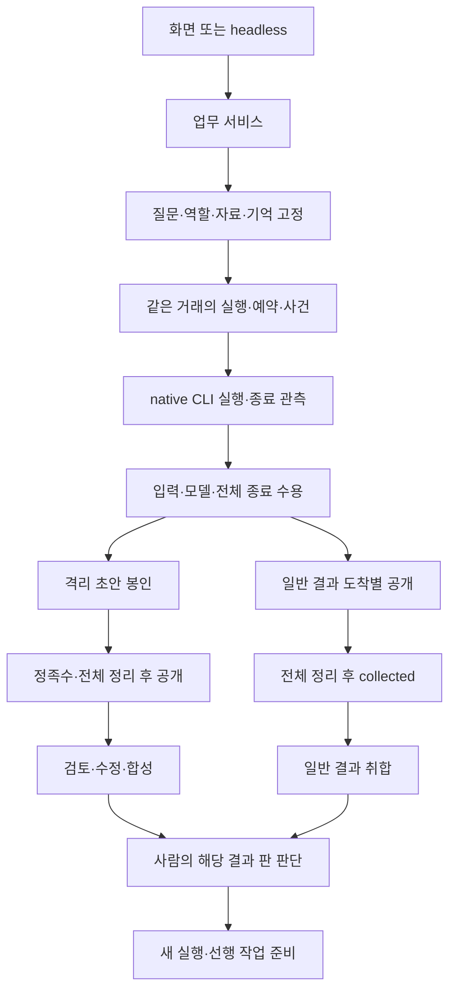

# 아키텍처·파이프라인 종합 판단

기준: [`48ab4bd6f0e297587707aecb83ebc0cd9968892f`](https://github.com/inlight37-design/decision-model_lab/commit/48ab4bd6f0e297587707aecb83ebc0cd9968892f), 2026-10-05. 아래에서 ‘현재’는 이 tree를 뜻한다. 실제 기기 관측은 기존 기록이며 이번 세션의 관측으로 바꾸지 않는다.

## 1. 결론: 기반을 유지하면서 연결 계약을 완성한다

현재 제품의 형태는 **하나의 Python 프로세스와 SQLite 원장을 중심으로 책임을 나눈 애플리케이션**이다. Controller가 조립과 기존 API 호환을 맡고, 입력 구성·업무 명령·실행·예약·공개 조회가 별도 모듈이다. 서버와 헤드리스가 같은 배선을 쓰며, native CLI의 종료 상태와 앱이 답을 수용하는 조건도 구별한다. 외부 오케스트레이터를 붙이지 않아도 현재 규모의 제한된 협업을 확장할 구조가 있다. [조립](https://github.com/inlight37-design/decision-model_lab/blob/48ab4bd6f0e297587707aecb83ebc0cd9968892f/app/controller.py#L53-L77), [두 실행 입구의 배선](https://github.com/inlight37-design/decision-model_lab/blob/48ab4bd6f0e297587707aecb83ebc0cd9968892f/app/wiring.py#L51-L89)

따라서 이번 권고는 새 프레임워크를 중심에 놓거나 이미 끝난 서비스 분리를 반복하는 것이 아니다. **같은 정보가 각 경로에서 같은 뜻을 가지게 하는 것**이 다음 단계다. 중요한 연결은 장기 작업과 호출 원장의 수명, 저장 답과 후속 검토의 해시, 사람이 판단한 결과 판과 기억, 수정 판과 최종 취합, 역할별 호출 관측과 화면이다.

이 결론은 ‘버그가 없다’는 평가가 아니다. 모델 없는 재현에서 실제 경로 간 불일치를 확인했다. 동시에 자료 고정·CAS·공개 경계·unknown 점유처럼 이미 있는 보호를 재작성하면 불필요한 변경 위험만 커진다. 결함 수정, 사용 흐름 완성, 규모 확대를 서로 다른 작업 단위로 다뤄야 한다.

## 2. 현재 실행 구조

이 그림의 `검토·수정·합성`은 모두 자동으로 도는 한 묶음이 아니다. 각각 조건과 사용자 시작이 있는 선택 단계다. 일반 팀원 교차검토는 아직 설계이며, 현재 일반 실행을 `revealed`로 바꾸어 이 경로를 열어서는 안 된다. 일반/격리 차이는 화면 배치뿐 아니라 공개·정족수·자료 범위의 계약이다. [모드별 gate](https://github.com/inlight37-design/decision-model_lab/blob/48ab4bd6f0e297587707aecb83ebc0cd9968892f/app/state.py#L72-L125)

### 권한과 정본의 위치

| 무엇의 정본인가 | 현재 담당 | 확대할 때 지켜야 할 의미 |
|---|---|---|
| 사용자가 확인한 질문·자료·역할 | InputBuilder가 만든 입력과 원장 사본 | 모델 제안·검색 결과가 승인된 입력을 나중에 바꾸지 않음 |
| 실행 소유권 | Store의 원장 잠금, Runtime의 worker 핸들 | 창 연결이나 thread 핸들 부재를 전체 자손 종료로 해석하지 않음 |
| 호출 소비·자리 | InvocationLedger와 예약 사건 | 실제 시작 실패·unknown을 임의 환불하거나 새 역할 회계에서 빼지 않음 |
| 참여자의 현재 상태 | participants 행 | 별도 UI 상태나 복제된 roster를 함께 정본으로 만들지 않음 |
| 공개 가능 여부 | app.state의 gate와 PublicQueries | 검색·알림·내보내기·기억에도 같은 공개 의미 적용 |
| 사람이 본 결과 판 | 결과 사건 seq와 human_reviewed | 새 수정·검토 결과까지 이전 판단으로 덮지 않음 |
| 초안과 수정 답 | drafts와 별도의 answer_revisions | 수정이 원본 초안과 독립 정족수를 바꾸지 않음 |
| 외부 자료의 내용/범위 | sources 및 DECISION-SOURCE 메타데이터 | 추출 성공·hash 일치를 사실 확인으로 승격하지 않음 |

근거: [원장 소유권·schema](https://github.com/inlight37-design/decision-model_lab/blob/48ab4bd6f0e297587707aecb83ebc0cd9968892f/app/store.py#L1-L44), [조건부 상태 전이와 결과 판](https://github.com/inlight37-design/decision-model_lab/blob/48ab4bd6f0e297587707aecb83ebc0cd9968892f/app/repository.py#L35-L75), [결과 수용](https://github.com/inlight37-design/decision-model_lab/blob/48ab4bd6f0e297587707aecb83ebc0cd9968892f/app/domain.py#L75-L97).

### 데이터 관계에서 구별할 단위

`task`는 장기 목표, `run`은 한 번 고정한 질문/역할/자료, `attempt`는 실제 호출 시도, `revision`은 원본에 대한 별도 답의 판이다. `result_revision`은 사용자가 보는 결과 집합의 변경 순서이며 답 본문의 revision ID와 다르다. `event.seq`도 실행별 순서여서 원장 전체의 재접속 cursor로 그대로 쓸 수 없다. 모델의 대화 session ID는 이들 중 어느 것과도 자동으로 같은 단위가 아니다. [저장 구조](https://github.com/inlight37-design/decision-model_lab/blob/48ab4bd6f0e297587707aecb83ebc0cd9968892f/app/store.py#L49-L140), [결과 판 계산](https://github.com/inlight37-design/decision-model_lab/blob/48ab4bd6f0e297587707aecb83ebc0cd9968892f/app/repository.py#L56-L75)

이 단위를 뭉쳐 `done`, `session`, `memory` 하나로 다루면 외부 도구가 쉬워 보이지만, 복구·검토·비용에서 의미가 어긋난다. 새 기능은 위 식별자를 그대로 연결하는 편이 작고 명확하다.

## 3. 파이프라인별 평가

| 구간 | 현재 잘 닫힌 부분 | 이번 검토에서 더 필요한 것 |
|---|---|---|
| 질문·자료 준비 | 자료 사본과 hash, 팀원별 배정, 계획/선행 상태를 미리보기와 생성 거래에서 재확인 | 긴 상위 역할 준비 기록을 다시 찾는 화면; 문서 추출의 작은 한계 표시 유지 |
| 입력 확정·생성 | 같은 run_id 재시작 거절, 다듬기/분담/제안 한 번 소비 CAS, 같은 거래로 생성 | 응답 유실 때 기존 ID의 실행/준비 기록을 회수하는 공통 흐름 |
| native 호출 | 최종 계획 확인, 공통 예약, provider별 상한, 입력·model·전체 tree 수용 | 직접 Controller embedding의 불변 예산 경계, 출력 terminal 순서, 상위 역할 한도 관측 |
| 격리/일반 공개 | 모드별 gate, 봉인 allowlist, 실패한 모델 자동 대체 없음 | 일반 검토의 새로운 자격을 `collected` 의미 위에 추가 |
| 검토·수정 | 한 라운드, 지적 처분, 원본과 별도 수정, 수정 preview의 근거 결속 | 검토/취합 시작 직전 원본 digest 재검증; 선택할 답의 판을 공통 manifest로 고정 |
| 기억·다음 실행 | 같은 작업 공개 이력, 고정 pack, 선택 이유·누락, 격리 초안 제외 | 지난 판단과 현재 판단 구별; 수정/재검토도 검색 대상과 발췌 대상으로 일치 |
| 장기 사용·복구 | 원장당 owner와 예산, 작업 계획, 검색, 반복 조회 cache | 원장 교체 후 작업 연속성과 이전 unknown; 준비 기록의 페이지/상세 분리 |

입력 생성 보호의 실제 구현은 [WorkService.create_run](https://github.com/inlight37-design/decision-model_lab/blob/48ab4bd6f0e297587707aecb83ebc0cd9968892f/app/application/work.py#L24-L102)에 있다. 이 코드는 이미 중복 시작을 거절하므로, 전역 command receipt가 없다는 이유만으로 현재의 같은 run_id 요청이 이중 호출된다고 주장하지 않는다.

## 4. 가장 큰 구조적 어긋남: 장기 작업과 작은 호출 원장의 수명

런처의 기본 예산은 provider별 5회다. `_has_room`은 모든 provider에 잔여가 있어야 기존 원장을 재사용하고, `pick_ledger`는 가장 최근 원장만 검사한다. 한 provider를 모두 쓰면 다른 provider 잔여가 있어도 다음 시작에서 새 원장 경로를 고른다. 한편 작업·템플릿·기억·검색은 같은 원장 안에 있다. [기본값](https://github.com/inlight37-design/decision-model_lab/blob/48ab4bd6f0e297587707aecb83ebc0cd9968892f/app/launch.py#L47-L60), [선택 로직](https://github.com/inlight37-design/decision-model_lab/blob/48ab4bd6f0e297587707aecb83ebc0cd9968892f/app/launch.py#L190-L224)

예를 들어 Codex 예약만 5회, Claude 예약은 0회인 합성 원장에서도 새 경로를 선택한다. 파일이 삭제된다는 뜻은 아니다. **앱이 자동 선택한 현재 원장에서 이전 작업의 맥락이 이어지지 않는 것**이다. 같은 작업 기억을 더 정교하게 만들어도 원장이 바뀌면 그 이력을 자동으로 볼 수 없다는 한계가 있다.

복구에도 경계가 있다. 현재 owner와 unknown 점유는 원장 안에서 계산한다. 이전 원장의 종료 미확정이 새 원장의 호출 관문으로 자동 전달되지는 않는다. 실제 고아 프로세스가 살아 있었다고 관측한 것은 아니며 원장당 cap 위반으로도 부르지 않는다. 다만 원장을 바꾸는 행동이 이전 미확정을 해결한 것처럼 보이지 않게 해야 한다.

### 최소 개선과 후속 설계를 나눈다

1. **먼저 이전 원장을 찾고 읽게 한다.** 현재 원장 이름·남은 횟수·교체 이유, 읽기 전용 이전 원장 선택, 원래 작업/실행으로 이동하는 기능을 붙인다. 예산이 찼다고 이력을 감추지 않는다.
2. **이어가기 입력을 명시한다.** 이전 작업에서 가져갈 질문·선택 답·미해결·출처 ID/hash를 작은 전달 자료로 고정한다. 새 원장의 새 예산을 사용하며 기존 소비를 복사·환불하거나 두 원장을 같은 실행으로 가장하지 않는다.
3. **이전 unknown부터 해결한다.** 최근 원장의 미확정이 있으면 원장 교체 이전에 해결 경로를 보여 주고, 새 시작의 최종 관문에서 그 상태를 다시 확인한다. 단순 프로세스 이름 검색만으로 종료를 확정하지 않는다.
4. **그 다음 장기 작업과 예산 구간 분리를 설계한다.** 장기 사용에서 실제로 원장 교체가 반복될 때, 영속 작업 ID와 budget epoch를 분리하는 이행을 검토한다. 기존 schema·소비·과거 호출 이력을 보존하는 별도 작업이다. 이번 문서가 새 budget table 도입을 결정한 것은 아니다.

AnchorMind/WorkTrail/Symphony의 장기 기억·인계·지속 실행에서 배울 수 있는 가장 유용한 지점이 이 수명 경계다. 새 기억 DB나 daemon 설치만으로 해결되지 않는다.

## 5. 답을 ‘최신’으로 쓰는 기준을 명시한다

현재 `result_revision`은 새 결과를 이전 사람 판단과 구별한다. 그러나 기억은 마지막 human_reviewed 메모를 현재성 표지 없이 넣을 수 있고, 기억 순위는 원래 답에서 계산한 뒤 선택된 실행의 수정 답을 발췌에 추가한다. 최종 합성·기존 보고는 원래 초안을 사용한다. 이 동작 중 수정 판 비소비는 문서에 명시된 범위이고, 기억의 판 의미 누락은 실제 사용자 오해 가능성을 가진 연결 문제다. [결과 판](https://github.com/inlight37-design/decision-model_lab/blob/48ab4bd6f0e297587707aecb83ebc0cd9968892f/app/repository.py#L56-L75), [기억 순위와 수정 발췌](https://github.com/inlight37-design/decision-model_lab/blob/48ab4bd6f0e297587707aecb83ebc0cd9968892f/app/memory.py#L75-L146)

권고하는 공통 개념은 `selected_result`다. 이름 자체보다 포함할 정보가 중요하다: 실행 ID, 작성자, 원본/수정 판 ID, 본문 hash, 선택한 시점의 결과 판, 선택 주체, 연결된 지적·재검토, 남은 미해결이다. 이것을 **GR-3 취합, 격리 합성의 후속 확장, 다음 단계 전달, 기억 출처 표시**가 함께 사용한다.

자동으로 ‘가장 최근 수정 답’을 고르면 실패한 수정, 미재검토 판, 사용자가 반박한 결과까지 채택할 수 있다. 처음에는 사람이 고른 판만 고정하고, 모델은 그 판의 내용을 모으도록 한다. 그 뒤 새 판이나 지적 처분이 바뀌면 기존 합성은 과거 manifest를 유지하면서 ‘현재 선택과 다름’을 표시한다. 원본·과거 판단을 덮어쓰지 않는다.

이 공통 계약도 모든 결과를 새 테이블로 이사시키는 일과는 다르다. 기존 drafts/answer_revisions를 읽는 검증 함수와 versioned manifest부터 시작할 수 있다. 스키마 추가는 실제 저장 요구가 정해졌을 때 한다.

## 6. 유지할 복잡도와 줄일 복잡도

| 유지할 것 | 왜 필요한가 | 줄일 때의 안전한 범위 |
|---|---|---|
| native outcome와 앱 수용의 분리 | 종료 코드·빈 답·불완전 입력·모델 불일치를 각각 해석 | 하나의 `success` bool로 합치지 않음 |
| participant·상위 역할·합성의 과거 저장 형식 | 기존 원장과 소비 이력의 의미 보존 | 공통 읽기 adapter/관측 계약부터 정리 |
| 공개 query와 원장 내부 읽기의 구별 | 봉인 자료가 검색·화면·내보내기로 새지 않게 함 | 새 기능이 SQL을 직접 퍼뜨리지 않게 연결 |
| 일반/격리 모드별 규칙 | 다른 과제 분담과 독립 답 비교는 의미가 다름 | 실행 엔진은 공유하되 입력/공개 정책은 구별 |
| 자료·답·판의 hash | 저장 손상과 잘못된 대상 연결을 발견 | hash를 이미 가진 소비 경로의 누락 검사만 통일 |
| 호출별 기록과 재시작의 unknown | 실제 외부 효과를 DB rollback으로 없앨 수 없음 | 자동 재호출 대신 기존 시도 회수와 명시적 해결 |

합성이 SEATS와 다른 lifecycle을 갖는 부분은 유지보수 위험이지만 지금 보호가 없는 것은 아니다. 역할 추가마다 관측·회계·복구를 여러 군데 다시 고쳐야 할 때 공통화를 진행한다. ‘파일이 크다’는 이유만으로 잘라 놓고 상호 의존을 늘리는 작업은 권하지 않는다.

`Controller` 호환 setter, event 기반 합성, 직접 SQL, 단일 lock 안의 큰 projection은 경계가 약해질 수 있는 접점이다. 새 외부 기능의 진입점을 이곳에 무제한 열지 말고, 담당 서비스와 검증 함수 뒤로 제한한다. 분산 scheduler·message broker·새 graph DB·외부 agent framework는 현재 확인된 문제의 선행 조건이 아니다.

## 7. 이식 여부를 판단하는 기준

외부 기능마다 다음 순서로 판단한다.

1. **지금 사용자 흐름의 어느 빈틈을 메우는가?** 이미 구현된 기능이면 유지·개선 대상으로 분류한다.
2. **우리의 어떤 상태와 자료를 읽고 쓰는가?** task/run/attempt/result 판과 공개 범위를 명시한다.
3. **모델 호출이 늘어나는가?** 버튼·상태 표시·검색·필터만으로 되는 일은 모델을 사용하지 않는다. 요약·검토·라우팅 호출은 기존 원장에 들어간다.
4. **어떤 권한과 수명을 추가하는가?** 읽기 전용 논의자에게 파일 쓰기·전역 훅·원격 daemon을 숨겨 넣지 않는다.
5. **실패할 때 무엇이 남는가?** 예약·실제 시작·결과 저장·공개·사람 판단을 구별하고 unknown과 미해결을 보존한다.
6. **작은 도입으로 효과를 측정할 수 있는가?** 대조군보다 도움이 없으면 더 큰 엔진 도입을 멈춘다.

따라서 ‘얼마나 이식할까’의 답은 제품 전체의 비율이 아니다. **현재 정보 경계에 들어맞는 계약과 사용자 기능까지는 적극적으로 가져오고, 실행기·회계·권한·장기 운영 체계를 하나 더 만드는 이식은 필요가 입증될 때까지 미룬다.** 현재 수집한 후보 전체의 판정과 원본 ID는 이 검토의 기능 매트릭스가 관리한다.

## 8. 검토의 한계

이 문서는 기준 tree의 정적 경로 추적과 모델 없는 합성 재현으로 작성했다. 사용자 PC, 실제 구독 인증, 외부 CLI의 최신 streaming 형식, 실제 계정 한도, 장시간 모델 품질은 이번에 확인하지 않았다. 기존 PC 실험 기록은 그대로 유효한 해당 시점·환경의 관측이며, 이 문서가 그 범위를 넓히거나 취소하지 않는다.

후속 우선순위는 코드의 위험도만으로 결정하지 않는다. 작은 무결성 수정과 이미 계획한 일반 검토를 먼저 진행하되, 장기 작업을 일상적으로 쓰기 전에는 원장 수명과 재접속 문제를 해결해야 한다. 품질 향상은 별도 과제 대조에서 판단하고, 새로운 호출·복잡도를 추가한 것 자체를 개선으로 세지 않는다.
